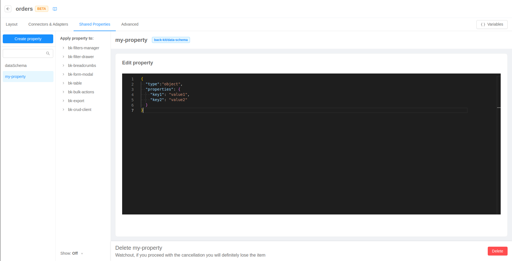
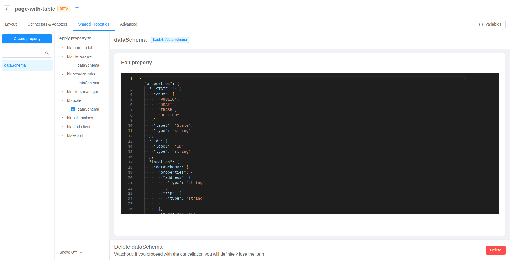

The pages of type [_compose_](./10_structure.md#page-type) can be configured in a **dedicated section** accessible via _edit page_ option in pages [context menu](./10_structure.md#edit-page).

:::tip
You can refer the [micro-lc documentation](https://micro-lc.io/docs/guides/applications/compose) on how to properly configure a compose page.
:::

## Templates

Compose pages can be created starting from a template, which is a pre-defined configuration carring a set of components.

:::tip
To learn how to use your own custom templates, read the [dedicated documentation](./30_configurator_settings.md#template-sources).
::: 

### Page with table

A page built to display an array of data with a tabular view. It provides filtering, exporting, pagination, creation, and editing functionalities.

The template should be linked to a data source implementing a [CRUD service](/runtime_suite/crud-service/10_overview_and_usage.md)-compatible interface configuring the _base path_ property of _CURD client_ and _CRUD export_ components in _Connectors & Adapters_ section.

Data shape is defined by `dataSchema` shared property, that can be edited in a no-code fashion from the [dedicated section](#shared-properties). 

### Table with file field

A page built to display an array of data carring file fields with a tabular view. Besides filtering, exporting, pagination, creation, and editing functionalities, it provides a way to upload and download files.

The template should be linked to a data source implementing a [CRUD service](/runtime_suite/crud-service/10_overview_and_usage.md)-compatible interface configuring the _base path_ property of _CURD client_ and _CRUD export_ components in _Connectors & Adapters_ section. Moreover, page should be linked to a [files service](/runtime_suite/files-service/configuration.mdx) instance thought the _base path_ property of _File service client_ component in _Connectors & Adapters_ section.

Data shape is defined by `dataSchema` shared property, that can be edited in a no-code fashion from the [dedicated section](#shared-properties).

### Master table

A table page built to be connected with another page that provides further details on the data.

The page should be connected to a data source just like a [page with table](#page-with-table), and to the correct details page configuring the table [`customActions` property](/microfrontend-composer/back-kit/60_components/510_table.md#configuring-actions-via-customactions).

### Details page

A page built to display a detailed view of data (e.g., a single row of a table) through [card components](/microfrontend-composer/back-kit/60_components/140_card.md).

The template should be linked to a data source implementing a [CRUD service](/runtime_suite/crud-service/10_overview_and_usage.md)-compatible interface configuring the _base path_ property of _CURD client_ component in _Connectors & Adapters_ section. Moreover, _URL mask_ property of _URL parameters adapter_ component in _Connectors & Adapters_ should be [properly configured](/microfrontend-composer/back-kit/60_components/540_url_parameters_adapter.md) to query data correctly.

Data shape is defined by `dataSchema` shared property, that can be edited in a no-code fashion from the [dedicated section](#shared-properties).

### Single view visualization

A page built to visualize a [Fast Data Single View](/fast_data/the_basics.md#single-view-sv). It offers a readonly interaction with the data and is equipped for nested data visualization.

The template should be linked to an exposed Single View configuring the _base path_ property of _CURD client_ component in _Connectors & Adapters_ section.

Data shape is defined by `dataSchema` shared property, that can be edited in a no-code fashion from the [dedicated section](#shared-properties).

### Calendar view

A page built to visualize data on a calendar. It provides filtering, exporting, pagination, creation, and editing functionalities.

The template should be linked to a data source implementing a [CRUD service](/runtime_suite/crud-service/10_overview_and_usage.md)-compatible interface configuring the _base path_ property of _CURD client_ and _CRUD export_ components in _Connectors & Adapters_
section.

Data shape is defined by `dataSchema` shared property, that can be edited in a no-code fashion from the [dedicated section](#shared-properties). Pre-configured schema already has the required fields by the [calendar component](/microfrontend-composer/back-kit/60_components/130_calendar.md).

### Picture gallery

A page built to visualize image files through a gallery view. Besides filtering, exporting, pagination, creation, and editing functionalities, it provides a way to upload and download files.

The template should be linked to a data source implementing a [CRUD service](/runtime_suite/crud-service/10_overview_and_usage.md)-compatible interface configuring the _base path_ property of _CURD client_ and _CRUD export_ components in _Connectors & Adapters_ section. Moreover, page should be linked to a [files service](/runtime_suite/files-service/configuration.mdx) instance thought the _base path_ property of _File service client_ component in _Connectors & Adapters_ section.

Data shape is defined by `dataSchema` shared property, that can be edited in a no-code fashion from the [dedicated section](#shared-properties).

## Layout

From the first tab you can configure in a no-code fashion the components that **renders something** on the page (as opposed to the merely logical components configurable in the [connectors & adapters](#connectors--adapters) tab).

This section works just as the layout tab of Backoffice Configurator. The **left menu** allows viewing, selecting, and hiding the custom components composing the page, the **live central preview** shows how the final page will look like, and from the **right menu** components properties can be consulted and edited.

For more technical insights, visit the [Layout section](./10_structure.md#layout) where all the behaviors are explained in deep.

## Connectors & Adapters

The second tab is equivalent to the first in terms of functionalities. However, it will show only **logical** components (i.e., components that do not render anything). For this reason, no live preview will be shown.

## Shared Properties

The third tab allows the user to define custom reusable properties and assign their value to different properties of components on the page. This is useful to centralize important values that can be shared across components and editing them in one place.

### Create and assign shared properties

In order to create a new Shared Property, it is necessary to click on the "Create property" button and fill out the form by assigning a **name** and a **type**  to the property (if no type is available in the dropdown, it means that no component in the page expects a shared property).

:::tip
When choosing the name of your new shared property, you can also select any definition that does not have a type assigned. This may be useful for example if you create a definition from the Advanced section and later you want to start editing it in a no-code fashion.
:::

Once that the property has been created, it will be visible in the left side menu. It is possible to assign it to a property of a component  in page by selecting it and flagging the checkbox of the relative property.

Alternatively, it is possible to assign a Shared Property to a component property directly in the [Component properties editor](./10_structure.md#components-properties-editor)

### Well-known shared properties

Some shared property types are well known by the Configurator, and a no-code editor is available for them.

#### Back Kit data schema

Properties of type `back-kit/data-schema` are a core concept of the [back-kit web-components library](/microfrontend-composer/back-kit/30_page_layout.md#data-schema)
and can be configured through a graphical interface.

You can add new fields to the schema, choose and edit their name, and set some relevant properties for each of them.

Moreover, data schemas can be **automatically generated** from CRUD collections. This can be done in specific components that are responsible for CRUD communication (e.g., [Curd Client](/microfrontend-composer/back-kit/60_components/100_crud_client.md) component), with the _Generate Schema_ button.

If the component does not have a value for its data schema property, the automatic generation process will create a **new shared property**, and will assign it to the component. If the component already references a shared property in its data schema property, the shared will be updated.

:::warning
If the component already references a shared, the generation process will **completely overwrite** the value of the shared property (this includes any additional field you may have added to the previous data schema).
:::

## Advanced

The fourth and last tab works like the advanced tab of the [structure section](./10_structure.md#advanced-configuration): the **whole configuration** of the page can be edited from a code editor with a live preview on the right.

