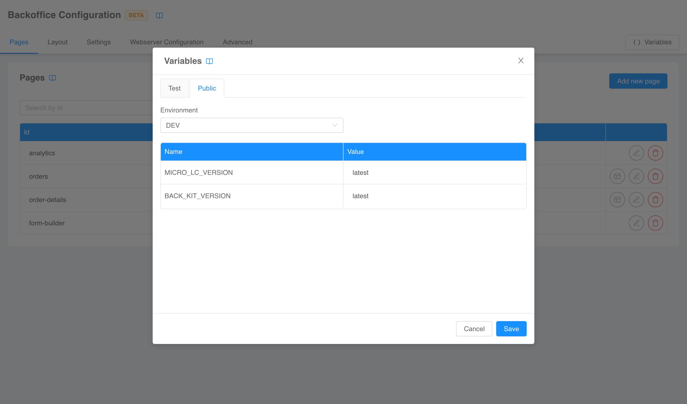
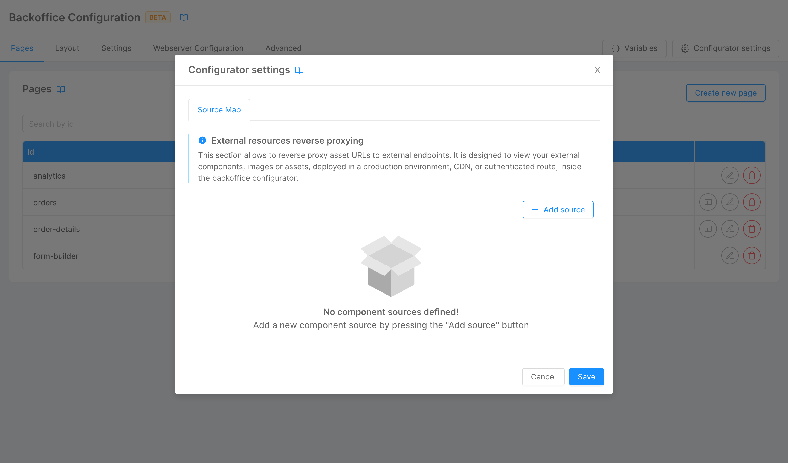
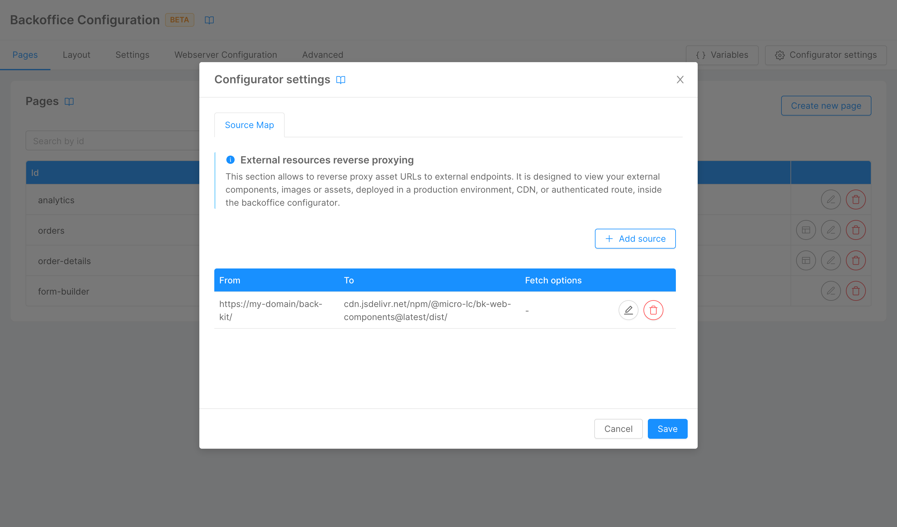
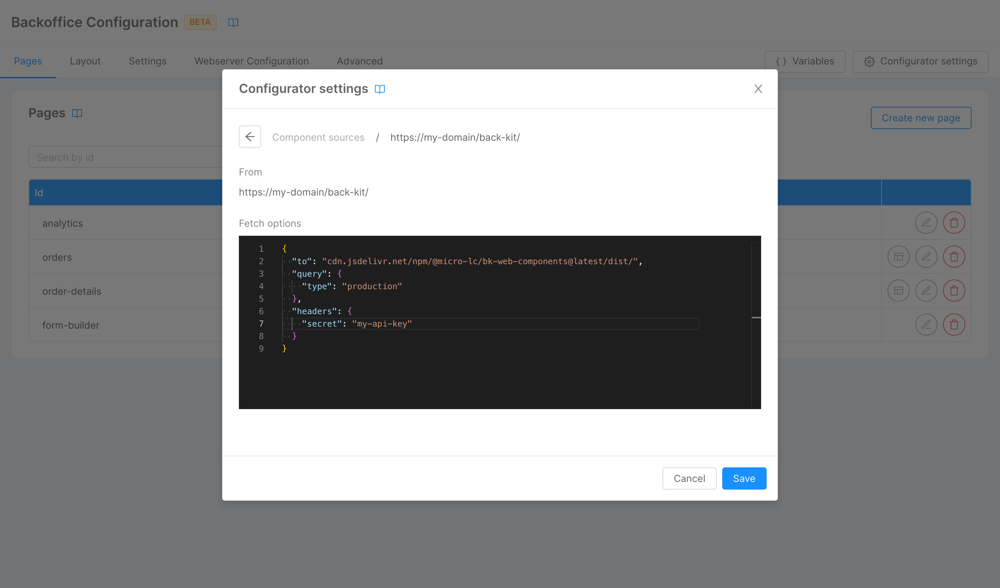
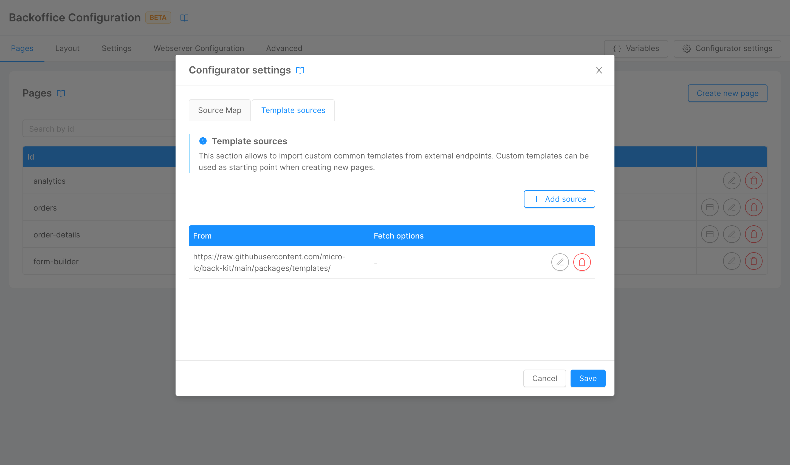

These settings are only related to the Console plugin itself and will not affect your runtime environment. 

## Environment variables

A common use-case when configuring a frontend is to use **interpolated variables** in configuration files (e.g., for the version of a web-components library). The configurator automatically pulls the unsecreted variables of the project and uses them to correctly interpret configurations with interpolated sections.

To manage the variables used by the configurator, a dedicated modal can be opened with the *Variables* button on the top right corner of both the [structure](./10_structure.md) and the [compose configuration](./20_compose_pages.md) pages.

The modal is divided into two section. The *Public* section lists the project unsecreted variables divided for environment (the variables are **readonly**). The environment can be switched to try the configuration with the different variables values.



The *Test* section can be used to define **volatile**, test-only variables in a key-value pair fashion. This can be useful for example to simulate secreted variables or to temporarily override unsecreted variables, since the configurator will use test variables over public variables when they have the same key.


:::tip
Variables defined in the *Test* section of the modal are shared between all sections of the configurator. However, if you leave the page and return, your will lose your environment.
:::

## Source maps

The Configurator preview can only load resources that are publicly available on the net and with the right [CORS headers](https://developer.mozilla.org/en-US/docs/Web/HTTP/CORS). 

This poses an issue if you would like to view [external components](/microfrontend-composer/external-components/overview.md), images, or assets deployed in a production environment, CDN, or authenticated route.

Let's consider, for example, the following compose page configuration, where web-components are sourced from the authenticated endpoint `https://my-domain/back-kit`:

```json
{
  "content": {
    "tag": "bk-button"
  },
  "sources": ["https://my-domain/back-kit/bk-web-components.esm.js"]
}
```

When the Configurator preview tries to call the endpoint, the request fails, since it is not authenticated.

To solve this issue, the Configurator loads a [Service Worker](https://developer.mozilla.org/en-US/docs/Web/API/Service_Worker_API) with the purpose of reverse proxying unreachable requests to URLs reachable by the preview. The Service Worker can be configured in the _Source Map_ tab of the _Configurator Settings_ modal.



Here you can specify pairs of locations in a _from-to_ fashion: the Service Worker will intercept any request made to the `from` URL and redirect it to the `to` URL, which may be, for example, a public CDN.



On top of that, for each pair you can specify any **query** or **header** to be attached to the request made to the `to` URL.



## Template sources

Whenever you [create](./10_structure.md#create-new-page) a compose page you can choose to start from a pre-configured [template](./20_compose_pages.md#templates). Templates are fetched from remote sources, and these sources can be configured in the _Template sources_ tab of the _Configurator Settings_ modal.



Here, you can list URLs that are called to retrieve the available templates. For each URL you can specify any **query** or **header** to be attached to the request.

The URL called should be one of a valid NPM package containing a `package.json` file in root (the call is made to `<template_source>/package.json?<optionally_specified_query>`). Inside the `package.json`, the location of the templates should be provided in the `exports` field (you can take a look at the [official templates repository](https://github.com/micro-lc/back-kit/tree/main/packages/templates) for an example).

```json
{
  "name": "my-templates-repo",
  "exports": {
    "./my-template.json": {
      "default": "./my-template.json"
    }
  }
}
```

Templates should be JSON files following [this schema](https://raw.githubusercontent.com/micro-lc/back-kit/main/packages/engine/schemas/template.schema.json).
