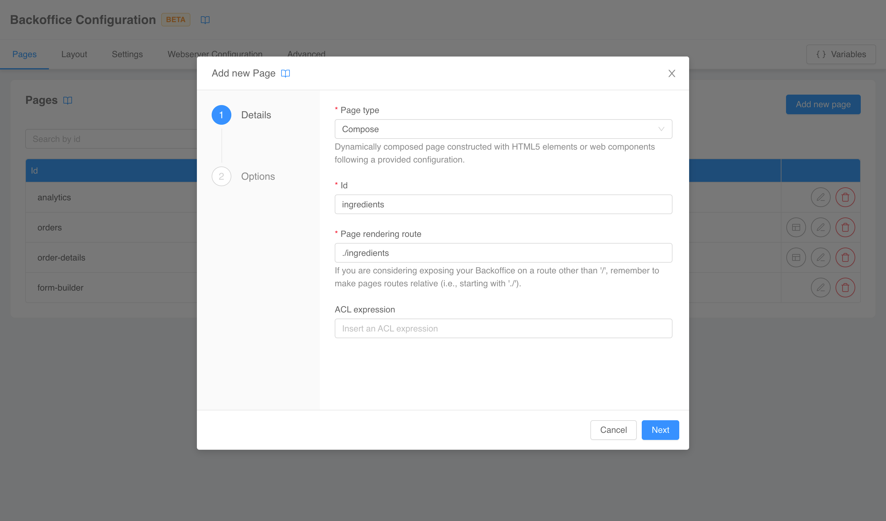
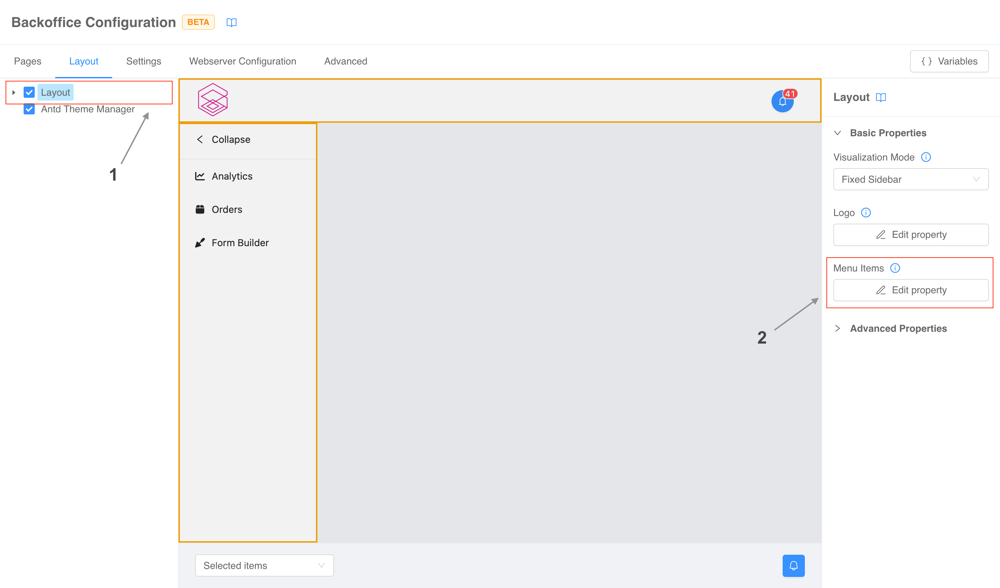
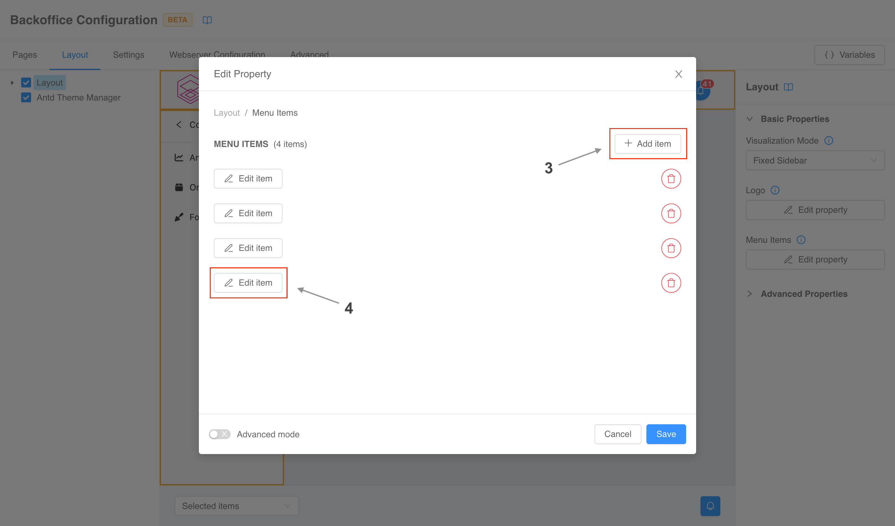
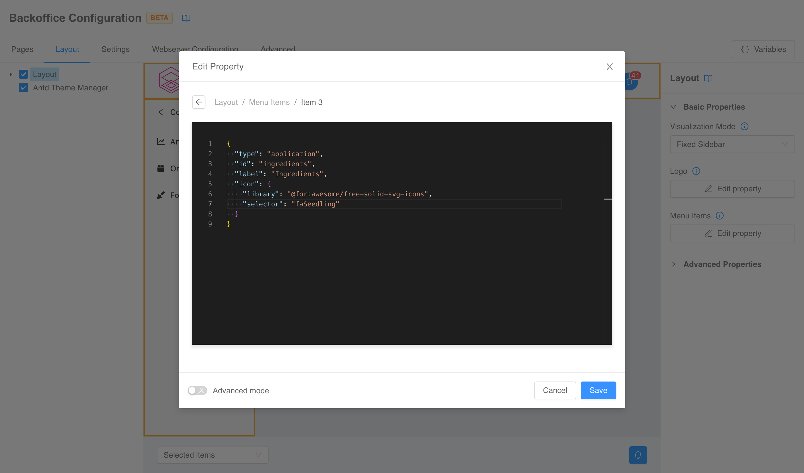
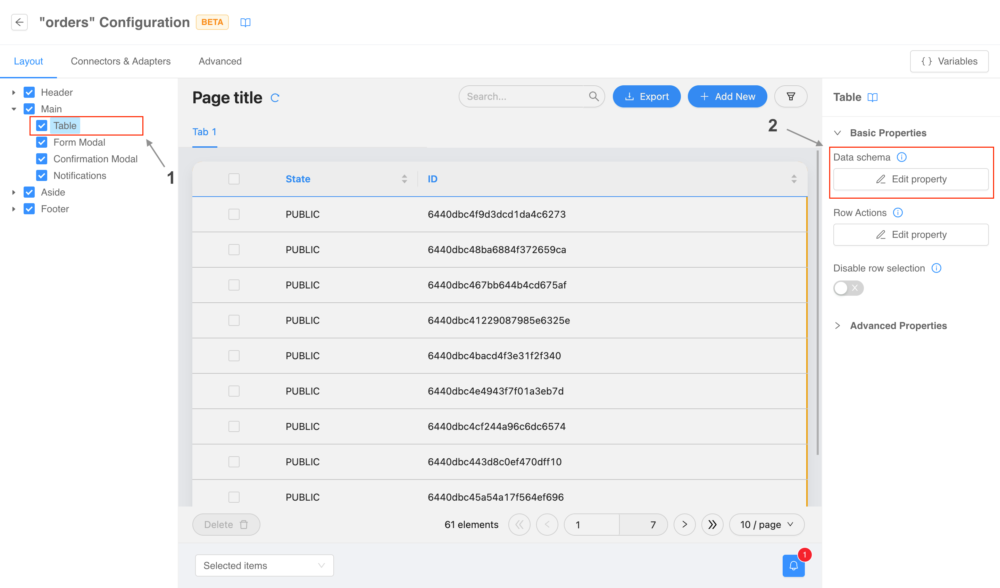

## Components

### How can I add a new page and show it in the navigation menu?

:::caution
The information regarding the menu are valid only if you are using the [`bk-layout`](/microfrontend-composer/back-kit/60_components/380_layout.md) component.
:::

The first step to add a new page to your frontend is to [create](/microfrontend-composer/composer/10_structure.md#create-new-page) it the _Pages_ tab of the Configurator.



Once the page has been spawned, you can move to the _Layout_ tab to connect it to the navigation menu. In the left drawer select the component named _Layout_, and in the right form locate the _Menu Items_ property.



Click the _Edit property_ button and in the modal that pops up click the _Add item_ button to insert a new voice in the menu. The click will spawn a new _Edit item_ button.



One clicked, a code editor will appear in the modal for you to write the [item configuration](/microfrontend-composer/back-kit/60_components/380_layout.md#application). Remember that the _id_ must match the identifier of your newly created page.



Once you have done, click the _Save_ button. The modal will close, and the new item will appear in the menu.

### How can I add a new column to a table?

:::caution
This information are valid only if you are using the [`bk-table`](/microfrontend-composer/back-kit/60_components/510_table.md) component.
:::

Columns of the table are defined by it's 
[`dataSchema` property](/microfrontend-composer/back-kit/30_page_layout.md#data-schema). To edit it you first need to open the configuration of the _compose page_ of your choice. Now you need to select the _Table_ component in the left menu (if you are starting from a template, it usually located under the _Main_ component) and click the _Edit property_ button of the _Data schema_ property in the right menu.



A modal will open with a code editor you can use to edit the property. Now you just need to add a new entry to the `properties` object as explained in the [official documentation](/microfrontend-composer/back-kit/30_page_layout.md#data-schema).

Once you have done, click the _Save_ button. The modal will close, and the table will display the new column.

### How can I change parts of the configuration based on user's groups and permissions?

Microfrontend Composer [suppports](https://micro-lc.io/add-ons/backend/middleware#acl-application) the usage of ACL expressions in configurations to omit sections based on logical expressions evaluated against user's groups and permissions.

:::info
An ALC expression is a combination of groups, permissions and JavaScript operators like `groups.admin && permissions.api.users.get`.
:::

ACL expressions can be [added](/microfrontend-composer/composer/10_structure.md#acl-expression) to each object in the configurations regardless of the nesting level. If an object has the special property `aclExpression`, the server will evaluate it and remove the object altogether in case of a *falsy* outcome.

### How can I use an Angular micro-frontend as parcel?

:::tip
Official micro-lc Angular templates are available on GitHub for Angular version [12](https://github.com/micro-lc/angular12-template), [13](https://github.com/micro-lc/angular13-template), and [14](https://github.com/micro-lc/angular14-template).
:::

Angular applications need [`zone.js`](https://github.com/angular/angular/tree/main/packages/zone.js) library to run, which is not bundled in micro-lc. Therefore, you need to import it as a `<script>` in you frontend entrypoint (you can find it in the _Webserver Configuration_ tab, under _Entry point_ section) **before** any micro-lc related module.

For example:

```html
<!DOCTYPE html>
<html lang="en">

<head>

  [...]

  <script
    type="module"
    nonce="**CSP_NONCE**"
    src="https://cdn.jsdelivr.net/npm/zone.js@0.13.0/dist/zone.min.js"
  ></script>

  <script
    type="module"
    nonce="**CSP_NONCE**"
    src="https://cdn.jsdelivr.net/npm/@micro-lc/orchestrator@latest/dist/micro-lc.production.js"
  ></script>
</head>

[...]

</html>
```

## Infrastructure

### How can I change the route under which the frontend is exposed?

When starting from the application (whether it is the [classic one](/runtime_suite_applications/backoffice/10_overview.md) or the [on prem one](/runtime_suite_applications/backoffice-on-prem/10_overview.md)), the frontend is exposed under `/mfe-application`. The steps to change this endpoint are the following.

1. Delete `/mfe-application` endpoint and create the new one, which **must have** _Rewrite Base Path_ set to `/public`.
2. Open the Configurator, and navigate to the _Webserver Configuration_ tab.
   1. Under _Entry point_ section you need to modify `index.html` `<base>` tag setting the `href` attribute to the newly created endpoint. **Remember** to always put a trailing `/` (i.e., `/my-new-endpoint/`).
   2. Under _Headers_ section, change the `/mfe-application/assets/style.css` link (and any other preload link you might have added) substituting `/mfe-application` with your new endpoint.

### How can I change the route under which frontend configurations are exposed?

When starting from the application (whether it is the [classic one](/runtime_suite_applications/backoffice/10_overview.md) or the [on prem one](/runtime_suite_applications/backoffice-on-prem/10_overview.md)), frontend configuration files are exposed under `/micro-lc-configurations`. The steps to change this endpoint are the following.

1. Delete `/micro-lc-configurations` endpoint and create the new one, which **must have** _Rewrite Base Path_ set to `/configurations`.
2. Open the Configurator, and navigate to the _Webserver Configuration_ tab.
   1. Under _Entry point_ section you need to modify the value of `config-src` attribute of `micro-lc` web component substituting `/micro-lc-configurations` with your new endpoint.
   2. Under _Headers_ section, change the `/micro-lc-configurations/config.json` link (and any other preload link you might have added) substituting `/micro-lc-configurations` with your new endpoint.

### How can I serve a static file through the frontend webserver?

When starting from the application (whether it is the [classic one](/runtime_suite_applications/backoffice/10_overview.md) or the [on prem one](/runtime_suite_applications/backoffice-on-prem/10_overview.md)), all the frontend related resources are served by a single service, called `micro-lc`. 

This service comes with four config maps, three of which are readonly and editable only thought the Configurator. The fourth one, `micro-lc-assets`, instead is open and it's content is exposed under `//mfe-application/assets` (unless you have [changed the endpoint](#how-can-i-change-the-route-under-which-the-frontend-is-exposed)), which means the the service **will serve any file** you mount in this directory.

Content types and response headers can be controlled in the _Webserver Configuration_ section of the Configurator (read the [full documentation](https://micro-lc.io/add-ons/backend/middleware#service-configuration)).

### How can I improve frontend loading performance?

Frontend loading performance can be improved (al least on [some browsers](https://caniuse.com/link-rel-preload)) setting the right [`preload`](https://developer.mozilla.org/en-US/docs/Web/HTML/Attributes/rel/preload) and [`modulepreload`](https://developer.mozilla.org/en-US/docs/Web/HTML/Attributes/rel/modulepreload) links in the headers of the entrypoint.

This can be done in the _Headers_ section of the _Webserver Configuration_ tab of the Configurator (read the [full documentation](https://micro-lc.io/add-ons/backend/middleware/#headers)). When starting from an application, some useful links are already in place, but you can always add more to cover the specific static resources used by your frontend implementation.

### How can I use my own web-components?

The first step is to properly build, bundle, and serve your own web-components library. You can read the section dedicated to [external components](/microfrontend-composer/external-components/overview.md) to cover the ins and outs of the process with particular attention to the [bundling section](/microfrontend-composer/external-components/bundling.md).

Runtime-wise, micro-lc has no limitations regarding web-components sources, as long as they can be correctly loaded by the application (read more about the different types of [sourcing](/microfrontend-composer/external-components/overview.md#sourcing)). To use a web-components library in the layout or in a compose page you just need to declare it in the configuration
[sources](https://micro-lc.io/docs/guides/applications/compose#plugin-configuration):

```json
{
  "content": {
    "tag": "my-button"
  },
  "sources": [
    "https://my-domain/my-library/my-entrypoint.js"
  ]
}
```

:::tip
In the Configurator you can edit sources from the _Advanced_ tabs.
:::

The Configurator, on the other hand, may have some troubles showing your custom components in the preview. For example, there may be CORS issues or authentication issues. To fix them you may need to adjust how your components are [served](/microfrontend-composer/external-components/overview.md#sourcing), or you can rely on the Configurator [Service Worker](/microfrontend-composer/composer/30_configurator_settings.md#source-maps) to reverse proxy your sources to something that can be loaded by the preview.

### How can I use my own compose page templates?

Templates available when creating a compose page are fetched from remote sources, which can be controlled in the _Template sources_ tab of the _Configurator Settings_ modal.

Refer to the [dedicated documentation](/microfrontend-composer/composer/30_configurator_settings.md#template-sources) for more information.
