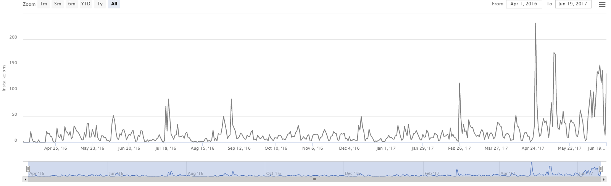
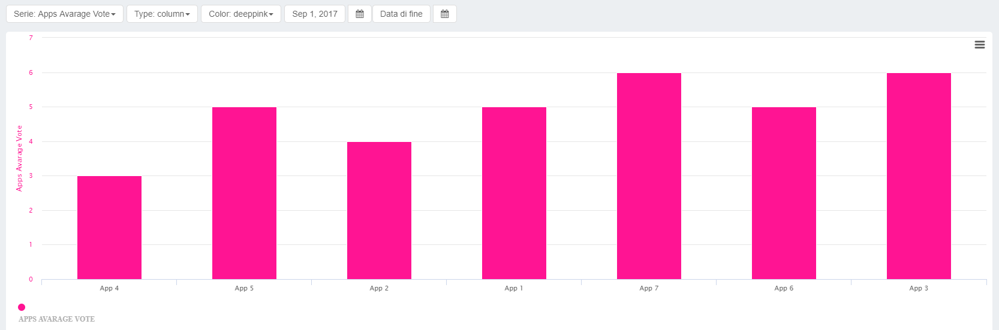
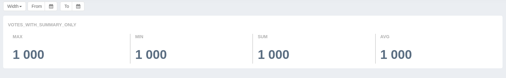
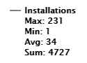

The analytics on the Mia-Platform CMS are configured through two types of JSON files:

- **widgets**: in this file all the analytics are defined, ie which are the calculations and the data types
- **graphic configuration file**: in these files you decide which graphs of the widget file are shown on the desired page of the CMS. The graphic configuration JSON files are: *dashboard.json*, which allows you to configure what is shown in the CMS dashboard, and a *analytics.json* file for each CMS collection to configure what is shown on the analytics page of the object.

The path to access the git analytics configuration files is:

`projectname-config/configurations/backoffice/_analytics-config`

Within the `_analytics-config` file are the two widget and dashboard files.

To configure the analytics.json file within a specific collection, the git path is:
`custom plugin/collection name/analytics.json`

By creating the *analytics* file, the Analyzers key is then enabled on the CMS and the graph is displayed as configured in the same file.

## How to configure the file *widget*

The widget file is the configuration file of the graphs. In my platform you have the possibility to configure two types of graph:

* ```custom-stock```: is a graph with a time series in abscissa

* ```chart```: is a graph not tied to time

* ```chart-summary```: is a graph in which are shown statistics regarding one or more data collections not related to time


### Example of configuration structure

```json
{
  "installations": {
    "type": "custom_stock",
    "title": "Installations",
    "legend": true,
    "yAxis": {
        "shared": true,
        "title": "the title",
        "labelType": "euro"
    },
    "series": [{
      "name": "Installations",
      "id": "installations",
      "type": "line",
      "color": "grey",
      "params": {
        "collection": "installations",
        "groupDate": "createdAt",
        "operations": [
          ["count"]
       ],
        "format": "ymd"
      }
    }]
  }
```

### The elements of the structure

This JSON contains an object whose elements are the different graphs.
The key of each element is the name of the graph (*installations* in the example above) and the value is another object with all the configuration parameters of the graph.
The name of the graph will then be used to create the JSON analytics and dashboard to recall the graph that you want to display on the page.

- ***type:*** (string) the type of chart, which can be ```custom-stock```,```chart``` or ```chart-summary```
- ***title:*** (string) title of the graph to show
- ***sortBy:*** (enum string) determines the series's series; the keys to use are: ```label-asc```,```label-desc```, ```value-asc```,```value-desc```.
- ***legend:*** (boolean / array). If you want to see or not see all the legend use a (boolean): false to disable it, in this way you will not see anything. If instead you write true the legend will contain all the statistics: max (maximum value), min (minimum value), sum (sum), avg (average).
**If you want to display only selected data, you will need to turn the boolean into an array.
Ex: in your chart you want to show only the sum and the average.
At the code level you will write: ```"legend": ["sum","avg"]```.
Remember, however, that the array does not decide the order, but is preset.



- ***yAxis***: allows you to create `custom_stock` graphs with multiple series, which share the same scale on the`y` axis. If omitted, the chart displays two `y` axes, with different scales, for each series. The keys of this object allow you to configure different aspects of the `y` axis
- *shared*: (boolean) if `true`, the series will share the same scale on the`y` axis. If `false` the chart behaves as if the entire`yAxis` object was not specified.
- *title*: (string) sets the title of the `y` axis.
- *labelType*: (string) optional, with the same syntax and semantics of `labelType` referring to the series (see below).
- ***series:*** (array of objects) each object of the array represents a path / series within the graph.
If you want to display multiple paths / series in a single graph, just put more than one object in the array.
Each object of the *series* array consists of the following elements:
- *name:* (string) name of the plot / series shown in the graph
- *id:* (string) track / series id, usually matches the name
- *type:* (string) line, spline, area, column are the types of data visualization
- *color:* (string) color of the plot / series, the allowed values are the main colors of css [color list](https://toolset.mrwebmaster.it/colori/colori-del-web.html)
- ***labelType:*** (string) optional, use only with 'euro' value. Indicates the type of value to show in the legend

- ***params:*** (object) This object contains the elements to configure the values of the path / series:
- *collection:* (string) from which collection to take the data that will be shown in the track / series
- *groupdate:* (string) name of the property on which to group data (data format only), ex. ```CreatedAt```
- *group:* (string) name of the property on which to group data (formats other than data), ex. ```AppSource```
- *operations:* (array) indicates the operation to be performed on the data, e.g. `[[ "Count"]]`

 The Operation parameter only works with **groupDate** and **group**.
 Allows you to specify the operations to be applied in the group created by groupDate or group.
 This parameter is an array and must be a valid JSON.
 Each operation consists of `[operationName, operands` where `operationName` is a parameter or a mongo arithmetic operation accepted by [group accumulator operators](https://docs.mongodb.com/manual/reference/operator/aggregation-group/) and `operands` is the name of the property or a mongo query that returns the values ​​on which to apply the `operationName`.  
 The **permitted transactions** are:
    - **count**: numbers the elements of a group, does not require an operands.
    - **sum**: sum the operands of each group
    - **avg**: calculates the average of the operands of a group
    - **last | first | min | max**: respectively returns the last, the first, the minimum and the maximum of each group
    - **constant**: returns in a group the specific string or numerical constant (default 1)
      :::caution
      **You can set only one operation per path / series.** You can also set up complex operations, for example: `["avg", {"$ multiply":
      ["$ totalPrice", "$ quantity"]}]`
      :::

- ***format:*** (string) element to be populated only if groupDate is used to indicate the default grouping time period of the plot / series. Possible formats: ```y```: years,```ym```: months, ```yw```: weeks,```ymd```: days, ```ymdh``` : hours, ```ymdhM```: minutes
- ***filter:*** (mongoquery) is used to create the path / series not on all the data in the collection but on a subset. It is possible to filter on a property of type date if and only if it is not already used as property for the groupDate.
The documentation to be consulted for the mongoqueries is available at this [link](https://docs.mongodb.com/manual/tutorial/query-documents/).
An example of mongoquery on a property is as follows:

`"filter": {"property name": {"$gte": value}}`

To know all the comparators you can follow this [link](https://docs.mongodb.com/manual/reference/operator/query-comparison/). In the right menu select the type of comparator and discover the potential of the mongoquery

- ***customRangeDates:*** (boolean) enable or disable the date fields ```startDate``` and ```endDate```, ***only*** for graphs of type ```chart```.
- ***start date - end date:*** (number) usable only if customRangeDate is set to true. Enter the timestamp in milliseconds of the dates of the period of interest.

:::note
If both rangeDate and customDate are active on a custom stock chart, it can be confusing. It can be more functional to disable rangeDate because the zoom can be set both with the cursor and with the display buttons
:::

- ***default zoom:*** (number) allows you to decide how much period zoom to start displaying in a custom stock. 0: day, 1: week, 2: month, 3: 3 months, 4: 6 months, 5: year, 6: all

## How to configure the *dashboard* and *analytics*

JSON files dashboard and analytics allow to configure the visualization of the graphs in the CMS respectively in the dashboard and in the analytical section within a collection.

### Example of configuration structure

```json
[
 {
    "id": "installations",
    "order": 2,
    "width": 12
  },
  {
    "id": "dailyuse",
    "order": 3,
    "width": 12
  }
]
```

### The elements of the structure ###

* ***id:*** (string) name of the graph in the dashboard (in the example above "installations")
* ***order:*** (number) display order of the graph (in the example above "2")
* ***width:*** (number 1-12) width of the chart that can go **from 1 to 12**. For example, if you have two graphs with width 6, these will be seen side by side. You can create different display combinations based on the given width.

In this case, having two graphs with width 12, these will be displayed one below the other.
