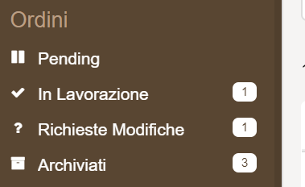

From the Console you can easily configure and manage your CMS.

:::note
Remember that before you can configure the CMS you must have already created your collections in the Collections area and displayed the related Endpoints.
:::

## Categories and Pages

The CMS consists of categories and pages. Pages and categories form the basis of the CMS information architecture.

The **Categories** are useful for grouping similar pages within them. The categories appear only in the CMS menu and represent a different section of the menu.

To give an example: in our CMS of the Library we will create the Category **Authors** and inside we will place the different Pages for the types of writer: novelist, poet, screenwriter, etc ...

The **Pages** are used to represent the data of a collection. Within the Pages you can manage your collections and the data in it.

:::tip
Before creating Pages or Categories try to build the information architecture of your CMS. It will be much simpler at that point to know what to create.
:::

## How to create a Category


To create a category, simply enter the **Name** of the Category you want to display on the CMS and the display order.

:::tip
We advise you to always order by following the tens order. If we want our Category to be the first in the CMS, then we will write 10. This will facilitate the change of order of the Categories.
:::

In our case, we added a Category for the writers: Name = Authors and it will be placed second with the Order = 20

## How to create a Page

In order to create a Page, click the blu button *Create new page* and it will be showned as follow:


The creation of a page consists of 2 steps:

1. Configure the menu area
2. Configure the general settings

### Configure the Menu Area


In this section you can choose how to represent the page in the CMS side menu. Let's take the example of the Novelist page.

**Name**: You will need to enter the name to be displayed in the menu to represent your page: Novelist.

**Endpoint**: You will have to choose which endpoint to hook your page to.

**Category**: You will have to choose your page in which category will be inserted. In our case we will hook the Authors category

**Icon**: You can choose whether to assign an icon to your page that represents it in the CMS. As an example: you can choose the fas fa-book icon to represent you page that contains books. At this [link](https://fontawesome.com/icons?d=gallery&s=solid&v=5.0.0,5.1.0,5.2.0,5.3.0&m=free) you can view and choose all the available icons.

Attention:

1. Mia-Platform supports only the solid, free icon up to version 5.3.0  
2. You should write the full name of the icon. *book*s is not enough. You should write **fas fa-book**

**Order**: With Order you can choose what order to give to your page within a category. We advise you to give the pages a number belonging to the tens order (ex: page 1 will have the order 10)

### Configure the General Settings

In this section you can choose the general configurations of your page.


**Layout**: you can decide the layout you want to give to your collection. The possible layouts are:

* *Table* is the most classic table view mode.

* *TableUser* is the display mode for users. It has in fact a special Reset Password field at the beginning of the table.

* *TablePush* instead is the perfect table for push notification or to send notifications to customers. Next to the table you will always find a push button to inject the content to your customers.

* *Card* each item will be represented similar to a card. To be able to view the card it will be necessary to configure it, to do so, find how to do it at the following [link](./conf_cms#1-configure-the-card).

* *Gallery* is instead the perfect representation for images. Follow the [link](./conf_cms.md#9-configure-the-gallery) to see how to configure it.

**Base Query**: in this field you can apply a visibility filter to your page. You can write a [MongoDB query](https://docs.mongodb.com/manual/tutorial/query-documents/) and using all types of [operators](https://docs.mongodb.com/manual/reference/operator/query/#query-selectors). This field is not required.
:::tip Base query example
In this page I want to see only the data that have how state *archived* or *refused*

```json
{
  "$or":[
   {"state": "archived"}, 
   {"state": "refused"}
  ]
}
```

:::

**Highlight a field**: enabling this check to highlight rows in the CMS. In the **query** field enter a [MongoDB query](https://docs.mongodb.com/manual/tutorial/query-documents/) to choose which rows to highlight. In the **background color** field you can set the background color with which to highlight the data.
In the **text color** field you can instead choose the color of the text. You can enter any valid HTML colors, using the name or the hexadecimal value.

**Notifies**: enabling this check to show or not a badge in the CMS menu area. The badge will display the number of elements that satisfy a condition. With the field **query**, in the **query** field enter a [MongoDB query](https://docs.mongodb.com/manual/tutorial/query-documents/) to set the condition. Badges will be shown as follows:



**Enable Delete**: activating this check, you enable the permanent deletion of items from the database. A CMS user will be able to perform the permanent deletion navigating in the "Trash" section and clicking on the "Delete" button.

**Enable Block**: activating this check, choose to block a page. In this way CMS will not be able to create new elements.

**Enable Hide**: by activating this check, choose to hide a page.

## Customizing properties

To make your CMS perfectly compatible with your needs, the last section on which you will be working is your property.

The properties section allows you to customize every single property.
We can divide this complex area into several parts:

1. [The general settings of a company](#the-general-settings-of-a-property)
2. [Visibility filters](#the-visibility-filters)
3. [The area of the lookups](#the-lookups)

### The general settings of a property

For each property you can configure different fields that allow you to improve the user experience in the CMS:


* **Interface Type**: Depending on the type of property defined in the collection, you can choose whether to improve the visibility of that property.  

  Interface types can be of different types:

  * *String*: if it is a classic text string;
  * *Number*: if it is a number;
  * *Date*: if it is a date;
  * *Date Time*: is instead a complete date with hours, minutes and seconds;
  * *Boolean*: if it can only be true or false; *text* if we want the content to be read as html;
  * *Text*: if you wanna write a description with heading, bold, italic and many other features. You will save it as a HTML text.
  * *Text Area*: if it is a text field, for example a description, but you do not want to make any particular configuration on it and you save it as a string plane;
  * *Lookup*: are used to select some values or between a range of values chosen by me or between a range of values taken from another collection. If you are interested in the theme of the Lookups below you will find a dedicated section;
  * *Multilookup*: if you want to select multiple values;
  * *Array*: if you want to save it as an ordered set of properties;
  * *Object* :is a set of properties not ordered;
  * *Geopoint*: if you want me to save a specific place;
  * *Files*: if it is a file such as an image or a pdf. In our case we will choose string simply wanting to write the name of the title.


:::info
  `Date` and `Date Time` allow you to set a `Date format` to decide what information will be displayed. Some possible formats are: `dd/MM/yyyy`, `dd/MM/yyyy HH:mm`.  
  (for more details click [here](https://code.angularjs.org/1.6.1/docs/api/ng/filter/date))

  In case you decide to show the Hours, the time will be converted to the timezone used by your device system.
:::


* **Label**: is the name you want to be displayed in the CMS.

* **Description**: you can enter the description of your property.

* **Order**: indicates the order of the property in the CMS display. Remember to use the tens meter (the first is the number 10), this will make it easier for you to manage the subsequent changes.

* **Location on the card**: if you have chosen the Card display mode you can choose in which position of the card to display your property.

* **Editable**: if you activate this check the property can be modified by anyone, otherwise it will not be editable by CMS

* **Visibility**: indicates at what level of the CMS you want to show a property. Layers can be: *Hidden* and is not visible; *All* and is visible in the main table; *Detail and Modal* and it is visible when you click in the table, in the right area of ​​your CMS, at this level you tend to put non-priority information, but which bring value, eg: in-depth information. Last is only in modal: *Modal* that is when I click Expand from the Side edit area.

### The visibility filters

In this section you can control the visibility of a property.
You can either refuse to make your property appear only under certain conditions.

Visibility can be controlled in two stages:

1. in the process of creating a new element in the CMS
2. when editing an item

#### Control being created

To control visibility during creation, you must choose which other property affects its visibility.

What should I do?

1. choose the **property**, I have a select that shows me all my properties.
2. choose the **comparator**. The supported comparators are the following:

  value | comment
  ------- | ---------
  `<` | lower
  `<=` | less or equal
  `>` | greater
  `> =` | greater or equal
  `==` | equal
  `! =` | different
  `===` | strictly equal
  `! ==` | strictly different

3. choose the **value**.

#### Control when editing an element

To control the visibility when editing an item, you must follow the same steps for checking when creating.
However, your property will only appear this time when you want to change an item from CMS.

You will always have to:

1. choose the **property**.
2. choose the **comparator**.
3. choose the **value**.

:::tip
To give an example: I have a CMS that manages the warehouse of a supermarket, I am in the property *expiry date*,
I want this property to appear only when the *perishable* property is equal to true.

1. choose the **property**, I choose perishable.
2. choose the **comparator**, in our case **==**
3. choose the **value**, in our case **true**
:::

### The Lookups

Lookups let you show in a property or preset values you choose, or show data from another collection.

In fact, there are two types of Lookup:

* **Look a collection**: which allows you to show data from another collection
* **Inline Source**: which allows you to set values to show.

At this point the options diverge.

#### Look a collection

When you select Look a collection you will have to fill in two values:

1. Collection ID: you will see a select and you will have to choose the collection whose data you want to show
2. Value to save: you will see a select and you will have to choose which property of the collection to save. It is generally advisable to save the id.

#### Inline Source

When you select Inline Source you will need to fill in two values:

* **The data you want to view**: in this field you will need to insert an array of objects you want to view. Remember to differentiate the value to be saved in the database with what you want to show your end user.

:::tip
Let's take an example: I have a property that has been and I want from the CMS to be able to select only specific states such as Pending, In Processing etc.
Here's how I'll have to build the array of objects:

```js

[{"name": "In Processing", "value": "working"}, {"name": "Pending", "value": "pending"}, {"name": "Archived", " value ":" archived "}]
```

:::

* **Value to be saved**: you will have to choose which value to save in the DB, in this case we advise you to save the value.

#### How to view the data of a Lookup

From a Look up you can also configure additional features that allow you to meet any viewing need.

* **Visible properties**: Here you can choose which properties of your collection or the inline source created to show. The properties you want to show should be entered as if it were an array of strings.
So if for example we wanted to show only the name, the array will be: ["name"]. If we want to show the name and surname it will instead be: ["name", "surname"].

* **Delimiter**: the delimiters are used when I have chosen to show more than one property and I want to insert a delimiter between the two properties. Ex: if before I chose to
show the name and surname properties and I want that between the two there is a hyphen I will have to write the hyphen in an array of strings. The delimiter will then be: ["-"]

* **Filter**: I can also choose to set a filter to visibility. To write a query we suggest two links: 1) the different types of queries 2) all types of operators that you can use.
Let's take an example: in this lookup I want to see only the data that have state = a working.
The query will be: {"state": "working"}

* **Limit**: I can set a maximum number of items to display in my Lookup

* **Automatic Reset**: if we want to reset, that is after having compiled the cell if we want to empty it

* **Automatic Selection**: if we want you to select the first value automatically

* **Live search**: if we want that while we are writing we will see the results (ex: I write A and they appear under the publishing houses that begin with A)

:::tip
An example of Lookup on the weapons collection:

:::

## Create a button

From the Console you can also choose to configure buttons. The buttons are actions that you want to do on a data or a set of data.


The buttons will be displayed in the central area of the CMS near the other buttons.

To create a button, go to the Buttons section and configure the following fields:

* **ID**: represents the field that uniquely identifies the action. it is an unmodifiable field
* **Label**: represents the name you want to appear in the CMS
* **Route**: in this field you will have to enter the route to which your action should point
* **Icon**: for each button you can also set an icon

In the Console, you will then be able to conveniently view the buttons created.

:::tip
**Example of a button**  
Let's take an example of a button on the Authors page. The button will get info.

* id: info
* label: Info
* route: /test
* icon: info

Here you can see how our button will appear:

:::

### Advanced configurations

Once you created the _button_ on the CMS, you have to configure the _Advanced Configurations_ of your project, otherwise the CMS will not find the created route.

Based on the route that you want to call from CMS, you have to configure one or both of the following files:

* **[maps-proxyBackOfficeName](/development_suite/api-console/advanced-section/api-gateway/how-to.md#how-to-proxy-a-request-through-a-service):** to set the service that you need to call for a specific request;

* **[maps-proxyBackOfficeUrl](/development_suite/api-console/advanced-section/api-gateway/how-to.md#how-to-forward-a-request-to-another-url):** to set the destination url of a specific request;

In the example, we will receive from the CMS a `POST` call to the `/documents-creator/contracts-comparison-cms` endpoint and we have to redirect this call to the _documents-creator_ service at the `/contracts-comparison-cms` path; to do this we have to:

1. edit the **maps-proxyBackOfficeName.before** file by adding the following line:
  `"~^POST-/documents-creator/contracts-comparison-cms(?<path>.*)" "/contracts-comparison-cms$path";`

1. edit the **maps-proxyBackOfficeUrl.before** file by adding the following line:
  `"~^POST-/contracts-comparison-cms(?<path>.*)" "/contracts-comparison-cms$path";`

otherwise the CMS will not find the path to consume the REST service.

### What does the button do

Once you correctly configured the _Advanced section_ files, you can use the button to send a `POST` request to your custom _endpoint_, but what you will receive in the request _body_?

The request _body_ will contain the following data:

* **actionId**: the ID that you set in the creation phase of the button (in the example above is `info`)

* **payload**: an array of the rows (CMS elements) selected by the user; every element of the array will contain a record of the CRUD, with all the information of the record, id and CRUD custom fields included.
