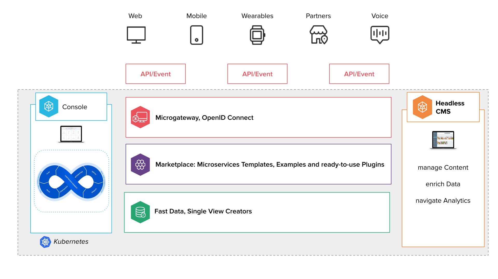

Welcome to the Headless CMS overview page!

Learn how to gain total control over your APIs, from design and security to versioning and retirement.

Deliver information everywhere with an API-centric approach. Design and manage your APIs, decouple your systems from your data and open to third-party business opportunities.

### Micro API Gateway

A lightweight solution to design, secure, consume and monetize your APIs. Manage accesses and requests, define endpoints, secure headers, apply micro-cache logics, rewrite URLs, version and retire REST and GraphQL API.

### Service Mesh

Easily create a network of deployed services with all the critical capabilities you need, including load balancing, service-to-service authentication, authorization, encryption, monitoring, and support for the circuit breaker
pattern.

### API Portal

Real-time auto-generated [documentation](/runtime_suite/api-portal/10_overview.md) of your development services. Test live your APIs, synchronize documentation, client libraries and source code, and get all the information you need in OpenAPI Specification.

### Headless CMS

A practical and intuitive interface to Create, Read, Update and Delete content on APIs, independently from the front-ends. Control different types of Users, Customize CMS and dashboards for your business and deliver a real Omnichannel Customer Experience.

### CMS Site

A microservice providing a web interface to help users directly interact with the CMS.

### Analytics

Take decisions leveraging the power of your data. Set your KPIs and monitor your performances in real time with beautiful dashboards.
Get an omnichannel view of your users and products and turn into a data-driven Company.
Discover how to configure your [Analytics from the Console](/microfrontend-composer/previous-tools/analytics/config_analytics.md) and how to set them through [JSON files](/microfrontend-composer/previous-tools/analytics/conf_analytics.md).
