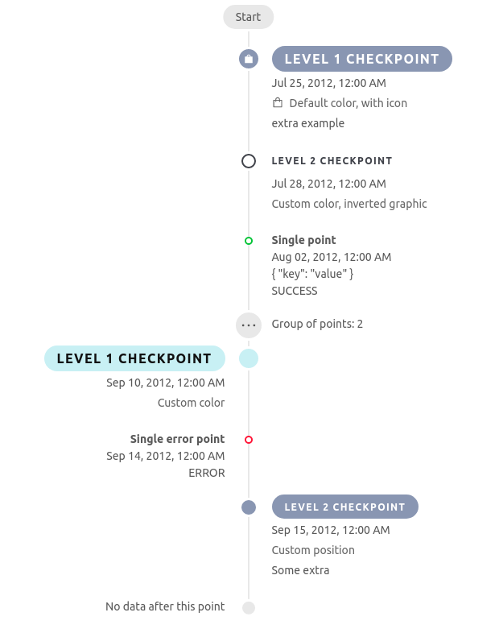
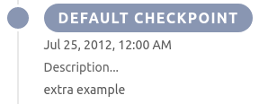
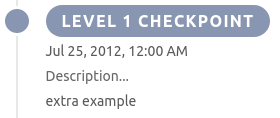
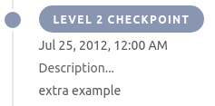
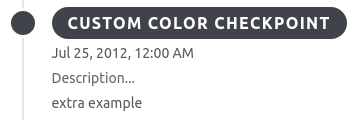
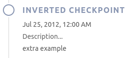
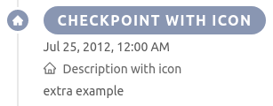
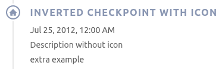

This generic frontend can be used to visualize data on a timeline. It requires a specific format for data exposed on a
certain endpoint.



### Url format

The application requires to be opened on a specific url which serves as configuration. The url format is
`/:resourceCollection/:resourceId` and is used to generate both target endpoints for data
`/timeline/:resourceCollection/json` and for live search `/v2/:resourceCollection`.

Allowed query strings are:

- `selected`: used to prefill the input search and automatically search for data;

- `liveSearch`: enables live search when set to `true`.

## Checkpoint customization

By default a **checkpoint** looks like the following image:



### Level

The top-level property `level` defines the importance of the displayed data. Higher the level, lower the importance and, consequently,
a smaller checkpoint dot and title will be rendered. As of now the available levels are **1** (default) and **2**.




### Styling

The style of the checkpoint can be customized through the top-level object property `style`. The property itself and all
of its attributes are optional.

#### Custom color

The property `primaryColor` allows to define the main color of the checkpoint. The value has to be a valid hex color
code (for example: `#8c96b4`).



#### Inverted graphic

The property `inverted` allows to specify if the dot and title coloring pattern have to be inverted. The value must be a boolean
(default `false`).



#### Icons

The property `icon` allows to define the name of the icon to visualize inside of the checkpoint dot (*only for level 1*,
by default no icon is rendered).

Through the flag `iconInDescription` one can specify if the icon has to be displayed also in the description (*works for
both level 1 and 2*, default false).

The selectable icons are the ones provided by ant.design v3 and can be found [here](https://3x.ant.design/components/icon/).




#### Custom positioning

By default, level 1 checkpoints define the positioning of all the following elements with lower importance (the first element of the timeline
is on the right).

The property `position` allows to define a custom position for a checkpoint. If the checkpoint is of level 1, the custom
position will affect all the following elements, while if it is of level 2, the custom position will only affect that
particular element, and the following ones will maintain the default positioning.

Possible values for the property are `left` or `right`.

### JsonSchema of the data read by the Timeline

```
{
    "type": "array",
    "items": {"$ref": "#/definitions/node"},
    "required": ["items"],
    "definitions": {
        "node": {
           "oneOf": [
                {"$ref": "#/definitions/point"},
                {"$ref": "#/definitions/checkpoint"},
                {"$ref": "#/definitions/separator"}
            ]
        },
        "checkpoint": {
            "type": "object",
            "properties": {
                "type": {"type": "string", "enum": ["checkpoint"]},
                "level": {
                    "type": "number",
                    "multipleOf": 1.0,
                    "minimum": 1,
                    "maximum": 2,
                    "default": 1
                },
                "style": { "$ref": "#/definitions/checkpointStyle" },
                "data": {
                    "type": "object",
                    "properties": {
                        "name": {"type": "string"},
                        "detail": { "$ref": "#/definitions/dataPoint"}
                    },
                    "additionalProperties": false,
                    "required": ["name"]
                }
            },
            "required": ["type", "data"]
        },
        "point": {
            "type": "object",
            "properties": {
                "type": {"type": "string", "enum": ["point"]},
                "data": {"$ref": "#/definitions/dataPoint"}
            },
            "required": ["type", "data"]
        },
        "separator": {
            "type": "object",
            "properties": {
                "type": {"type": "string", "enum": ["separator"]},
                "data": {
                    "type": "object",
                    "properties": {
                        "name": {"type": "string"},
                        "description": {"type": "string"}
                    },
                    "additionalProperties": false,
                    "required": ["name"]
                }
            },
            "required": ["type", "data"]
        },
        "checkpointStyle": {
            "type": "object",
            "properties": {
                "primaryColor": { "type": "string" },
                "inverted": { "type": "boolean" },
                "icon": { "type": "string" },
                "iconInDescription": { "type": "boolean" },
                "position": {
                    "type": "string" ,
                    "enum": ["left", "right"]
                }
            },
            "additionalProperties": false,
        },
        "dataPoint": {
            "type": "object",
            "properties": {
                "group": {
                    "type": "object",
                    "properties": {
                        "id": {"type": "string"},
                        "description": {"type": "string"}
                    },
                    "required": ["id"]
                },
                "description": {"type": "string"},
                "date": {"type": "string"},
                "status": {
                    "type": "string",
                    "enum":["default", "success", "error", "info", "warn"],
                    "default": "default"
                },
                "extra": {
                    "type": "array",
                    "items": {
                        "type": "string"
                    },
                    "default": []
                }
            },
            "additionalProperties": false,
            "required": ["date"]
        }
    }
}
```

:::tip
The result shown in the picture at the top of this page can be achieved passing the following data:

    ```JSON
    [
        {
          'type': 'checkpoint',
          'style': {
            'icon': 'shopping',
            'iconInDescription': true
          },
          'data': {
            'name': 'Level 1 checkpoint',
            'detail': {
              'description': 'Default color, with icon',
              'date': new Date('25 July 2012').toISOString(),
              'extra': ['extra example'],
              'status': 'success'
            }
          }
        },
        {
          'type': 'checkpoint',
          'level': 2,
          'style': {
            'primaryColor': '#41434b',
            'inverted': true
          },
          'data': {
            'name': 'Level 2 checkpoint',
            'detail': {
              'description': 'Custom color, inverted graphic',
              'date': new Date('28 July 2012').toISOString(),
              'extra': [],
              'status': 'success'
            }
          }
        },
        {
          'type': 'point',
          'data': {
            'description': 'Single point',
            'date': new Date('02 August 2012').toISOString(),
            'extra': ['{ "key": "value" }'],
            'status': 'success'
          }
        },
        {
          'type': 'point',
          'data': {
            'group': {
              'id': '1234',
              'description': 'Group of points'
            },
            'description': 'Collapsed, error point',
            'date': new Date('25 August 2012').toISOString(),
            'extra': [],
            'status': 'error'
          }
        },
        {
          'type': 'point',
          'data': {
            'group': {
              'id': '1234',
              'description': 'Group of points'
            },
            'description': 'Collapsed, success point',
            'date': new Date('26 August 2012').toISOString(),
            'extra': ['FOO', 'BAR'],
            'status': 'success'
          }
        },
        {
          'type': 'checkpoint',
          'level': 1,
          'style': {
            'primaryColor': '#d0f0f5'
          },
          'data': {
            'name': 'Level 1 checkpoint',
            'detail': {
              'description': 'Custom color',
              'date': new Date('10 September 2012').toISOString(),
              'extra': [],
              'status': 'error'
            }
          }
        },
        {
          'type': 'point',
          'data': {
            'description': 'Single error point',
            'date': new Date('14 September 2012').toISOString(),
            'extra': [],
            'status': 'error'
          }
        },
        {
          'type': 'checkpoint',
          'level': 2,
          'style': {
            'position': 'right'
          },
          'data': {
            'name': 'Level 2 checkpoint',
            'detail': {
              'description': 'Custom position',
              'date': new Date('15 September 2012').toISOString(),
              'extra': ['Some extra'],
              'status': 'success'
            }
          }
        }
    ]
    ```
:::
