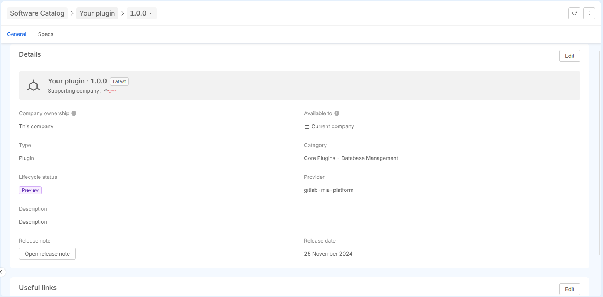

:::info
Editing items is only possible for users with the necessary permissions: Project Administrator or Company Owner.
:::

The ability to edit items in the Software Catalog depends on whether the item supports versioning:

- **Item without versioning support**: If an item does not support versioning, you can edit all fields, including the technical details (assets), without any restrictions.

- **Item with versioning support**: If an item supports versioning, editing capabilities are more restricted. Specifically, only the `metadata` of the item can be edited. `Assets` cannot be edited in these versions.
In the case of the NA (Not Available) version, it is treated like any other version. Therefore, only the metadata can be edited, and assets cannot be modified.
If you need to modify the `assets` of an item that supports versioning, you must create a **new version** of the item. This allows you to update the assets and keep track of changes in the version history.

To edit an item, an `Edit` button is available in the relevant tab (e.g., metadata or resources). The availability of this button depends on whether the item is versionable and the specific section you are attempting to edit.

