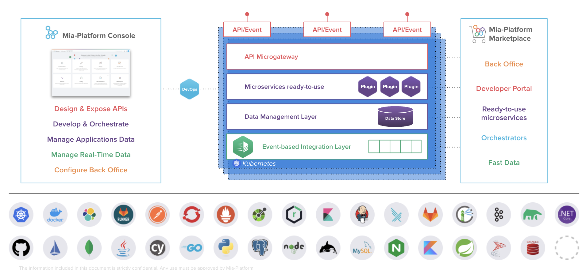

Mia‑Platform provides the first end‑to‑end Digital Integration Hub on the market with a full DevOps Lifecycle Management: one unique Console to run Fast Data, Microservices and APIs.

Here's an overview of Mia-Platform suite:

### Console

Manage your API, Kubernetes clusters, define environments, set up test automation, design and run your CI/CD pipelines controlling your preferred tools from one unique Console.

Find out more in the [Console section](./../development_suite/overview-dev-suite.md).

### Microservices Ecosystem

A set of ready to use microservices to speed up your applications’ development.

Find out more in the [Microservices Ecosystem](./../runtime_suite/mia-platform-plugins.md) section.

### Fast Data Real-time Single view

Aggregate and map your data to create real-time Single Views.

Find out more in the [Fast Data](./../fast_data/overview.md) section.

### Backoffice

A practical and intuitive interface for non-technical people who can easily manage content over APIs and supervise business analytics.

Find out more in the [Backoffice](./../business_suite/backoffice/overview.md) section.

### More Resources

If you want to know more about Mia-Platform, please visit our [Release Note](../release_notes/release_notes.md) and our [Blog](https://blog.mia-platform.eu/en).
