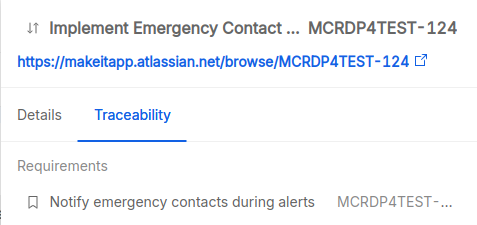

# Changes

## Overview

This section provides an overview of all the change requests managed in the **P4SaMD** project. Each row in the table represents a **P4SaMD Change Request** entity in Jira.
The changes displayed in the table originate from **Jira**, where they are created, updated, and edited, and they update automatically every time a change is modified on Jira.

## Table

Each change listed in the table contains the following information:

- **Title**: A brief description of the identified change and a link to the Jira issue identified by its key.
- **Status**: The status of the change request, actual values depend on the configuration of the corresponding Jira issue type and could include for example `Received`, `Reviewed`, `Completed` and `Refused`.
- **Classification**: The classification of the type, scale and impact of the change, actual values depend on the configuration of the corresponding Jira issue type and could include for example `patch`, `minor` or `major`.
- **Assignee**: The owner of processing the change request.
- **Due Date**: The deadline for the completion and release of the change in the affected software items.
- **Software Items**: The number of software items affected by the change.
- **Requirements**: The number of requirements related to the the change.
- **Risks**: The number of risks that may affect the change.

## Drawer

Clicking on a row opens a drawer displaying detailed information about the selected change.

The drawer shows the following information in two different tabs: **Details** and **Traceability**

### Details

The **Details** tab provides, in addition to the information displayed in the table:

- **Description**: A summary of the change request (current behavior, proposed change, reasons for change, affected components, etc.).
- **Priority**: The level of priority (typically a positive number, where a lower value corresponds to a higher priority).
- **Affected version**: The software component affected by the change.
- **Reporter**: The user who created the change request on Jira.
- **Approval Date**: When the change request was approved.
- **Acceptance criteria**: The criteria to verify and validate that the change has been successfully applied.
- **Notes**: Any additional notes about the change.

### Traceability

The **Traceability** tab shows all the issues linked to the change grouped by:
- **Software Items**
- **Risk Control Measures**
- **Changes**

You can click on any linked item to see its details.