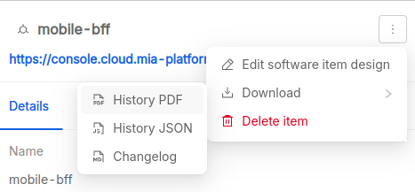

# Documentation

**Mia-Care P4SaMD** can automatically generate documentation based on information about managed entities, like [risks][risks], requirements, [tests][tests] and [changes][changes], to ensure compliance with most common documentation requirements outlined in international regulation and standards related to SaMD development.

In the following sections we illustrate the type of documentation you can generate, how you can do it and which information you can expect to find.

:::warning

Documentation completeness and correctness depend on correct and updated information available in the integrated ALM.
If ALM information are missing, incorrect or outdated, the generated documentation may not be generated correctly, lack relevant information or include incorrect or outdated information. 

:::

## Change report

| Available formats | Available for  | Download from |
|:------------------|:---------------|:--------------|
| PDF               | System version | Overview page |

The **Change report** contains a list of all change requests linked to a system version and can be downloaded from the [Overview page][software-system-overview].

For each change, the following information are available:

- **Key**: the identifier with a link to the ALM issue
- **Reporter**: the user who reported the change request
- **Assignee**: the owner of processing the change request.
- **Approval date**: when the change request was approved
- **Due date**: the deadline for the implementation of the change request, if approved
- **Affected version**: the software component affected by the change.
- **Classification**: the classification of the type, scale and impact of the change, actual values depend on the configuration of the corresponding Jira issue type and could include for example `patch`, `minor` or `major`.
- **Priority**: the level of priority (typically a positive number, where a lower value corresponds to a higher priority).
- **Description**: a summary of the change request (current behavior, proposed change, reasons for change, affected components, etc.).
- **Acceptance criteria**: The criteria to verify and validate that the change has been successfully applied.
- **Notes**: Any additional notes about the change.
- **Linked requirements**: the list of requirements related to the the change.
- **Linked risks**: the list of risks that may affect the change.
- **Software Items**: the list of software items affected by the change.

## Changelogs

Mia-Care P4SaMD allows you to download changelogs of software items in PDF format.

The changelog is not generated from ALM entities, but directly from an existing changelog in Markdown format and following the `CHANGELOG.md` naming convention, located in your software item repository.

### Software item

| Available formats | Available for | Download from             |
|:------------------|:--------------|:--------------------------|
| PDF               | Software item | Software Item drawer menu |

You can download the changelog from the drawer that appears when you select a row in the software items table:

### System version

| Available formats  | Available for  | Download from |
|:-------------------|:---------------|:--------------|
| Zip archive of PDF | System version | Overview page |

From the [Overview page][software-system-overview] you can download a zip archive containing all the available changelogs of software items linked to the system version.
Each changelog in the archive is named according the software item name and version.

## Release notes

| Available formats | Available for  | Download from |
|:------------------|:---------------|:--------------|
| PDF               | System version | Overview page |

The **Release notes** contain the list of all requirements and the hierarchy of software items (name and version) linked to the system version.
You can download it from the [Overview page][software-system-overview].

## Risk report

| Available formats | Available for  | Download from |
|:------------------|:---------------|:--------------|
| PDF               | System version | Overview page |

The **Risk report** contains a detailed list of all risks linked to a system version and can be downloaded from the [Overview page][software-system-overview].

For each risk, the following information are available:

- **Title**: A brief description of the identified risk and a link to the Jira Issue represented by its Key.  
- **Key**: identifier of the risk in the integrated ALM
- **Type**: type of risk
- **Status**: status of the risk
- **Assignee**: owner of assessing the risk
- **Hazardous situation**: The specific scenario in which the risk could occur.  
- **Sequence of events**: The conditions leading to the risk.  
- **Hazard**: The nature of the risk and its potential consequences.  
- **Harm**: The expected negative impact.  
- **Severity**: A numerical value representing the potential impact of the risk.  
- **Probability**: A numerical value indicating the likelihood of the risk occurring.  
- **Risk**: A classification based on probability and severity. [Levels][risks-levels]
- **Description**: A paragraph describing the risk.
- **Software Items**: The number of software items affected by the risk (name, version).
- **Risk Control Measures (RCM)**: A list of risk control measures that mitigate the risk (key, title, link)
- **Mitigated probability**: A number indicating how much the **RCM** mitigates probability.
- **Mitigation severity**: A number indicating how much the **RCM** mitigates severity.
- **Residual Risk**: The remaining level of risk after mitigation measures are applied. [Levels][risks-levels]

## Software Item History

| Available formats | Available for | Download from             |
|:------------------|:--------------|:--------------------------|
| JSON, PDF         | Software Item | Software Item drawer menu |

The Software Item History report contains a log of the changes performed on a software item, from the most recent to the least, and can be download from the drawer that appears when you select a row in the software items table.

This report is available in two formats:

- **JSON**: the machine-readable version, including all the available information and suitable for further automated processing;
- **PDF**: the readable version, including the most relevant information for regulatory and compliance purposes.

For each history item the report includes the following information:

- the operation performed (e.g. approval, link creation/update/removal, …);
- the user who performed the operation;
- when the operation was performed;
- additional details about the operation performed (e.g. which fields were changed, which entity was linked, …).

## SBOM report

| Available formats | Available for  | Download from       |
|:------------------|:---------------|:--------------------|
| Excel (.xlsx)     | System version | Software Items page |

The SBOM report contains the list of dependencies of all custom services linked to a system version and can be downloaded from the **Software Items** page.

For additional information about the Software Bill of Materials (SBOM), please take a look at the [dedicated page][sbom].

## SOUP report

| Available formats | Available for  | Download from |
|:------------------|:---------------|:--------------|
| Excel (.xlsx)     | System version | Overview page |

The SOUP report contains information about *Software of Unknown Provenance* (SOUP) and can be downloaded from the [Overview page][software-system-overview].

The spreadsheet contains two tabs:

- `Info`: document generation metadata, including when it was generated (in `dd/mm/yyyy` format) and who generated it (user name and email address);
- `SOUP Report`: the list of SOUPs, with the following information:
  - **Name**: the name of th software item;
  - **Version**: the version of the software item;
  - **Approved?**: if the software item is approved;
  - **Approver**: who approved the software item;
  - **Approval Date**: when the software item was approved;
  - **Medical Device**: if the software item is classified as SaMD;
  - **Class**: the SaMD classification according to FDA, EU MDR, IMDRF or similar international regulations or standard;
  - **Design Reference**: a link to design specifications;
  - **Manufacturer**: the name of the software item manufacturer;
  - **Verification Reason**: information about the software item verification rationale and outcome;
  - **License**: the software item license;
  - **Required Software and Hardware**: software and hardware requirements. 

## Test report

| Available formats | Available for  | Download from |
|:------------------|:---------------|:--------------|
| PDF               | System version | Overview page |

The **test report** contains a list of all tests linked to a system version, including their executions, and can be downloaded from the [Overview page][software-system-overview].

For each test, the following information are available:

- **Title**: the unique identifier (ID or key) and title of the test;
- **Key**: the identifier of the test in the ALM;
- **Type**: the type of test, like integration or system;
- **Status**: the status of the test, based on the outcome of the last execution;
- **Assignee**: the owner of the test;
- **Execution Mode**: how the test is executed (typically automatic or manual);
- **Description**: a detailed description of the test, including the scope and procedure;
- **Requirements**: the list of requirements covered by the test, with key, title and link to the ALM issue;
- **Software Items**: the list of software items associated to the test, with name and version;
- **Test executions**: the list of test execution, from most to least recent:
  - **Execution date**: when the test was executed;
  - **Tester**: who executed the test;
  - **Outcome**: if the test passed or failed.

## Unit Test report

| Available formats  | Available for  | Download from |
|:-------------------|:---------------|:--------------|
| Zip archive of PDF | System version | Overview page |

The **Unit Test report** contains the outcome of the automated test suites linked to the software items of a software system and can be downloaded from the [Overview page][software-system-overview].
Each report in the archive is named according the software item name and version it refers to.

Each report provides a list of test suites with the following information:

- **Name**: name of the test suite;
- **Tests**: number of tests executed;
- **Errors**: number of errors occurred;
- **Failures**: number of tests failed;
- **Skipped**: number of tests skipped; 
- **Time**: how much time the test suite required to finish.

For each test case in the test suite the following information are provided:

- **Test Case**: name of the test case;
- **Class**: description of the test case;
- **Time**: how much time the test case required to finish.

[software-system-overview]: overview.md
[changes]: changes.md
[risks]: risks.md
[risks-levels]: risks.md#levels
[sbom]: sbom.md
[tests]: verification.md