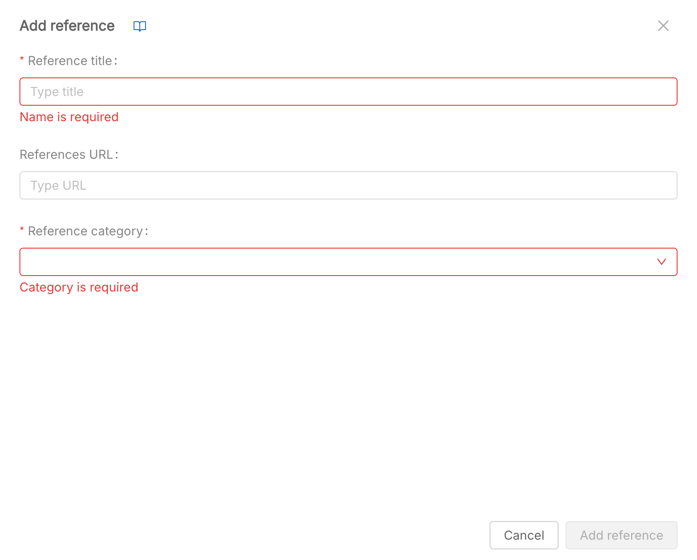

# References

## Overview
This table provides an overview of different references for the project, displaying their name, URL, and category. From this section, you have access to the references table on the product page by navigating to the **reference** tab.

## 1. Create a Reference

1. **Click the "Add reference" Button**  
   This will open the modal to create a new reference.

2. **Fill in the Required Fields**  
   In the modal, you need to fill out the **Reference title** field.  
   Fill in the required fields as needed  
   Choose a category between the available ones:
    - Plan
    - SOP
    - Standard
    - Regulation
    - Guideline
    - Other

3. **Save the New Reference**  
   Once you've completed the form, click the **"Add Reference"** button at the end of the modal to create and save the new reference.

## 2. Reference Table
For each reference, the following informations are available:
- **Title** (required): The name of the reference.
- **URL**: The URL to the reference web page
- **Category** (required): The category of the reference.  

## 3. Reference Actions
On the last column, you can click on the icons to edit or remove a reference, if needed. Be careful: once removed, a reference is permanently deleted and cannot be recovered.
