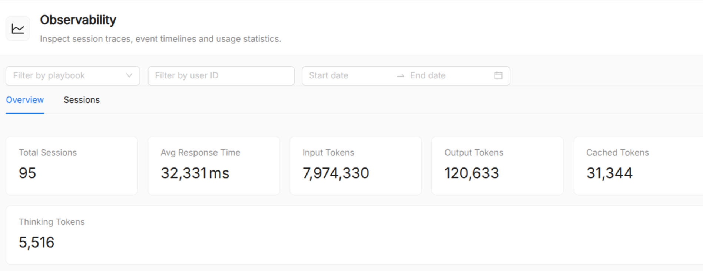

:::caution Beta

AI Foundry is in **beta**. We are actively shaping the product, so things may change as we iterate. Your feedback is welcome.

:::

# Observability

The **Observability** page gives you real-time visibility into how your agents and playbooks are performing in production. It surfaces aggregate usage statistics, charts, and a searchable session list, making it easier to diagnose problems, monitor costs, and understand usage patterns across your AI workloads.

## Getting there

Navigate to **Observability** from the left sidebar. The page is split into two tabs:

- **Overview** (aggregate metrics and charts)
- **Sessions** (a searchable log of individual sessions).

## Filter bar

All views on the Observability page are driven by a shared filter bar at the top:

| Filter       | Description                                                                                      |
| ------------ | ------------------------------------------------------------------------------------------------ |
| **Playbook** | Select a specific playbook to narrow metrics and session list to that playbook's activity.       |
| **Date range** | Pick a start and end date. Metrics and charts update to cover only the selected time window.   |
| **User ID**  | Optionally enter a user ID to filter sessions belonging to a specific end user.                  |

## Overview tab

The Overview tab shows aggregate statistics and time-series charts for the selected filter scope.

### Statistics cards

Six summary cards appear at the top of the Overview:

| Metric                   | Description                                                         |
| ------------------------ | ------------------------------------------------------------------- |
| **Total Sessions**       | Number of agent sessions recorded in the selected window.           |
| **Avg Response Time**    | Mean end-to-end response latency in milliseconds.                   |
| **Input Tokens**         | Total tokens sent to LLM providers (prompt + context).              |
| **Output Tokens**        | Total tokens generated by LLM providers.                            |
| **Cached Tokens**        | Tokens served from the provider's prompt cache (reduces cost).      |
| **Thinking Tokens**      | Tokens consumed by extended-thinking / reasoning steps (if enabled).|

### Charts

Below the cards, four charts visualise trends over the selected time range:

- **Success / failure rate**: Pie chart showing the proportion of sessions that completed successfully versus those that ended in an error.
- **Agent distribution**: Bar chart showing how many sessions used each agent.
- **Tool usage frequency**: Bar chart showing the most frequently called tools across all sessions.
- **Sessions over time**: Line chart showing session volume per day/hour.
- **Token consumption over time**: Stacked area chart breaking down input, output, cached, and thinking tokens per day/hour.

## Sessions tab

The Sessions tab lists every recorded session in a paginated table, with 20 rows per page.

### Columns

| Column            | Description                                                              |
| ----------------- | ------------------------------------------------------------------------ |
| **Agent/Playbook**| The playbook (or agent) that handled the session.                        |
| **Session ID**    | Truncated session identifier; hover to see the full ID.                  |
| **Session name**  | Human-readable label for the session (if set by the caller).             |
| **User ID**       | The end-user identifier passed at session creation time.                 |
| **Events**        | Total number of events recorded in the session.                          |
| **Duration**      | Wall-clock duration from the first to the last event.                    |
| **Tokens**        | Compact token summary (↑ input, ↓ output, cached, thinking).             |

### Opening a session

Click any row to open the **Session Detail** page for that session, or use the drawer preview to inspect the event timeline without leaving the list.

## Session Detail page

The Session Detail page (`/observability/sessions/:sessionId`) provides a full trace of a single session.

### Event timeline

Events are displayed in chronological order. Each event is annotated with:

- **Type tag** (color-coded): User Message, Agent Message, Tool Call, Tool Response, Handoff, or Other.
- **Timestamp**: When the event occurred.
- **Author**: Which agent produced the event (useful for multi-agent flows).

### Event content

| Event type       | Rendered as                                                                                  |
| ---------------- | -------------------------------------------------------------------------------------------- |
| User/Agent text  | Whitespace-preserved text block.                                                             |
| Tool call        | Collapsible JSON block showing the function name and arguments.                              |
| Tool response    | Collapsible JSON block showing the function result (or error message).                       |
| Inline image     | Base64-decoded image rendered inline.                                                        |

Token usage (input, output, cached, thinking) is shown per event when available from the provider.

## See also

- [Playbook](./basic-concepts/60_playbook.md): multi-step agentic workflows whose sessions are tracked here.
- [Agent](./basic-concepts/10_agent.md): the execution unit whose calls are recorded as events.
- [AI Foundry Overview](./overview.md): platform overview including the AI Playground.
