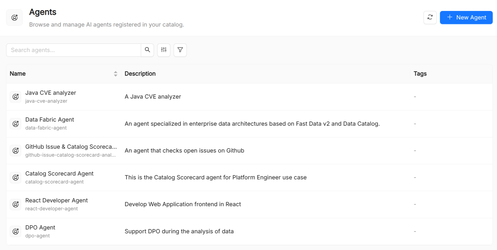

:::caution Beta

AI Foundry is in **beta**. We are actively shaping the product, so things may change as we iterate. Your feedback is welcome.

:::

# Agent

An **Agent** is the central execution unit in AI Foundry. It combines a large language model (LLM) with a set of instructions, tools, and skills to produce a reusable, autonomous AI actor that can carry out a specific task, such as answering questions, calling external APIs, running code, or coordinating with other agents inside a [Playbook](/products/ai-foundry/basic-concepts/60_playbook.md).

## Agent reference

| Field             | Required | Description                                                                                                                 |
| ----------------- | -------- | --------------------------------------------------------------------------------------------------------------------------- |
| `Title`           | Yes      | Display name shown in the UI.                                                                                               |
| `Name`            | Yes      | Unique identifier within the organization. Lowercase alphanumeric and hyphens, max 63 characters. Immutable after creation. |
| `Description`     | Yes      | Short human-readable description of what the agent does.                                                                    |
| `Runtime Name`    | Yes      | A unique identifier used by the runtime to route requests to this agent. Typically matches `metadata.name`.                 |
| `Model`           | Yes      | The `name` of a [Model](/products/ai-foundry/basic-concepts/20_model.md) resource that provides the LLM configuration.                                        |
| `Instruction`     | Yes      | The system prompt sent to the LLM on every invocation. Supports Markdown.                                                   |
| `Tools`           | No       | List of [Tool](/products/ai-foundry/basic-concepts/40_tool.md) resource names the agent is allowed to call.                                                   |
| `Skills`          | No       | List of [Skill](/products/ai-foundry/basic-concepts/50_skill.md) resource names the agent can invoke.                                                         |
| `Model Arguments` | No       | A free-form JSON object passed through to the LLM provider (e.g. `temperature`, `max_tokens`).                              |

## Designing effective agents

**Keep instructions focused.** Agents with a narrow, well-defined purpose outperform general-purpose agents. Prefer composing specialized agents in a [Playbook](/products/ai-foundry/basic-concepts/60_playbook.md) over loading a single agent with too many responsibilities.

**Constrain the tool surface.** Attach only the tools the agent actually needs. A smaller tool surface reduces the chance of the LLM making unintended calls and improves latency.

**Version your instructions.** The `instruction` field is the most impactful part of an agent. Treat it like code: review changes, test them in the [AI Playground](/products/ai-foundry/overview.md#ai-playground), and maintain a changelog.

**Use `model_arguments` sparingly.** Low `temperature` values (0–0.3) are suitable for deterministic tasks like data extraction or classification. Higher values (0.7–1.0) suit creative or exploratory use cases.

## Testing an agent

The **AI Playground** provides a live chat interface where you can send messages to any registered agent and observe:

- The LLM's reasoning steps ("thinking") when available
- Tool call requests and their results
- The final response

You can toggle individual tools and skills on or off during a session to debug behavior without modifying the agent manifest.

## See also

- [Model](/products/ai-foundry/basic-concepts/20_model.md): LLM configurations that back agents.
- [Tool](/products/ai-foundry/basic-concepts/40_tool.md): executable functions agents can call.
- [Skill](/products/ai-foundry/basic-concepts/50_skill.md): reusable capabilities that agents can invoke.
- [Playbook](/products/ai-foundry/basic-concepts/60_playbook.md): multi-step workflows that orchestrate agents.
