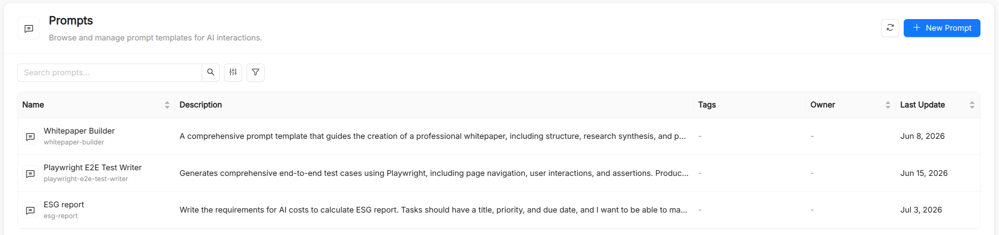

# Prompt

A **Prompt** is a catalog resource that stores a reusable piece of text, typically a user message, an instruction template, or a few-shot example set, that [Playbooks](/products/ai-foundry/basic-concepts/21_playbook.md) can reference by name.

Centralizing prompt text in the catalog keeps it searchable, reusable, and decoupled from the resources that consume it. When a prompt needs to change you update it in one place, and every playbook that references it, as well as every IDE it is exported to, picks up the new version.

## Why centralize prompts?

Prompt engineering is an iterative process. Prompt strings scattered across agent definitions or hard-coded in application code are difficult to audit, compare, or collaborate on. Treating prompts as first-class catalog resources gives you:

- **Reuse.** Multiple playbooks can reference the same prompt without duplicating text.
- **Discoverability.** Prompts are listed and searchable in the AI Foundry UI, with full-text and tag-based filtering.
- **Separation of concerns.** Prompt authors, often domain experts or technical writers, can work independently from the engineers who wire agents together.
- **Consistency across tools.** The same prompt is offered in the AI Playground and in your IDE as a slash command.

## Prompt reference

Besides the common metadata (`Title`, `Name`, `Description`, and optional `Tags`), a prompt has a single spec field. The `Name` is auto-derived from the title, can contain lowercase letters, digits, dots, and hyphens (starting and ending with a letter or digit, up to 63 characters), and is immutable after creation. Playbooks reference it in `spec.prompts`.

| Field    | Type   | Required | Description                                                                                                  |
| -------- | ------ | -------- | ------------------------------------------------------------------------------------------------------------ |
| `prompt` | string | Yes      | The full prompt text, in Markdown. The form provides a Markdown editor with an **Edit**/**Preview** toggle. |

## Where prompts are used

- **AI Playground.** The prompts attached to the selected playbook are offered as slash prompts: type `/` at the start of the message box, or use the slash button, and pick a prompt to insert its text into the input.
- **IDEs and coding assistants.** When you download a playbook or a prompt from **Connections**, or subscribe to the plugin marketplace, prompts are exported in the format each tool expects. For example, they become slash commands in `.claude/commands/<name>.md` for Claude Code and prompt files in `.github/prompts/<name>.prompt.md` for GitHub Copilot, Cursor, JetBrains, and Antigravity. Amazon Kiro receives them as steering documents with manual inclusion.

When a prompt is exported, its description is added as frontmatter. If the prompt text already starts with a YAML frontmatter block (`---`), it is exported verbatim, so you can control tool-specific options such as `argument-hint` directly from the prompt.

## Prompt content guidelines

**Be explicit about role and constraints.** Clearly state what the LLM should and should not do. Vague prompts produce inconsistent outputs.

**Use Markdown for structure.** Headings, bullet lists, and code blocks inside the prompt text help the LLM distinguish sections of a long instruction.

**Document placeholders.** If the prompt expects the user to fill in some context (for example, a ticket to triage), say so in the prompt's description so that consumers know what they must provide.

**Keep prompts composable.** Prefer short, focused prompts that address one concern. A playbook can reference several prompts rather than bundling everything into one.

## See also

- [Playbook](/products/ai-foundry/basic-concepts/21_playbook.md): multi-agent flows that reference prompts in `spec.prompts`.
- [Agent](/products/ai-foundry/basic-concepts/20_agent.md): agents carry their own system instructions, separate from prompts.
- [Skill](/products/ai-foundry/basic-concepts/12_skill.md): reusable capabilities that bundle instructions with references, templates, and scripts.
- [Spec Templates](/products/ai-foundry/basic-concepts/16_spec.md): longer, structured specification documents referenced by playbooks.
