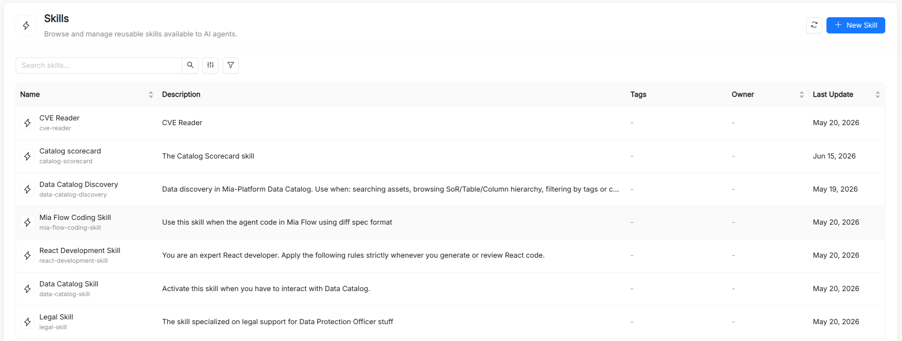

# Skill

A **Skill** is a catalog resource that packages a specialized guideline to accomplish a task. Where a [Tool](/products/ai-foundry/basic-concepts/13_tool.md) wraps a single atomic operation (call this API, run this query), a skill captures a multi-step capability together with the knowledge, templates, and scripts needed to exercise it, for example "summarize a document", "classify intent", or "draft a reply in brand voice".

Skills can be attached to [Agents](/products/ai-foundry/basic-concepts/20_agent.md) and [Playbooks](/products/ai-foundry/basic-concepts/21_playbook.md), so the same capability can be shared across many agents without duplicating its instructions. Skills follow the `SKILL.md` format used by coding assistants, so the same skill also works in your IDE once exported.

## Skill reference

Besides the common metadata (`Title`, `Name`, `Description`, and optional `Tags`), a skill has the spec fields below. The `Name` is auto-derived from the title, can contain lowercase letters, digits, dots, and hyphens (starting and ending with a letter or digit, up to 63 characters), and is immutable after creation. It is referenced in `Agent.spec.skills` and `Playbook.spec.skills`. The `Description` matters: it is what tells the model when the skill is relevant.

| Field      | Type   | Required | Description                                                                                                                             |
| ---------- | ------ | -------- | --------------------------------------------------------------------------------------------------------------------------------------- |
| `manifest` | string | Yes      | The full skill instructions in Markdown (the content of `SKILL.md`). The form provides a Markdown editor with an **Edit**/**Preview** toggle. |
| `refs`     | object | No       | Reference documents, as a map of file name to Markdown content (for example style guides or domain glossaries).                        |
| `assets`   | object | No       | Asset files, as a map of file name to content (for example templates, schemas, API docs, or examples).                                  |
| `scripts`  | object | No       | Executable scripts, as a map of file name to source code (`.py`, `.sh`, or `.bash`).                                                    |

In the creation form, **Refs**, **Assets**, and **Scripts** are editable lists of file name and content pairs. A **JSON** view lets you edit the whole spec directly.

## How agents use skills

Skills are loaded on demand rather than pasted into the agent's instructions. The agent sees the name and description of each attached skill and, when a request matches, loads the skill's manifest and then only the reference or asset files it needs. Scripts bundled with a skill run in a sandboxed code executor.

In the **AI Playground** you can enable or disable individual skills for a live session, without modifying the agent or the playbook. A disabled skill cannot be listed or loaded by the agent.

## Exporting skills to IDEs

Skills are exported, on their own or as part of a playbook plugin, in the layout each coding assistant expects:

| Target                                                | Location                                                                                                  |
| ----------------------------------------------------- | --------------------------------------------------------------------------------------------------------- |
| Claude Code                                           | `.claude/skills/<name>/SKILL.md`, with `references/`, `templates/` (assets), and `scripts/` subfolders |
| GitHub Copilot (VS Code), Cursor, JetBrains, Antigravity | `.github/skills/<name>/SKILL.md`, with the same subfolders                                              |
| Amazon Kiro                                           | `.kiro/steering/<name>.md`, as a steering document with manual inclusion                                 |

When a skill is exported, its title and description are written as the `SKILL.md` frontmatter. If the manifest already starts with a YAML frontmatter block (`---`), it is exported verbatim.

## Skills vs. tools

| Aspect                  | Skill                                                            | Tool                                                |
| ----------------------- | ---------------------------------------------------------------- | --------------------------------------------------- |
| Abstraction level       | High: a multi-step, knowledge-rich capability                    | Low: a single executable operation                  |
| Where the logic lives   | In the catalog item (`manifest`, `refs`, `assets`, `scripts`)    | In the AI Foundry runtime or on an MCP server       |
| Attached to             | Agents and playbooks                                             | Agents                                              |
| Typical use             | Writing, reasoning, and classification patterns; team procedures | API calls, database queries, web search, code execution |

## See also

- [Agent](/products/ai-foundry/basic-concepts/20_agent.md): attaches skills in `spec.skills`.
- [Playbook](/products/ai-foundry/basic-concepts/21_playbook.md): declares skills at the playbook level and exports them in its plugin.
- [Tool](/products/ai-foundry/basic-concepts/13_tool.md): fine-grained executable capabilities.
- [Prompt](/products/ai-foundry/basic-concepts/11_prompt.md): reusable prompt text, exported as slash commands.
