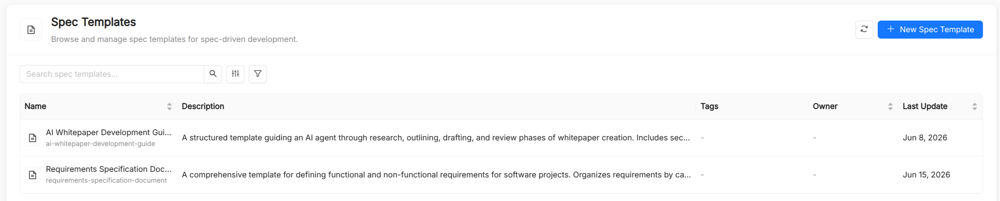

# Spec Templates

A **Spec Template** is a catalog resource that stores a reusable Markdown template driving one step of a **Spec-Driven Development** workflow: a way of working in which AI agents move through structured phases, from requirement definition and clarification through planning, task breakdown, and implementation.

Each template targets one of two frameworks: [Spec Kit](https://github.com/github/spec-kit) (`speckit`), whose workflow is driven by slash commands, or [OpenSpec](https://openspec.dev/) (`openspec`), whose workflow is driven by change documents. The template content is what the agent produces or follows when that step is invoked.

## Spec Template reference

Besides the common metadata (`title`, `name`, `description`, and `tags`), a Spec Template has the following spec fields. The `name` is referenced in `Playbook.spec.spectemplates` and `Playbook.spec.flow.nodes[].spectemplates`.

| Field       | Type              | Required    | Description                                                                                                                  |
| ----------- | ----------------- | ----------- | ---------------------------------------------------------------------------------------------------------------------------- |
| `framework` | string            | Yes         | The Spec-Driven Development framework the template targets: `speckit` (default) or `openspec`.                              |
| `command`   | string            | Conditional | For `speckit` only: the slash command that triggers the template. See [Spec Kit commands](#spec-kit-commands).               |
| `document`  | string            | Conditional | For `openspec` only: the change document the template drives. See [OpenSpec documents](#openspec-documents).                 |
| `template`  | string (Markdown) | Yes         | The Markdown template produced or followed by the command or document.                                                      |

In the **Create Spec Template** form, the **Configuration** section shows **Framework** as a toggle; depending on the choice, it then asks for a **Command** or a **Document**. The **Template** editor has **Edit** and **Preview** modes, and you can let AI Foundry generate a first draft of the title, description, and template content from a short description.

## When to use a Spec Template

Spec Templates are appropriate when you want an agent to follow a consistent structure for:

- **Project principles**: the coding guidelines and constraints every change must respect.
- **Feature specifications**: the sections a specification must contain and the level of detail expected.
- **Technical plans and task lists**: how a plan is broken down into ordered, atomic tasks.
- **Change proposals and design notes**: the shape of an OpenSpec change and its spec deltas.
- **Review checklists**: the readiness checks to run before a build or a release.

## Spec Kit commands

When `framework` is `speckit`, the `command` field binds the template to one of these phases:

| Command              | Purpose                                                       |
| -------------------- | ------------------------------------------------------------- |
| `/spec.constitution` | Establish project principles and coding guidelines            |
| `/spec.specify`      | Write a detailed feature specification                        |
| `/spec.clarify`      | Generate targeted clarifying questions before writing a spec  |
| `/spec.plan`         | Produce a technical architecture plan from a spec             |
| `/spec.tasks`        | Break a plan into an ordered, atomic task list                |
| `/spec.analyze`      | Analyze existing code for patterns and anti-patterns          |
| `/spec.checklist`    | Run a pre-build readiness check on a spec or plan             |
| `/spec.implement`    | Implement a specific task from the task list                  |
| `/spec.memory`       | Update the persistent project memory with finalized decisions |

## OpenSpec documents

When `framework` is `openspec`, the `document` field binds the template to one document of an OpenSpec change:

| Document     | Purpose                                                                  |
| ------------ | ------------------------------------------------------------------------ |
| `proposal`   | The change proposal: what changes and why                                |
| `tasks`      | The task breakdown of the change                                         |
| `design`     | The design notes of the change                                           |
| `spec-delta` | A spec delta, listing the added, modified, and removed requirements      |

## Using Spec Templates

- **In playbooks**: attach templates at the playbook level or to individual nodes, so the agents of a [Playbook](/products/ai-foundry/basic-concepts/21_playbook.md) receive them when the corresponding step runs.
- **In your editor**: when you download assets from **Connections**, Spec Kit templates are written under `.specify/templates/` and OpenSpec templates under `openspec/templates/`, where each framework's tooling picks them up.

## Spec Templates vs. Prompts

| Aspect       | Spec Template                                         | Prompt                                     |
| ------------ | ----------------------------------------------------- | ------------------------------------------ |
| Purpose      | Structure of one Spec-Driven Development step         | Instructions, templates, few-shot examples |
| Typical size | Medium to large (full documents)                      | Short to medium (focused instructions)     |
| Bound to     | A Spec Kit command or an OpenSpec document            | A slash command of its own                 |
| Rendering    | Markdown with edit/preview toggle                     | Markdown with preview/source toggle        |

In practice the two complement each other: a playbook node might receive a Prompt with the task at hand, while a Spec Template defines the structure of the document the node must produce.

## See also

- [Playbook](/products/ai-foundry/basic-concepts/21_playbook.md): references spec templates at the playbook and node level.
- [Prompt](/products/ai-foundry/basic-concepts/11_prompt.md): shorter, instruction-oriented text resources.
- [Skill](/products/ai-foundry/basic-concepts/12_skill.md): reusable capabilities that can accompany spec templates in a playbook.
