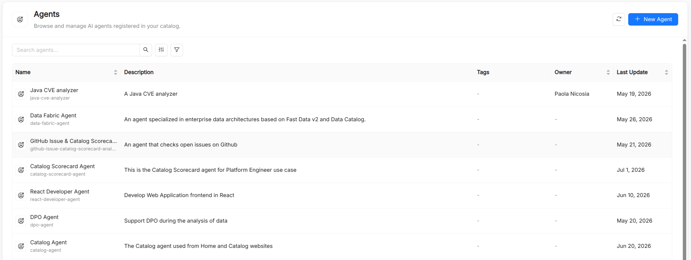

# Agent

An **Agent** is the central execution unit in AI Foundry. It combines a large language model (LLM) with a set of instructions, tools, skills, and guardrails to produce a reusable AI actor that carries out a specific task, such as answering questions, calling external APIs, or running code.

An agent answers a single request on its own. To combine several agents in a conversation, you connect them in a [Playbook](/products/ai-foundry/basic-concepts/21_playbook.md); to run agents as part of a durable, triggerable process, you call that playbook from an [Agentic Workflow](/products/ai-foundry/basic-concepts/22_workflow.md).

## Agent reference

Besides the common metadata of every catalog resource (**Title**, **Name**, **Description**, and **Tags**), an agent has the following spec fields.

| Field               | Type    | Required | Description |
| ------------------- | ------- | -------- | ----------- |
| `runtime_name`      | string  | Yes      | Technical identifier the runtime uses to route requests to this agent. The form derives it from the Title using lowercase letters, digits, and underscores, starting with a letter (for example, `my_assistant`). It differs in format from `Name`, which uses hyphens. |
| `model`             | string  | Yes      | Name of the [Model](/products/ai-foundry/basic-concepts/10_model.md) that provides the LLM configuration. |
| `instruction`       | string  | Yes      | System instructions sent to the LLM on every invocation. Supports Markdown. |
| `tools`             | array   | No       | [Tools](/products/ai-foundry/basic-concepts/13_tool.md) the agent is allowed to call, including tools discovered from [MCP Servers](/products/ai-foundry/basic-concepts/14_mcp-server.md). |
| `skills`            | array   | No       | Names of the [Skills](/products/ai-foundry/basic-concepts/12_skill.md) available to the agent. |
| `guardrails`        | array   | No       | Names of the [Guardrails](/products/ai-foundry/basic-concepts/17_guardrail.md) that the agent's model calls run through. Empty means none. |
| `output_key`        | string  | No       | Name of the session-state entry the agent's final answer is written to. A later agent in the same playbook reads it by writing `{output_key}` in its instructions, or `{output_key?}` when this agent may not have run yet. Must be a valid identifier (letters, digits, and underscores, not starting with a digit). |
| `model_arguments`   | object  | No       | Free-form JSON object passed through to the LLM provider (for example, `temperature` or `max_tokens`). |
| `workspaceTools`    | boolean | No       | Lets the agent read the shared workspace of an [Agentic Workflow](/products/ai-foundry/basic-concepts/22_workflow.md) run, for example a repository cloned by an earlier step. Has no effect outside a run. |
| `workspaceWrites`   | boolean | No       | Lets the agent change files in the run's workspace. Also enables `workspaceTools`. |
| `workspaceCommands` | boolean | No       | Lets the agent run shell commands in the run's workspace. Also enables the other two workspace permissions, and works only when the installation allows commands. |

## Creating an agent

The **Create Agent** page is split into two sections:

- **Overview**: **Title**, **Name**, **Description**, and **Tags**. **Name** is auto-derived from Title and accepts lowercase letters, digits, dots, and hyphens only.
- **Configuration**: **Runtime Name**, **Model**, **Instructions** (a Markdown editor with an **Edit**/**Preview** toggle), **Tools** (grouped by category), **Skills**, **Output Key**, and **Model Arguments**.

The Configuration section can be switched to a JSON mode that edits the spec directly. The workspace permissions are set only in JSON mode.

Guardrails are not part of the creation form. To attach them, open the agent's detail page and edit it: the edit dialog adds a **Guardrails** field. Alternatively, list guardrail names in the `guardrails` field of the JSON spec.

## Memory

When [Memory](/products/ai-foundry/basic-concepts/15_memory.md) is enabled on the installation, every agent uses it: it can recall relevant entries during a conversation and store new facts about the user.

## Designing effective agents

**Keep instructions focused.** Agents with a narrow, well-defined purpose outperform general-purpose agents. Prefer composing specialized agents in a [Playbook](/products/ai-foundry/basic-concepts/21_playbook.md) over loading a single agent with too many responsibilities.

**Constrain the tool surface.** Attach only the tools the agent actually needs. A smaller tool surface reduces the chance of the LLM making unintended calls and improves latency. The same applies to workspace permissions: grant `workspaceCommands` only to agents that must build or test code.

**Version your instructions.** The `instruction` field is the most impactful part of an agent. Treat it like code: review changes, test them in the [AI Playground](/products/ai-foundry/overview.md#ai-playground), and maintain a changelog.

**Use `model_arguments` sparingly.** Low `temperature` values (0–0.3) are suitable for deterministic tasks like data extraction or classification. Higher values (0.7–1.0) suit creative or exploratory use cases.

## Testing an agent

The **AI Playground** runs playbooks, not individual agents. To test an agent, add it to a playbook (a single agent node is enough) and select that playbook in the playground. During the session you can observe:

- The LLM's reasoning steps ("thinking") when available
- Tool call requests and their results
- Hand-offs between agents
- The final response

You can toggle individual tools and skills on or off during a session to debug behavior without modifying the agent.

## See also

- [Model](/products/ai-foundry/basic-concepts/10_model.md): LLM configurations that back agents.
- [Tool](/products/ai-foundry/basic-concepts/13_tool.md): executable functions agents can call.
- [Skill](/products/ai-foundry/basic-concepts/12_skill.md): reusable capabilities that agents can invoke.
- [Guardrail](/products/ai-foundry/basic-concepts/17_guardrail.md): safety and compliance policies attached to agents.
- [Memory](/products/ai-foundry/basic-concepts/15_memory.md): long-term recall across conversations.
- [Playbook](/products/ai-foundry/basic-concepts/21_playbook.md): conversational flows that orchestrate agents.
- [Agentic Workflow](/products/ai-foundry/basic-concepts/22_workflow.md): durable processes that reach agents through playbook steps.
