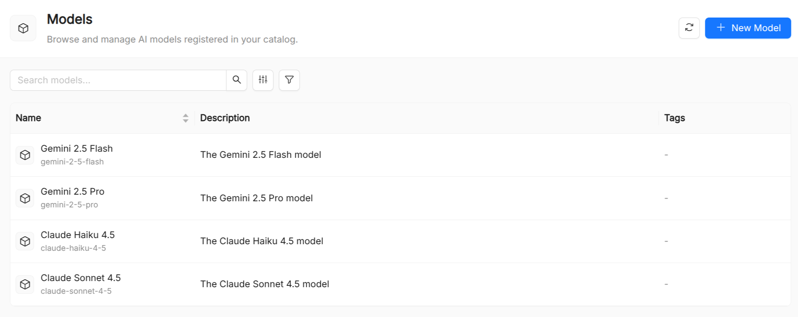

:::caution Beta

AI Foundry is in **beta**. We are actively shaping the product, so things may change as we iterate. Your feedback is welcome.

:::

# Model

A **Model** is a catalog resource that wraps the configuration needed to connect to a large language model (LLM) provider. It decouples the LLM choice from the agents that use it: agents reference a model by name, so swapping the underlying model (or updating API credentials) requires changing only the Model resource without touching any Agent.

.

## Model reference

| Field             | Required | Description                                                                                                                                                                                  |
| ----------------- | -------- | -------------------------------------------------------------------------------------------------------------------------------------------------------------------------------------------- |
| `Title`           | Yes      | Display name shown in the UI and in the agent creation form's model picker.                                                                                                                  |
| `Name`            | Yes      | Unique identifier. Must match the value used in `Agent.spec.model`.                                                                                                                          |
| `Description`     | Yes      | Short description of the model's capabilities or intended use.                                                                                                                               |
| `Type`            | Yes      | Provider identifier string. Common values: `openai`, `anthropic`, `azure`, `ollama/<model>`, `mistral`. Passed to the LLM client unchanged.                                                  |
| `Provider`        | Yes      | Provider name displayed in the UI model picker (e.g. `openai`, `anthropic`, `ollama`).                                                                                                       |
| `Secret`          | No       | Name of the environment variable that holds the API key. The key is never stored in the catalog; only its variable name is.                                                                  |
| `URL`             | No       | Base URL of the LLM API endpoint. Defaults to the provider's public endpoint when omitted. Must be a valid URL.                                                                              |
| `Context Window`  | No       | Maximum context window size in tokens. Informational; surfaced in the model detail view.                                                                                                     |
| `Supports Tools`  | No       | Set to `true` if the model supports tool/function calling. Used by the AI Playground to determine which agent features are available. Defaults to `false`.                                   |
| `Supports Vision` | No       | Set to `true` if the model accepts image inputs. Defaults to `false`.                                                                                                                        |
| `LiteLLM`         | No       | When `true`, requests are routed through a LiteLLM proxy, enabling a unified interface for any provider LiteLLM supports. Defaults to `false`.                                               |
| `Arguments`       | No       | A free-form JSON object with default parameters applied to every request (e.g. `temperature`, `max_tokens`, `top_p`). Individual agents can override these via `Agent.spec.model_arguments`. |

## See also

- [Agent](./10_agent.md): resources that reference a model.
