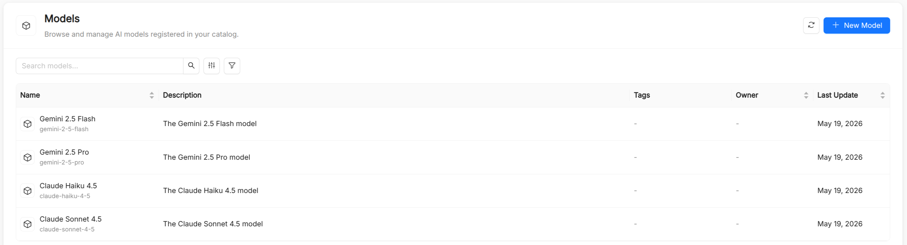

# Model

A **Model** is a catalog resource that wraps the configuration needed to connect to a large language model (LLM) provider. It decouples the LLM choice from the agents that use it: agents reference a model by name, so swapping the underlying model (or updating API credentials) requires changing only the Model resource without touching any Agent.

.

## Model reference

| Field             | Required | Description                                                                                                                                                                                  |
| ----------------- | -------- | -------------------------------------------------------------------------------------------------------------------------------------------------------------------------------------------- |
| `Title`           | Yes      | Display name shown in the UI and in the agent creation form's model picker.                                                                                                                  |
| `Name`            | Yes      | Unique identifier, auto-derived from Title. Lowercase letters, digits, dots, and hyphens only (must start and end with an alphanumeric character), max 63 characters. Immutable after creation. Must match the value used in `Agent.spec.model`.                                                                                                                          |
| `Description`     | Yes      | Short description of the model's capabilities or intended use.                                                                                                                               |
| `Tags`            | No       | Free-form, multi-value tags used to make the model easier to find and filter.                                                                                                                 |
| `Type`            | Yes      | The LiteLLM model identifier string passed directly to the runtime, e.g. `gpt-4o`, `vertex_ai/gemini-pro`, `anthropic/claude-sonnet-5`.                                                      |
| `Provider`        | Yes      | Free-text, human-readable provider label (e.g. `OpenAI`, `Anthropic`, `Google`). Currently informational only — not yet rendered in any AI Foundry UI view.                                  |
| `Secret`          | No       | Name of the environment variable that holds the API key. The key is never stored in the catalog; only its variable name is.                                                                  |
| `URL`             | No       | Free-text reference URL for the model endpoint. Currently informational only — the runtime ignores this field and does not use it to route requests.                                        |
| `Context Window`  | No       | Maximum context window size in tokens. Informational; surfaced in the model detail view.                                                                                                     |
| `Supports Tools`  | No       | Set to `true` if the model supports tool/function calling. Used by the AI Playground to determine which agent features are available. Defaults to `true`.                                    |
| `Supports Vision` | No       | Set to `true` if the model accepts image inputs. Defaults to `false`.                                                                                                                        |
| `LiteLLM`         | No       | Explicit override for whether requests are routed through LiteLLM. The runtime already enables LiteLLM automatically for any model that has a `Type` value set (i.e. essentially always, since `Type` is required) — use this field only to force it off.                                   |
| `Arguments`       | No       | A free-form JSON object with default parameters applied to every request (e.g. `temperature`, `max_tokens`, `top_p`). Individual agents can override these via `Agent.spec.model_arguments`. |

## See also

- [Agent](/products/ai-foundry/basic-concepts/10_agent.md): resources that reference a model.
