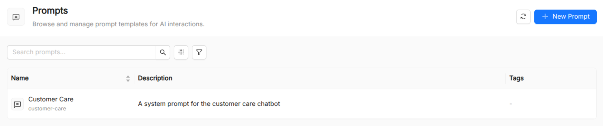

:::caution Beta

AI Foundry is in **beta**. We are actively shaping the product, so things may change as we iterate. Your feedback is welcome.

:::

# Prompt

A **Prompt** is a catalog resource that stores a reusable piece of text (typically a user message, an instruction template, or a few-shot example set) that agents and [Playbooks](/products/ai-foundry/basic-concepts/60_playbook.md) can reference by name.

Centralizing prompt text in the catalog keeps it version-controlled, searchable, and decoupled from the agents that consume it. When a prompt needs to change you update it in one place and every referencing resource benefits automatically.

## Why centralize prompts?

Prompt engineering is an iterative process. Raw prompt strings scattered inside agent definitions or hard-coded in application code are difficult to audit, compare, or collaborate on. Treating prompts as first-class catalog resources gives you:

- **Reuse.** Multiple agents or playbook nodes can reference the same prompt without duplicating text.
- **Discoverability.** Prompts are listed and searchable in the AI Foundry UI, with full-text and tag-based filtering.
- **Separation of concerns.** Prompt authors (often domain experts or technical writers) can work independently from the engineers who wire agents together.
- **Auditability.** Every prompt update is tracked as a new resource version by the Catalog.

## Prompt reference

| Field         | Required | Description                                                                                              |
| ------------- | -------- | -------------------------------------------------------------------------------------------------------- |
| `Title`       | Yes      | Display name shown in the UI.                                                                            |
| `Name`        | Yes      | Unique identifier. Used when referencing the prompt from playbooks.                                      |
| `Description` | Yes      | Short description of the prompt's purpose.                                                               |
| `Prompt`      | Yes      | The full prompt text. Supports Markdown. Rendered with syntax highlighting and a preview pane in the UI. |

## Prompt content guidelines

**Be explicit about role and constraints.** Clearly state what the LLM should and should not do. Vague prompts produce inconsistent outputs.

**Use Markdown for structure.** Headings, bullet lists, and code blocks inside the prompt text help the LLM distinguish sections of a long instruction.

**Document placeholders.** If the prompt uses template variables (e.g. `{{ticket_content}}`), document them in `metadata.description` so consumers know what context they must provide.

**Keep prompts composable.** Prefer short, focused prompts that address one concern. A playbook can inject multiple prompts into different nodes rather than bundling everything into one.

## See also

- [Playbook](/products/ai-foundry/basic-concepts/60_playbook.md): workflows that reference prompts at the playbook and node level.
- [Agent](/products/ai-foundry/basic-concepts/10_agent.md): agents carry their own `instruction` field but can also receive prompt context from a playbook.
- [Spec](/products/ai-foundry/basic-concepts/80_spec.md): for longer, structured specification documents referenced by playbooks.
