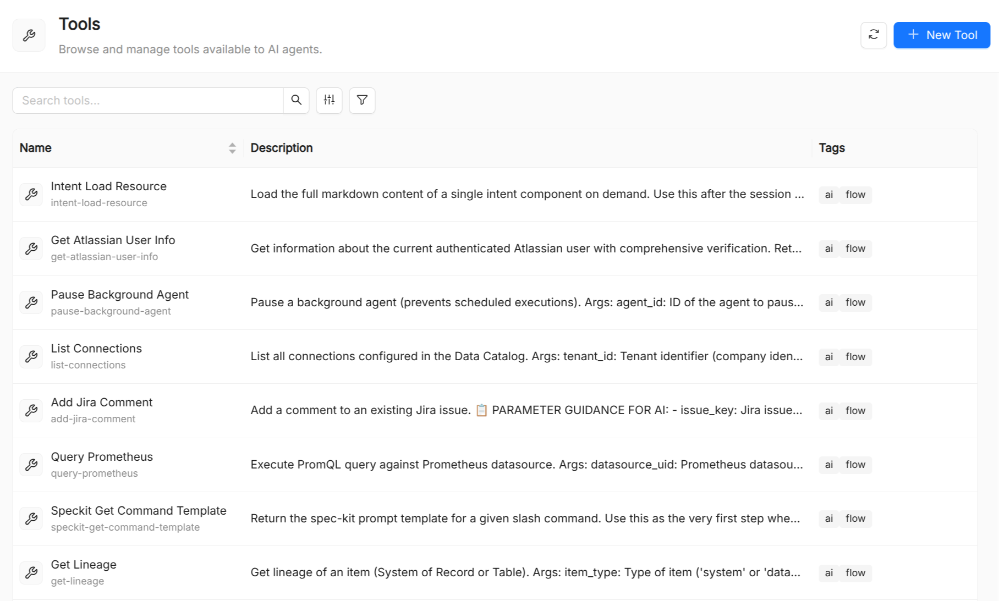

:::caution Beta

AI Foundry is in **beta**. We are actively shaping the product, so things may change as we iterate. Your feedback is welcome.

:::

# Tool

A **Tool** is a catalog resource that describes a discrete, executable capability that an [Agent](/products/ai-foundry/basic-concepts/10_agent.md) can invoke during a conversation. Tools are how agents extend their abilities beyond pure language generation: they can call REST APIs, query databases, run code, search knowledge bases, or interact with any external system.

Tools exposed by [MCP Servers](/products/ai-foundry/basic-concepts/70_mcp-server.md) are surfaced automatically inside the tool browser and can be attached to agents the same way as manually registered tools.

## Tool reference

| Field          | Required | Description                                                                                                                                                                 |
| -------------- | -------- | --------------------------------------------------------------------------------------------------------------------------------------------------------------------------- |
| `Title`        | Yes      | Display name shown in the UI and in the agent tool picker.                                                                                                                  |
| `Name`         | Yes      | Unique identifier. Referenced verbatim in `Agent.spec.tools`.                                                                                                               |
| `Description`  | Yes      | Plain-language description of what the tool does, what inputs it expects, and what it returns. This description is part of what helps the LLM decide when to call the tool. |
| `Type`         | Yes      | Tool source: `built-in` for tools implemented inside the AI Foundry backend, or `mcp-server` for tools exposed by an MCP server.                                            |
| `Runtime Name` | Yes      | The identifier the runtime uses to invoke the tool (e.g. the function name registered in the backend). Must not contain spaces.                                             |
| `Category`     | No       | Optional grouping label. Tools with the same `category` are shown together in the agent creation form's grouped picker.                                                     |
| `Enabled`      | Yes      | When `false`, the tool is hidden from the agent creation picker and unavailable at runtime. Defaults to `true`.                                                             |

## Writing good tool descriptions

The `description` in `metadata` is surfaced to the LLM when the agent decides which tool to call. A clear, accurate description directly improves agent behavior:

- **State what the tool does** in the first sentence: "Searches the internal knowledge base for articles matching a query."
- **Describe the input format**: "Input: a natural-language question string."
- **Describe the output format**: "Output: up to five article snippets with titles and URLs."
- **Note limitations**: "Only covers articles published after 2023-01-01."

Avoid vague names or descriptions: the LLM uses them to reason about when a tool is appropriate.

## Attaching tools to agents

The AI Foundry UI provides a multi-select dropdown populated from all registered Tool resources to attach them to an agent .

In the **AI Playground** you can toggle individual tools on or off for a live session without modifying the agent manifest.
This is useful for debugging unexpected tool calls.

## Tools vs. Skills

Both tools and skills extend what an agent can do, but they operate at different levels of abstraction:

| Aspect         | Tool                             | Skill                                                          |
| -------------- | -------------------------------- | -------------------------------------------------------------- |
| Granularity    | Fine-grained, single operation   | Higher-level, multi-step capability                            |
| Implementation | External service / MCP server    | Documented in the catalog as a [Skill](/products/ai-foundry/basic-concepts/50_skill.md) manifest |
| Called by      | Agent (via LLM function-calling) | Agent or Playbook node                                         |
| Can be locked? | Yes, in the Playground           | Yes, prevents accidental invocation                            |

## See also

- [Agent](/products/ai-foundry/basic-concepts/10_agent.md): attaches tools via `spec.tools`.
- [Skill](/products/ai-foundry/basic-concepts/50_skill.md): higher-level reusable capabilities.
- [MCP Server](/products/ai-foundry/basic-concepts/70_mcp-server.md): a server that exposes multiple tools through the Model Context Protocol.
