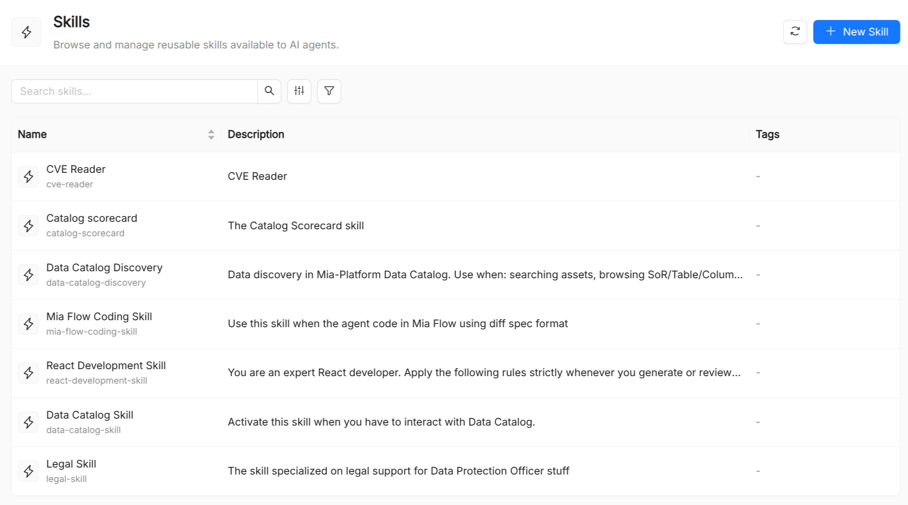

:::caution Beta

AI Foundry is in **beta**. We are actively shaping the product, so things may change as we iterate. Your feedback is welcome.

:::

# Skill

A **Skill** is a catalog resource that encapsulates a reusable, higher-level AI capability. Where a [Tool](./40_tool.md) wraps a single atomic operation (call this API, run this query), a skill captures a multi-step capability along with the knowledge, templates, scripts, and assets needed to exercise it, for example "summarise a document", "classify intent", or "draft a reply in brand voice".

Skills can be referenced both by [Agents](./10_agent.md) or [Playbooks](./60_playbook.md). They act as a reusable building block that can be shared across multiple agents without duplicating the underlying logic.

## Anatomy of a skill

A skill bundles four optional content sections alongside its metadata:

- **`manifest`**: the primary Markdown documentation of the skill (`SKILL.md`), covering what it does, how to invoke it, and optionally the information about other elements listed below.
- **`refs`**: named reference materials the skill draws on (e.g. style guides, domain glossaries, external links).
- **`assets`**: named templates or structured content the skill produces or consumes (e.g. a response template, a classification taxonomy).
- **`scripts`**: named code snippets or pseudocode that implement part of the skill logic.

## Skill schema

| Field         | Required | Description                                                                                                             |
| ------------- | -------- | ----------------------------------------------------------------------------------------------------------------------- |
| `Title`       | Yes      | Display name shown in the UI.                                                                                           |
| `Name`        | Yes      | Unique identifier. Immutable after creation. Referenced in `Agent.spec.skills` and `Playbook.spec.skills`.              |
| `Description` | No       | Short description of what the skill enables.                                                                            |
| `Manifest`    | Yes      | Markdown documentation of the skill. Must be non-empty. Rendered in the detail view with a source/preview toggle.       |
| `Refs`        | No       | A key-value map where each key is a reference name and each value is the reference content (Markdown).                  |
| `Assets`      | No       | A key-value map where each key is an asset name and each value is the asset content (templates, schemas, etc.).         |
| `Scripts`     | No       | A key-value map where each key is a script name and each value is the script content (pseudocode, shell, Python, etc.). |

## Skills vs. Tools

| Aspect                    | Skill                                                       | Tool                                        |
| ------------------------- | ----------------------------------------------------------- | ------------------------------------------- |
| Abstraction level         | High: captures a multi-step, knowledge-rich capability      | Low: wraps a single external operation      |
| Implementation location   | Documented in the catalog (`manifest`, `scripts`, `assets`) | External service or MCP server              |
| Content stored in catalog | Yes (manifest, refs, assets, scripts)                       | Yes                                         |
| Typical use               | Writing, reasoning, classification patterns                 | API calls, database queries, code execution |

## See also

- [Agent](./10_agent.md): attaches skills.
- [Tool](./40_tool.md): fine-grained executable capabilities.
- [Playbook](./60_playbook.md): can declare skills at the playbook level or per node.
