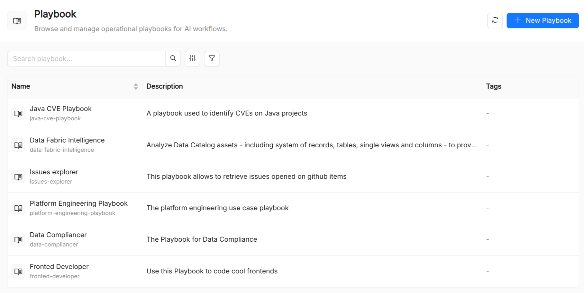

:::caution Beta

AI Foundry is in **beta**. We are actively shaping the product, so things may change as we iterate. Your feedback is welcome.

:::

# Playbook

A **Playbook** is a catalog resource that describes a multi-step agentic workflow. It composes agents, prompts, skills, and spec templates into a directed graph where each node performs a discrete task and edges define the flow of control and data between them.

Playbooks move the AI platform from single-agent interactions toward **agentic pipelines**: complex, stateful workflows where the output of one agent feeds the input of the next, loops repeat until a condition is met, and parallel branches execute concurrently.

## Playbook reference

| Field                         | Required | Description                                                                                 |
| ----------------------------- | -------- | ------------------------------------------------------------------------------------------- |
| `Title`                       | Yes      | Display name shown in the UI.                                                               |
| `Name`                        | Yes      | Unique identifier. Immutable after creation.                                                |
| `Description`                 | Yes      | Short description of the workflow's purpose.                                                |
| `Show on Home`                | No       | When enabled, this playbook appears as a quick-launch button on the home screen.            |
| `Launch Mode`                 | No       | Default UI to open when this playbook is launched.                                          |
| `Home Prompt`                 | No       | Optional pre-filled prompt auto-sent when the user clicks this playbook from the home page. |
| `Source Template ID`          | No       | Optional source template linked to this playbook on the home screen.                        |
| `Project Template ID`         | No       | Optional project template linked to this playbook on the home screen.                       |
| `Prompts`                     | No       | Built-in Agents (reference)                                                                 |
| `Skills`                      | No       | Skills available to all agents in this playbook.                                            |
| `Spec Templates`              | No       | Spec templates available to all agents in this playbook.                                    |
| `Built-in Agents (reference)` | No       | Built-in external AI agents referenced by this playbook.                                    |

## Playbook flow model

A Playbook workflow at its core comprises a set of orchestrated agents working sequentially, in parallel or loop.

You can either deploy a single built-in agent (an external AI agent not managed by the Catalog, like a model provider or third-party assistant) or a combination of agents managed by the Catalog.

## The visual builder

The **Playbook Builder** in the AI Foundry UI provides a drag-and-drop canvas for designing and editing without writing JSON:

1. **Overview step**: set name, title, and description.
2. **Agentic Flow step**: add nodes from a palette, draw edges between them, and configure node properties.
3. **Resources step**: attach playbook-level prompts, skills, and specs using multi-select pickers.

Switching to **JSON mode** replaces the visual builder with a full-spec JSON editor, which is useful for bulk edits or for copying playbooks across environments.

## Resource scoping

Resources (prompts, skills, specs) can be attached at two levels:

- **Playbook level**: available to every node in the flow.
- **Node level**: available only to that specific node. Node-level lists are merged with the playbook-level lists.

This allows a common baseline (e.g. a shared style guide) while letting individual nodes use specialized resources.

## See also

- [Agent](./10_agent.md): the execution unit referenced by playbook nodes.
- [Prompt](./30_prompt.md): reusable text injected into nodes.
- [Skill](./50_skill.md): reusable capabilities attached at playbook or node level.
- [Spec](./80_spec.md): structured documents referenced by nodes.
