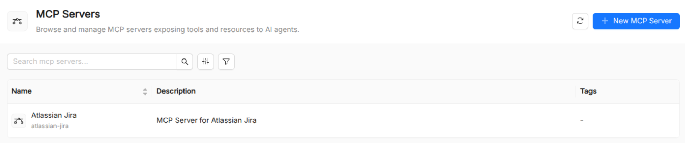

:::caution Beta

AI Foundry is in **beta**. We are actively shaping the product, so things may change as we iterate. Your feedback is welcome.

:::

# MCP Server

An **MCP Server** is a catalog resource that registers an external [Model Context Protocol (MCP)](https://modelcontextprotocol.io/) server with AI Foundry. Once registered, the tools and resources exposed by the server are automatically surfaced in the tool browser and can be attached to [Agents](./10_agent.md) like any other [Tool](./40_tool.md).



## What is the Model Context Protocol?

The **Model Context Protocol** is an open standard (developed by Anthropic) that defines a uniform interface between LLM clients and the services that supply them with context, tools, and capabilities. An MCP server exposes a well-defined API that any compliant LLM runtime can discover and call, regardless of the underlying implementation language or transport.

Key concepts in MCP:

- **Tools**: callable functions with defined input/output schemas, equivalent to function-calling definitions.
- **Resources**: structured data sources the LLM can read (files, database records, API responses).
- **Prompts**: server-managed prompt templates the client can request by name.

By integrating with MCP, AI Foundry can consume capabilities from any MCP-compliant service without per-tool integration work.

## Manifest

MCP server connections can use three transport modes: **Streamable HTTP** (recommended), **SSE** (Server-Sent Events), and **stdio** (the server runs as a subprocess).

### Streamable HTTP (recommended)

```yaml
apiVersion: new-ai.mia-platform.eu/v1alpha1
kind: McpServer
metadata:
  name: internal-search-mcp
  title: Internal Search MCP
  description: Exposes the enterprise knowledge-base search API as MCP tools.
  tags:
    - search
    - internal
spec:
  type: streamable_http
  url: https://search.internal.example.com/mcp
  auth:
    type: bearer
    token: MY_SEARCH_API_KEY    # name of the env var holding the token
  tool_name_prefix: search_
  use_mcp_resources: false
  require_confirmation: false
```

### SSE transport

```yaml
apiVersion: new-ai.mia-platform.eu/v1alpha1
kind: McpServer
metadata:
  name: events-mcp
  title: Events MCP Server
spec:
  type: sse
  url: https://events.internal.example.com/mcp/sse
  auth:
    type: none
```

### stdio transport

```yaml
apiVersion: new-ai.mia-platform.eu/v1alpha1
kind: McpServer
metadata:
  name: filesystem-mcp
  title: Filesystem MCP Server
  description: Provides read/write access to a sandboxed local filesystem.
  tags:
    - filesystem
    - local
spec:
  type: stdio
  url: npx -y @modelcontextprotocol/server-filesystem /tmp/sandbox
  auth:
    type: none
```

## Fields reference

### `metadata`

| Field         | Required | Description                              |
| ------------- | -------- | ---------------------------------------- |
| `name`        | Yes      | Unique identifier.                       |
| `title`       | Yes      | Display name shown in the UI.            |
| `description` | Yes      | Description of what the server provides. |
| `tags`        | No       | Free-form tags for filtering.            |
| `labels`      | No       | Key/value pairs for API-level filtering. |

### `spec`

| Field                  | Required | Description                                                                                                                                    |
| ---------------------- | -------- | ---------------------------------------------------------------------------------------------------------------------------------------------- |
| `type`                 | Yes      | Transport mode: `streamable_http` (recommended), `sse`, or `stdio`.                                                                           |
| `url`                  | Yes      | For `streamable_http` and `sse`: the base URL of the running MCP server. For `stdio`: the command string used to launch the server subprocess. |
| `auth`                 | No       | Authentication configuration object. See [Authentication](#authentication) below.                                                             |
| `tool_name_prefix`     | No       | A string prepended to all tool names exposed by this server (regex: `^[a-zA-Z_]*$`). Useful to avoid name collisions across multiple servers. |
| `use_mcp_resources`    | No       | When `true`, the server's MCP resources are also surfaced to agents. Defaults to `false`.                                                      |
| `require_confirmation` | No       | When `true`, users must confirm each tool call in the AI Playground before it is executed. Defaults to `false`.                                |

### Authentication

The `auth` object configures how AI Foundry authenticates against the MCP server. Five schemes are supported:

| `auth.type` | Additional fields              | Description                                                    |
| ----------- | ------------------------------ | -------------------------------------------------------------- |
| `none`      | —                              | No authentication.                                             |
| `bearer`    | `token`                        | HTTP `Authorization: Bearer <token>`. Store the token in an env var and reference its name. |
| `basic`     | `username`, `password`         | HTTP Basic authentication.                                     |
| `api_key`   | `token`, `header_name`         | Custom header authentication. Defaults to `X-API-Key` if `header_name` is omitted. |
| `oauth2`    | `access_token`                 | OAuth 2 access token sent as a Bearer header.                  |

:::caution
Never store secret values (tokens, passwords) directly in the catalog. Reference the name of an environment variable that holds the actual secret value and inject it at deployment time.
:::

## How MCP tools appear in AI Foundry

When an MCP Server resource is registered:

1. AI Foundry connects to the server (at startup or on demand) and discovers the tools it exposes.
2. Those tool definitions are added to the tool registry alongside manually registered Tool resources.
3. These tools become selectable in the agent creation form's tool picker.
4. At runtime, when an agent calls an MCP-sourced tool, AI Foundry routes the call to the corresponding MCP server.

## IDE and tooling integration

The detail view of an MCP Server resource provides export options for common developer tooling configurations:

- **`.claude/settings.json`**: Claude desktop app configuration block that connects to this server.
- **`.github/copilot-instructions.md`**: GitHub Copilot instructions snippet referencing this server.

These exports let developers copy a server's connection block into their local tooling without manually constructing the configuration.

## See also

- [Tool](./40_tool.md): individual tools, including those sourced from MCP servers.
- [Agent](./10_agent.md): attaches tools (including MCP tools) via `spec.tools`.
