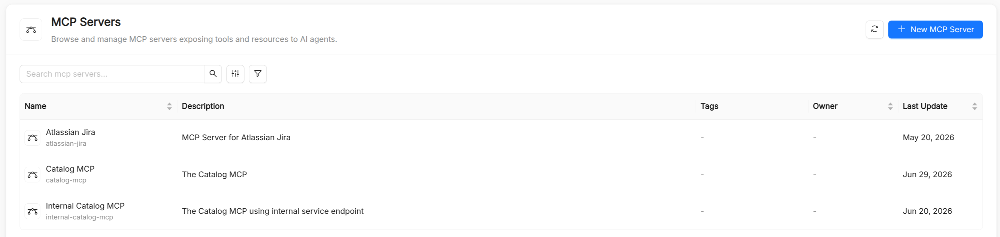

# MCP Server

An **MCP Server** is a catalog resource that registers an external [Model Context Protocol (MCP)](https://modelcontextprotocol.io/) server with AI Foundry.

Once created, the tools and resources exposed by the server can be discovered and then added to the Catalog tools.
From that moment you can attach the MCP Server tools to [Agents](/products/ai-foundry/basic-concepts/10_agent.md) like any other [Tool](/products/ai-foundry/basic-concepts/40_tool.md).

## MCP Server reference

| Field                  | Required | Description                                                                                                                                   |
| ---------------------- | -------- | --------------------------------------------------------------------------------------------------------------------------------------------- |
| `Title`                | Yes      | Display name shown in the UI.                                                                                                                 |
| `Name`                 | Yes      | Unique identifier, auto-derived from Title. Lowercase letters, digits, dots, and hyphens only (must start and end with an alphanumeric character), max 63 characters. Immutable after creation. |
| `Description`          | Yes      | Description of what the server provides.                                                                                                      |
| `Tags`                 | No       | Free-form, multi-value tags used to make the MCP server easier to find and filter.                                                            |
| `URL`                  | Yes      | The endpoint URL of the MCP server.                                                                                                           |
| `Transport Type`       | Yes      | Transport protocol used to communicate with the MCP server: `Streamable HTTP`, `SSE`, or `stdio`.                                             |
| `Auth Type`            | No       | Authentication method used when connecting to this MCP server.                                                                                |
| `Tool Name Prefix`     | No       | A string prepended to all tool names exposed by this server (regex: `^[a-zA-Z_]*$`). Useful to avoid name collisions across multiple servers. |
| `Expose MCP Resources` | No       | Whether to expose MCP resources in addition to tools. Defaults to `false`.                                                                    |
| `Require Confirmation` | No       | Whether tool invocations require explicit user confirmation before execution. Defaults to `false`.                                            |

### Authentication

The `Auth Type` field configures how AI Foundry authenticates against the MCP server. Five schemes are supported:

| `Auth Type`                   | Additional fields        | Description                                                                                 |
| ----------------------------- | ------------------------ | ------------------------------------------------------------------------------------------- |
| `None`                        | -                        | No authentication.                                                                          |
| `Bearer token`                | `Bearer Token`           | HTTP `Authorization: Bearer <token>`. Store the token in an env var and reference its name. |
| `Basic (username / password)` | `Username`, `Password`   | HTTP Basic authentication.                                                                  |
| `API Key (custom header)`     | `API Key`, `Header Name` | Custom header authentication. Defaults to `X-API-Key` if `header Name` is omitted.          |
| `OAuth2 (access token)`       | `Access Token`           | OAuth 2 access token sent as a Bearer header.                                               |

:::caution
Never store secret values (tokens, passwords) directly in the Catalog. Reference the name of an environment variable that holds the actual secret value and inject it at deployment time.
:::

## How MCP tools appear in AI Foundry

Adding an MCP server's tools to the catalog is a guided, three-step onboarding flow rather than a fully automatic process:

1. **Discovery**: once you save the MCP Server resource, AI Foundry connects live to its `URL` and lists the tools it currently exposes.
2. **Conflict check**: the UI checks whether any of the discovered tool names already exist as Catalog `Tool` items, so you can spot and resolve naming collisions before anything is registered.
3. **Registration**: for the tools you select, AI Foundry creates (or updates) the corresponding Catalog `Tool` items. If `Tool Name Prefix` is set on the MCP Server, each registered tool's name becomes `{prefix}_{tool_name}`; the tool's `spec.mcpServer.name` is set to the MCP Server's `Name`, linking it back to the server that exposes it.

Once registered, these tools behave exactly like manually created Tool resources: they are selectable in the agent creation form's tool picker, and at runtime AI Foundry routes calls to them to the corresponding MCP server.

## See also

- [Tool](/products/ai-foundry/basic-concepts/40_tool.md): individual tools, including those sourced from MCP servers.
- [Agent](/products/ai-foundry/basic-concepts/10_agent.md): attaches tools (including MCP tools).
