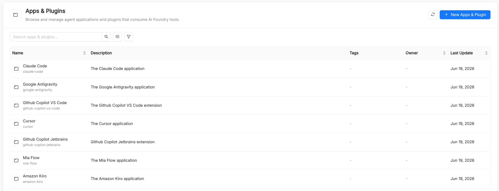

# App

An **App** is a catalog resource that represents an application or plugin that consumes AI Foundry's built-in tools. For example, an IDE-based coding assistant such as "Claude Code" can be registered as an App, with built-in tools like a web-search tool declared as belonging to it.

## App reference

| Field         | Required | Description                                                                                                                  |
| ------------- | -------- | ------------------------------------------------------------------------------------------------------------------------------ |
| `Title`       | Yes      | Display name shown in the UI, for example "Claude Code".                                                                     |
| `Name`        | Yes      | Unique identifier, automatically derived from `Title`. Lowercase letters, digits, dots, and hyphens only (`^[a-z0-9][a-z0-9.-]*[a-z0-9]$`). |
| `Description` | Yes      | Description of what the application or plugin is and how it uses AI Foundry's built-in tools.                                 |
| `Tags`        | No       | Free-form, multi-value tags used to make the App easier to find and filter.                                                    |

## Grouping built-in tools by App

A built-in [Tool](/products/ai-foundry/basic-concepts/40_tool.md) must declare which App it belongs to through its required `Application` field. This groups built-in tools by the client application or plugin that owns them, mirroring how tools sourced from an [MCP Server](/products/ai-foundry/basic-concepts/70_mcp-server.md) are instead grouped by the MCP Server that exposes them.

## See also

- [Tool](/products/ai-foundry/basic-concepts/40_tool.md): built-in tools declare their owning App.
- [MCP Server](/products/ai-foundry/basic-concepts/70_mcp-server.md): the equivalent grouping mechanism for externally-sourced tools.
