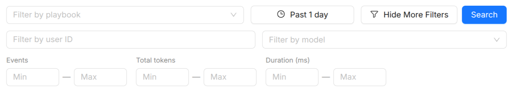

# Playbook Sessions

The **Playbook Sessions** page gives you real-time visibility into how your agents and playbooks are performing in production. It surfaces aggregate usage statistics, charts, and a searchable session list, making it easier to diagnose problems, monitor costs, and understand usage patterns across your AI workloads.

The page is split into two tabs:

- **Overview** (aggregate metrics and charts)
- **Sessions** (a searchable log of individual sessions).

## Filter bar

All views on the Playbook Sessions page are driven by a shared filter bar at the top:

| Filter         | Description                                                                                   |
| -------------- | ----------------------------------------------------------------------------------------------- |
| **Playbook**   | Multi-select one or more playbooks to narrow metrics and the session list to their activity.  |
| **User ID**    | Optionally enter a user ID to filter sessions belonging to a specific end user.                |
| **Model**      | Multi-select one or more LLM models to filter sessions down to those that used them.           |
| **Date range** | Pick a start and end date. Metrics and charts update to cover only the selected time window.  |

### Advanced filters

An **Advanced filters** panel adds min/max range filters on:

- **Events**: narrow the list to sessions with an unusually low or high number of events.
- **Total tokens**: narrow the list to unusually lightweight or token-heavy sessions.
- **Duration** (ms): narrow the list to unusually fast or slow sessions.

## Overview tab

The Overview tab shows aggregate statistics and time-series charts for the selected filter scope.

### Statistics cards

Six summary cards appear at the top of the Overview:

| Metric                | Description                                                          |
| --------------------- | -------------------------------------------------------------------- |
| **Total Sessions**    | Number of agent sessions recorded in the selected window.            |
| **Avg Response Time** | Mean end-to-end response latency in milliseconds.                    |
| **Input Tokens**      | Total tokens sent to LLM providers (prompt + context).               |
| **Output Tokens**     | Total tokens generated by LLM providers.                             |
| **Cached Tokens**     | Tokens served from the provider's prompt cache (reduces cost).       |
| **Thinking Tokens**   | Tokens consumed by extended-thinking / reasoning steps (if enabled). |

### Charts

Below the cards, a series of charts and tables break down usage across agents, users, models, and tools for the selected filter scope:

- **Sessions by Agent**: Bar chart showing how many sessions used each agent.
- **Token Distribution**: Pie chart breaking down total tokens into input, output, cached, and thinking.
- **Token Averages per Session**: Summary tiles for average input, output, and (when applicable) thinking tokens per session, plus the cache hit rate.
- **User Token Consumption**: Bar chart showing total tokens consumed per end user.
- **Token Usage by Agent**: Bar chart showing total tokens consumed per agent.
- **Event Type Breakdown**: Pie chart showing the distribution of event types (user message, agent message, tool call, etc.) across all sessions.
- **Top Tools by Usage**: Bar chart showing the most frequently called tools across all sessions. Only shown when tool-call data is present.
- **Playbook latency table**: A sortable table of session-duration percentiles (p50, p95, p99) per playbook, for spotting which playbooks are slowest.
- **Model Usage**: Stacked bar chart showing input, output, and thinking tokens consumed per LLM model.

### Trends over time

Below the charts above, three further panels track trends across the selected date range:

- **Sessions Over Time**: Area chart showing session volume per day/hour.
- **Tokens Over Time**: Area chart breaking down input, output, cached, and thinking tokens per day/hour.

## Sessions tab

The Sessions tab lists every recorded session in a paginated table, with 20 rows per page.

### Columns

| Column             | Description                                                  |
| ------------------ | ------------------------------------------------------------ |
| **Agent**          | The agent (or playbook) that handled the session.            |
| **Session ID**     | Truncated session identifier; hover to see the full ID.      |
| **Session name**   | Human-readable label for the session (if set by the caller). |
| **User ID**        | The end-user identifier passed at session creation time.     |
| **Events**         | Total number of events recorded in the session.              |
| **Tokens**         | Compact token summary (↑ input, ↓ output; a "+more" indicator reveals cached/thinking tokens in a tooltip). |
| **Duration**       | Wall-clock duration from the first to the last event.        |
| **Date**           | When the session was last updated.                            |

### Opening a session

Click any row to open the **Session Detail** page for that session, or use the drawer preview to inspect the event timeline without leaving the list.

## Session Detail page

The Session Detail page provides a full trace of a single session.

### Event timeline

Events are displayed in chronological order. Each event is annotated with:

- **Type tag** (color-coded): User Message, Agent Message, Tool Call, Tool Response, Handoff, or Other.
- **Timestamp**: When the event occurred.
- **Author**: Which agent produced the event (useful for multi-agent flows).

### Event content

| Event type      | Rendered as                                                            |
| --------------- | ---------------------------------------------------------------------- |
| User/Agent text | Whitespace-preserved text block.                                       |
| Tool call       | Collapsible JSON block showing the function name and arguments.        |
| Tool response   | Collapsible JSON block showing the function result (or error message). |
| Inline image    | Base64-decoded image rendered inline.                                  |

Token usage (input, output, cached, thinking) is shown per event when available from the provider.

## See also

- [Playbook](/products/ai-foundry/basic-concepts/60_playbook.md): multi-step agentic workflows whose sessions are tracked here.
- [Agent](/products/ai-foundry/basic-concepts/10_agent.md): the execution unit whose calls are recorded as events.
- [AI Traces](/products/ai-foundry/observability/20_ai_traces.md): low-level distributed tracing across AI Foundry services.
- [AI Foundry Overview](/products/ai-foundry/overview.md): platform overview including the AI Playground.
