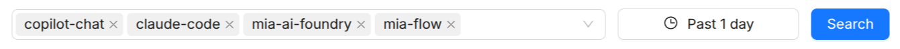

# AI Traces

The **AI Traces** page gives you low-level distributed-tracing visibility across the AI Foundry services themselves. It complements the session-level view on the [Playbook Sessions](/products/ai-foundry/observability/10_playbook_sessions.md) page: use AI Traces when you need to diagnose latency and errors at the span and service level, rather than at the conversational-session level.

The page is split into two tabs:

- **Overview** (span and latency analytics)
- **Traces** (a searchable log of individual traces).

## Filter bar

Both tabs share a filter bar at the top:

| Filter          | Description                                                                                          |
| --------------- | ----------------------------------------------------------------------------------------------------- |
| **Services**    | Multi-select one or more services to narrow the analytics and trace list to their activity.          |
| **Date range**  | Pick a start and end date. Analytics and traces update to cover only the selected time window.        |

:::note

Your administrator may scope which services appear in the services selector. In some deployments, only a fixed, pre-configured set of services is tracked and made available for filtering.

:::

## Overview tab

The Overview tab shows span and latency analytics for the selected services and date range, including:

- A **per-operation latency table**, listing the slowest or most frequent operations across the selected services.
- A **per-service latency chart**, showing how latency trends over time for each selected service.

Use this tab to spot which operations or services are contributing most to overall latency before drilling into individual traces.

## Traces tab

The Traces tab lists individual traces for the selected services and date range in a searchable, paginated table.

### Columns

| Column             | Description                                                        |
| ------------------- | ------------------------------------------------------------------- |
| **Status**          | Status indicator for the trace. Currently always shown as `OK`; per-trace error detection is not yet available. |
| **Trace ID**        | Truncated trace identifier; hover to see the full ID.              |
| **Service**         | The root service that started the trace.                           |
| **Root Operation**  | The top-level operation name for the trace.                        |
| **Duration**        | Total wall-clock duration of the trace.                            |
| **Start Time**      | When the trace started.                                            |

### Opening a trace

Click any row to open the **Trace Detail** view for that trace, showing the full span waterfall so you can inspect the timing and relationships between all spans that make up the trace.

## See also

- [Observability](/products/ai-foundry/observability/10_playbook_sessions.md): session-level view of agent and playbook runs — start there for conversational debugging.
- [Agent](/products/ai-foundry/basic-concepts/10_agent.md): the execution unit whose calls generate spans traced here.
