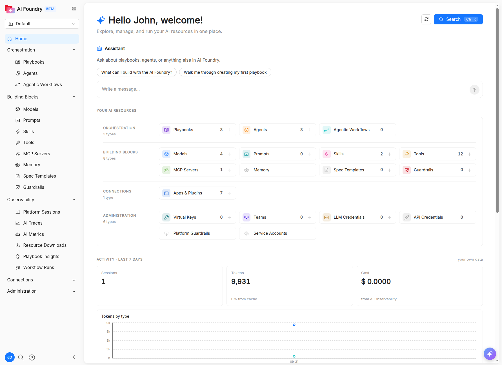
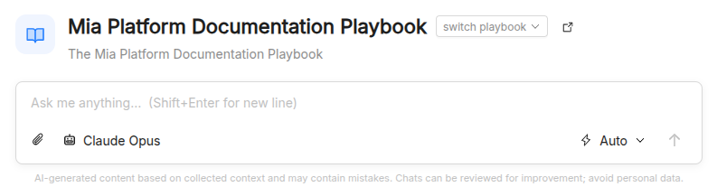
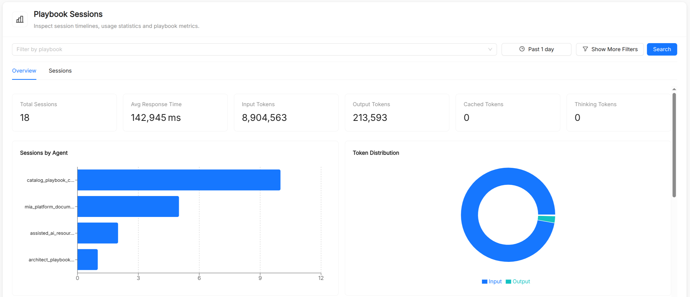
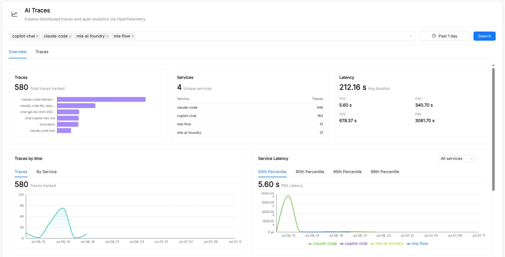
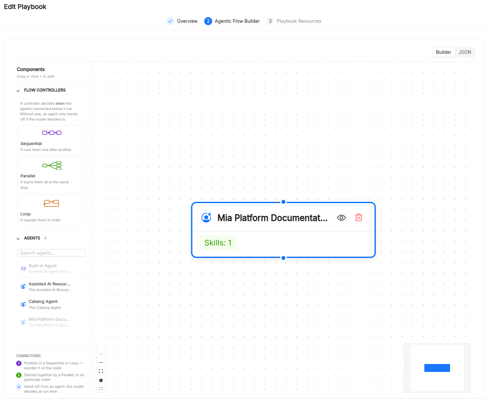

# AI Foundry Overview

**AI Foundry** is a web-based management and orchestration platform for building, managing, and validating AI-powered workflows. It provides a unified interface to compose and test complex agentic applications without writing code directly, targeting enterprises that need to govern and reuse AI assets across teams.

## Key Concepts

AI Foundry organizes AI assets as catalog resources, each sharing common metadata (name, title, description, tags, labels, and timestamps). The platform manages eight resource types:

| Resource           | Purpose                                                                                                         |
| ------------------ | --------------------------------------------------------------------------------------------------------------- |
| **Agent**          | An AI entity backed by a configured LLM, with assigned tools, skills, and system instructions.                  |
| **Model**          | An LLM configuration that wraps a model identifier and its runtime parameters.                                  |
| **Prompt**         | A reusable prompt template that agents and playbooks can reference.                                             |
| **Tool**           | An executable function or integration that an agent can invoke, including tools exposed by MCP servers.         |
| **Skill**          | A reusable capability that agents can call.                                                                     |
| **Playbook**       | A multi-step agentic workflow composed of agents, prompts, skills, and specs connected in a directed graph.     |
| **MCP Server**     | A [Model Context Protocol](https://modelcontextprotocol.io/) server that exposes tools and resources to agents. |
| **Spec Templates** | A free-form specification document referenced by playbooks and workflows.                                       |

## Features

### AI Playground

The **AI Playground** provides a live chat interface for testing agents in real time. Select a playbook, configure per-agent model overrides, and chat with the configured agentic flow. The playground streams responses, visualizes tool calls and "thinking" steps inline, and lets you enable or disable individual tools and skills on the fly. It also supports slash-prompt auto-completion from prompts associated to the selected playbook.

### Observability

Monitor how your agents and playbooks behave in production from two dedicated pages. **Playbook Sessions** surfaces aggregate usage statistics, charts, and a searchable log of individual sessions, with a full event timeline for each one. **AI Traces** complements it with lower-level distributed tracing across AI Foundry's own services, for diagnosing latency and errors at the span level. See [Playbook Sessions](/products/ai-foundry/observability/10_playbook_sessions.md) and [AI Traces](/products/ai-foundry/observability/20_ai_traces.md) for details.

### Playbook Builder

The **Playbook Builder** is a three-step wizard for designing multi-step agentic workflows:

1. **Overview**: set the playbook's name, title, and description, and optionally enable and configure its [Mia Flow](/products/flow/overview.md) integration (show-on-home toggle, launch mode).
2. **Agentic Flow**: a drag-and-drop canvas where agent nodes are connected with edges. In addition to regular agent nodes, you can add orchestration nodes for **sequential**, **parallel**, and **loop** (with configurable max iterations) execution patterns.
3. **Resources**: attach playbook-level prompts, skills, and spec templates using multi-select pickers.

Playbooks can also be authored as raw JSON using the built-in Monaco editor.

### Agent Management

Create and configure agents by selecting an LLM model, writing system instructions in Markdown, and attaching tools and skills. Tools are shown grouped by category in the picker, including tools sourced from registered MCP servers. Agents can be created through a guided form or by editing the underlying JSON spec directly.

### Model and Prompt Management

Manage LLM configurations and prompt templates as first-class catalog items. 
Prompts are authored in Markdown with a live preview pane and can be tagged for discoverability.

### Tool and Skill Discovery

Browse all tools and skills available in the system, including those exposed dynamically by registered MCP servers.
Tools and skills are attachable to agents from the catalog.

### MCP Server Integration

Register external [Model Context Protocol](https://modelcontextprotocol.io/) servers to expand the tool ecosystem available to your agents.
Each registered server is stored as a catalog resource and its tools are included in the available tools list.

### Programmatic access

The AI Foundry ADK BE APIs can be called machine-to-machine using a **service account**, registered through Platform Administration — see [Registering a service account](/products/mia-platform-suite/rbac_management.md#registering-a-service-account) and [Requesting an access token](/products/mia-platform-suite/rbac_management.md#requesting-an-access-token). Unlike Catalog, calling the AI Foundry ADK BE APIs requires the token to be requested with **all three** scopes together — `mia:catalog`, `mia:ai-foundry`, and `mia:authz` — requesting `mia:ai-foundry` alone is not sufficient.

## IDE and tooling integration

You can download the following AI assets to work from your workstation:

- [Agents](/products/ai-foundry/basic-concepts/10_agent.md)
- [Playbooks](/products/ai-foundry/basic-concepts/60_playbook.md)
- [MCP Servers](/products/ai-foundry/basic-concepts/70_mcp-server.md)
- [Skills](/products/ai-foundry/basic-concepts/50_skill.md)
- [Prompts](/products/ai-foundry/basic-concepts/30_prompt.md)

These exports let developers work seamlessly from the cloud or locally.

AI Foundry also provides a dedicated **Connections** area in the left sidebar, with setup guidance for specific IDEs and tools (VS Code, Claude Code, Cursor, JetBrains, and others), plus a generic manual-download option. This lets developers wire their editor's plugin or marketplace mechanism directly to their AI Foundry catalog, rather than downloading assets one at a time.

## Where to go next

New to AI Foundry? Start with the Basic Concepts section:

- [Agent](/products/ai-foundry/basic-concepts/10_agent.md): the autonomous AI actor at the heart of the platform.
- [Model](/products/ai-foundry/basic-concepts/20_model.md): LLM configurations that back agents.
- [Prompt](/products/ai-foundry/basic-concepts/30_prompt.md): reusable text templates for agents and workflows.
- [Tool](/products/ai-foundry/basic-concepts/40_tool.md): executable functions agents can call.
- [App](/products/ai-foundry/basic-concepts/90_app.md): applications and plugins that built-in tools belong to.
- [Skill](/products/ai-foundry/basic-concepts/50_skill.md): reusable, higher-level AI capabilities.
- [Playbook](/products/ai-foundry/basic-concepts/60_playbook.md): multi-step agentic workflows.
- [MCP Server](/products/ai-foundry/basic-concepts/70_mcp-server.md): Model Context Protocol server integrations.
- [Spec Templates](/products/ai-foundry/basic-concepts/80_spec.md): structured reference documents for agents and playbooks.
- [Playbook Sessions](/products/ai-foundry/observability/10_playbook_sessions.md): session-level monitoring and analytics for playbook and agent runs.
- [AI Traces](/products/ai-foundry/observability/20_ai_traces.md): distributed tracing across AI Foundry services.
