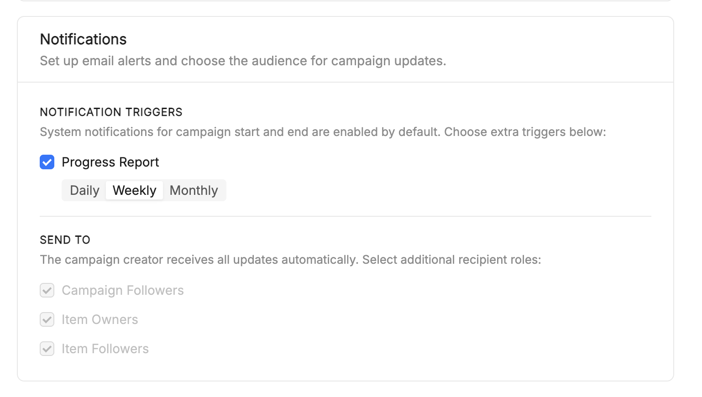
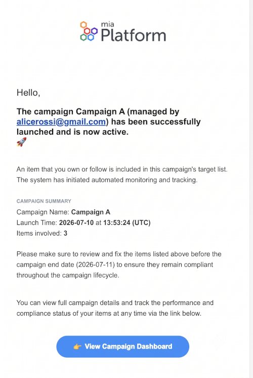

# Campaigns

A **Campaign** groups one or more [Rules](/products/catalog/basic-concepts/30_evaluation-criteria.md) that must be satisfied by a set of catalog items within a defined time window. Campaigns turn a snapshot evaluation into a time-bounded compliance program with a clear deadline.

A campaign declares:

- `startTime`: when the campaign period begins.
- `endTime`: the deadline by which all rules should be satisfied.
- `rules[]`: one or more [Rules](/products/catalog/basic-concepts/30_evaluation-criteria.md), either **copied from a [Scorecard](/products/catalog/basic-concepts/40_scorecards.md)** when the campaign is built from one (once a target level is selected, that level's rules *and every level below it* are duplicated onto the campaign) or **written directly on the campaign** when it is built from scratch. Once on the campaign, the rules are independent of the source scorecard: later changes to the scorecard do not propagate.
- `scope`: a target set of items defined as a [view](/products/catalog/usage/catalog-app.md#views) reference or a raw query (see [Query Language](/products/catalog/basic-concepts/70_query-language.md)).
- `reportFrequency` *(optional)*: `Daily`, `Weekly`, or `Monthly` — see [Evaluation](#evaluation) for how it drives scheduled re-evaluation.

The dates define the campaign's time window and also drive automatic evaluations — see [Evaluation](#evaluation) below.

## Relationship with Scorecards

In practice, a campaign is most often **built from a [Scorecard](/products/catalog/basic-concepts/40_scorecards.md)**: you pick an existing scorecard and select a target level — the rules from that level downward are copied onto the campaign. The campaign keeps a link to the scorecard it originated from for audit and navigation, but the copied rules evolve independently from that point on.

It is also possible to create a campaign **from scratch** by defining rules directly, without referencing a scorecard.

The mental model:

- A **scorecard** is the *standing* compliance ladder for a scope: it answers "where do we sit today?" continuously.
- A **campaign** is the *time-bounded* push to move that scope up the ladder by a deadline.

## Evaluation

Every configured rule is evaluated against the target item set (the same flow used by a standalone rule run, see [Evaluation Criteria](/products/catalog/basic-concepts/30_evaluation-criteria.md)). Results are stored on the `Campaign` item and exposed both via the [Catalog API](/products/catalog/usage/catalog-api.md) and in the Catalog App.

A campaign is re-evaluated through three independent mechanisms:

- **On demand**: an operator triggers a run from the [Catalog App](/products/catalog/usage/catalog-app.md#evaluate-a-campaign).
- **On a schedule**: evaluations are automatically triggered at `startTime`, at `endTime`, and — if `reportFrequency` is set — at every `Daily`/`Weekly`/`Monthly` interval in between.
- **On item change**: whenever any item in the catalog is created or updated, the catalog automatically checks whether that item belongs to the scope of any campaign and, if so, re-evaluates those campaigns.

## Notifications

Campaign Notifications is a feature of the **Campaigns** module in the Mia-Platform Catalog application. It lets users define a notification policy for a campaign, controlling which events raise a notification, who receives it, and how often periodic reports are sent.

Compliance campaigns run asynchronously over days or weeks, evaluating many catalog items against a set of rules. Rather than requiring stakeholders to poll campaign status, Campaign Notifications attaches an automated, configurable policy to each campaign that the backend evaluates during execution.

### Core concepts

* **Campaign** — a compliance initiative that evaluates catalog items against a set of rules within a time window (`startTime`–`endTime`).
* **CampaignNotifications** — the notification policy embedded in `Campaign.spec.notifications`, defining events, recipients, and report frequency.
* **Notification event** — a campaign lifecycle event that can trigger a notification: `start`, `end`, `reminder`, `periodicReport`.
* **Report frequency** — the cadence of periodic progress reports: `daily`, `weekly`, `monthly`.
* **Recipient group** — a set of users eligible to receive notifications: `campaignOwners`, `campaignFollowers`, `itemOwners`, `itemFollowers`.
* **Follower** — a user linked to a campaign through a `Relationship` item of type `follow.mia-platform.eu`.
* **Relationship** — a generic Catalog entity (`kind: Relationship`) connecting two resources via a `typeRef`; here it links users to campaigns.
* **Catalog Engine** — the backend service exposing the generic Item CRUD API and compliance-specific endpoints.

### What it does

Campaign Notifications is not a standalone service — it's a feature built into the Campaign domain model and the Catalog frontend. Two flows coexist:

* **Notification configuration** — the frontend lets users set up and edit a campaign's notification policy, and persists it through the generic Item CRUD API alongside the rest of the campaign resource. No dedicated notification store, message broker, or delivery orchestration lives in the frontend.
* **Generic notification center** — a separate Server-Sent Events client (`useNotifications`) supports an in-app notification center. It's independent from Campaign Notifications: campaign emails are generated by backend services and don't depend on this SSE infrastructure.

Delivery itself — email generation, scheduling, transport — is entirely a backend responsibility and outside the scope of this repository.

### How configuration works

* A user creates a campaign; default notification settings are initialized.
* The user customizes events, recipient groups, and report frequency.
* The policy is persisted as part of the `Campaign` resource.
* The Campaign Details page displays the persisted configuration, read-only.

### How subscriptions work

* A user follows a campaign.
* A `Relationship` resource of type `follow.mia-platform.eu` is created between the user and the campaign.
* The user becomes part of the `campaignFollowers` recipient group.

### How delivery works

* The backend executes the campaign evaluation.
* Lifecycle events (`start`, `end`, `scheduled`, `periodicReport`) are generated.
* The backend evaluates the notification policy and resolves recipient groups.
* Notifications are delivered through the supported channel, currently email.

### Design choices

* **Notifications live inside the campaign resource.** Embedding the policy in `Campaign.spec.notifications` keeps configuration and notification behavior versioned and persisted together, without a dedicated notification store.
* **The frontend only configures, it doesn't deliver.** Scheduling, event generation, recipient resolution, and message delivery stay backend responsibilities, keeping presentation and execution separate.
* **Followers reuse the generic relationship model.** Modeling followers as `Relationship` items — instead of a campaign-specific structure — lets the same mechanism apply across resource types.
* **Configuration is decoupled from transport.** The data model doesn't depend on the delivery mechanism, so new channels (in-app, push, messaging platforms) can be added without changing the Campaign domain model.

### Current limitation

At the time of writing, only `spec.reportFrequency` is guaranteed to be persisted consistently by the backend. The remaining notification configuration fields are part of the intended data model but may not yet be fully supported by the persistence layer.

## Item types involved

Campaigns interact with a small number of catalog item types:

- **[Rules](/products/catalog/basic-concepts/30_evaluation-criteria.md)**: deterministic conditions evaluated against a context of items; a campaign's rules are either copied from a [Scorecard](/products/catalog/basic-concepts/40_scorecards.md) or defined directly on the campaign.
- **[Rule-runs](/products/catalog/basic-concepts/30_evaluation-criteria.md#outcome)**: evaluations of a rule against a context of items at a given moment.
- **Scorecards**: see [Scorecards](/products/catalog/basic-concepts/40_scorecards.md) for the related, complementary concept.

## See also

- [Evaluation Criteria](/products/catalog/basic-concepts/30_evaluation-criteria.md): how individual rules are evaluated.
- [Scorecards](/products/catalog/basic-concepts/40_scorecards.md): how to express and roll up overall compliance posture.
- [Catalog App](/products/catalog/usage/catalog-app.md): where to monitor campaign progress in the UI.
