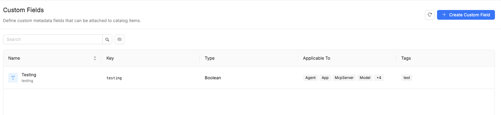
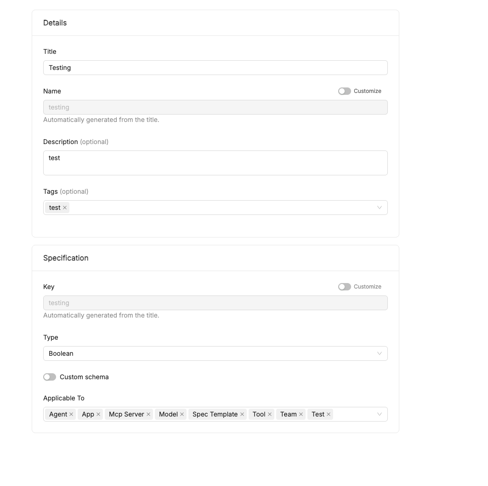
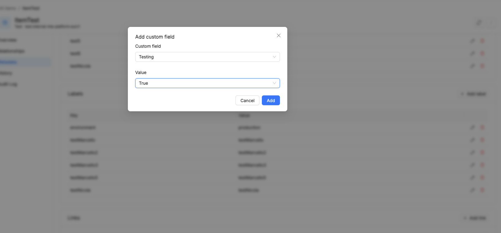

# Custom Fields

**Custom Fields** let you extend the standard data model of Catalog [items](/products/catalog/basic-concepts/10_items.md) with arbitrary, user-defined metadata, without having to modify the native schema of each [Item Type](/products/catalog/basic-concepts/20_item-types.md).

This gives teams managing the Catalog (e.g. Platform or Governance teams) a way to capture business- or governance-specific information that isn't available out of the box, while keeping that data **typed and structured** — instead of relying on free-text descriptions or unstructured tags.

## Managing Custom Fields

Custom Fields are managed from a dedicated **Custom Fields** section, under **Configuration** in the Catalog App, described there as: *"Define custom metadata fields that can be attached to catalog items."*

The Custom Fields list shows every field defined so far, with its name, technical key, type, applicability, and tags, and supports search and column filters to quickly find a specific field. A **Create Custom Field** button opens the creation form.

### Create a Custom Field

The creation form is split into two sections: **Details** and **Specification**.

**Details:**

- **Title** — the human-readable name of the field.
- **Name** — a technical slug. By default it's automatically generated from the title (e.g. `Testing` → `testing`); toggling **Customize** allows setting it explicitly.
- **Description** *(optional)*.
- **Tags** *(optional)* — used to categorize the field.

**Specification:**

- **Key** — the technical key stored on the item's `customFields` map. As with Name, it's automatically generated from the title by default, and can be customized via the **Customize** toggle.
- **Type** — one of `String`, `Number`, `Integer`, `Boolean`, `Options`, `Array`, `Object`.
- **Custom schema** — a toggle that, when enabled, lets you define a custom JSON Schema to validate the structure of the field's value (relevant for complex types such as `Array` or `Object`), instead of accepting any arbitrary content of that type.
- **Applicable To** — the Item Type(s) the field can be associated with (e.g. `Agent`, `App`, `MCP Server`, `Model`, `Spec Template`, `Tool`, `Team`, or any other registered Item Type). A field can be reserved for a single Item Type, or made available across several of them.

### Setting a value on an item

Once a Custom Field is defined and applicable to a given Item Type, it can be set on individual items of that type from the item's detail view, in its **Custom Fields** tab. Clicking **Add custom field** opens a modal where you pick the **Custom field** (from those applicable to that item's type) and its **Value**.

## Example

A Governance team wants to track, for every `Model` published in the Catalog, its risk level under the AI Act (e.g. `minimal`, `limited`, `high`, `unacceptable`), in addition to the metadata already defined by the `Model` Item Type.

Without touching the `Model` Item Type's base schema, the team:

1. Creates a Custom Field of type `Options`, with the four allowed risk levels as values.
2. Sets its **Applicable To** to `Model`.

From that point on, anyone publishing or updating a `Model` in the Catalog can (or must, if the field is made mandatory) set a value for this field. The Governance team can then filter or query items on this attribute to build compliance reports.

## Benefits

- **Guided, validated input** — users enrich items with domain- or organization-specific information through a typed field (including a custom schema for object values) instead of ad-hoc workarounds like description fields or unstructured tags, reducing input errors.
- **Extensibility without schema changes** — Custom Fields let you capture metadata specific to a customer or a vertical use case (compliance, governance, internal tagging, …) without continuously extending the native schema of every Item Type.
