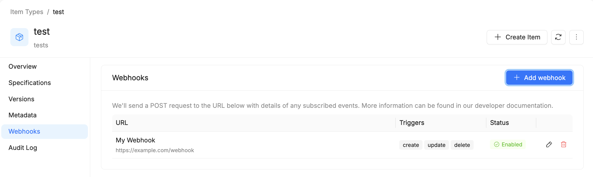
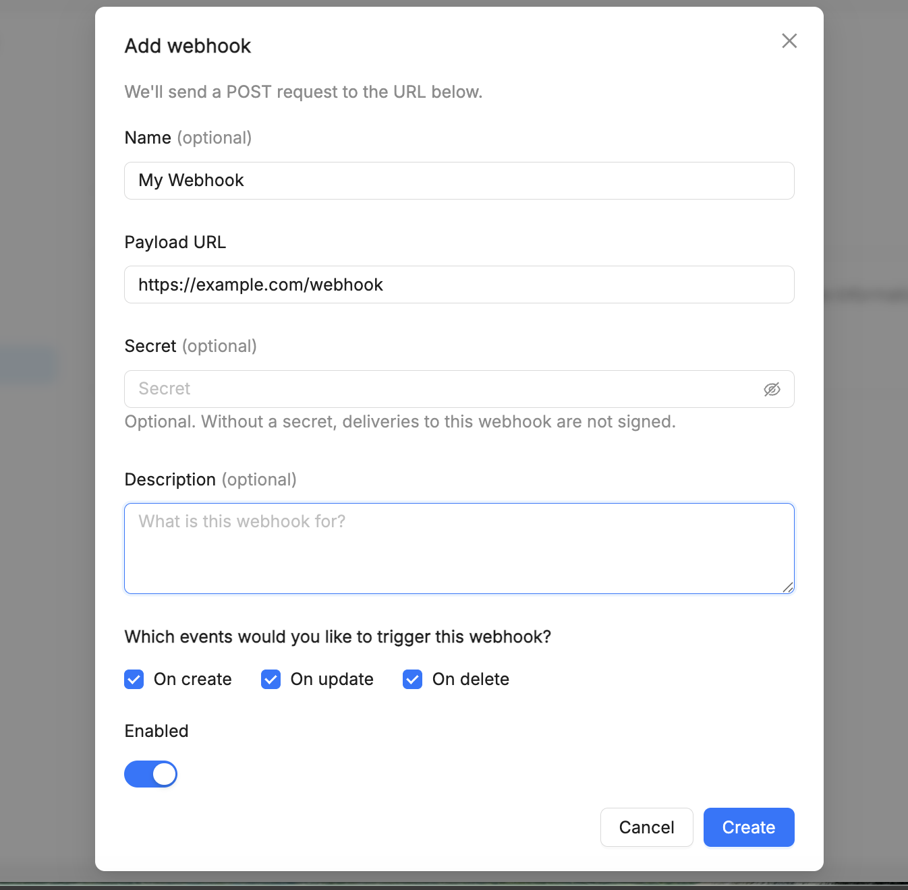

# Webhooks

**Webhooks** let the Catalog notify an external service whenever an [item](/products/catalog/basic-concepts/10_items.md) of a given [Item Type](/products/catalog/basic-concepts/20_item-types.md) is created, updated, or deleted — without that external service having to poll the Catalog for changes.

This is useful, for example, to trigger downstream automation (notifications, pipelines, or other systems) as soon as something relevant happens to items of a given type, removing the need for repetitive manual checks.

## Where webhooks are configured

Webhooks are configured **per Item Type**, in its **Webhooks** tab: a webhook registered there fires for every item of that type, regardless of which specific item triggered the event.

The table lists every webhook configured on the type, with its URL, the triggers it responds to, and its status (**Enabled**/Disabled).

## Adding a webhook

From the **Webhooks** tab, **Add webhook** opens a form to register a new webhook. We'll send a `POST` request to the configured URL for each subscribed event.

- **Name** *(optional)* — a label to identify the webhook in the list.
- **Payload URL** *(required)* — the external endpoint the `POST` request is sent to when the webhook fires.
- **Secret** *(optional)* — used to sign the delivery. Without a secret, deliveries to this webhook are not signed.
- **Description** *(optional)* — what the webhook is for.
- **Which events would you like to trigger this webhook?** — `On create`, `On update`, and `On delete` can be enabled independently, so a webhook can respond to only the operations you care about.
- **Enabled** — a toggle to activate the webhook immediately, or leave it registered but inactive.

## Current limitations

- Only operations that modify an item are covered — a new **version** being created for an item ([see Item Versioning](/products/catalog/basic-concepts/65_item-history.md)) does not, on its own, fire a webhook.
