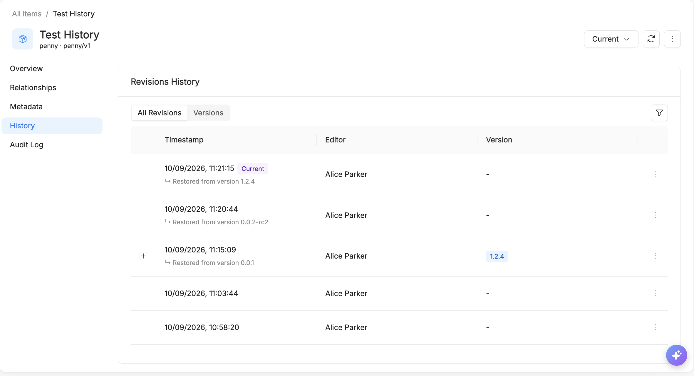
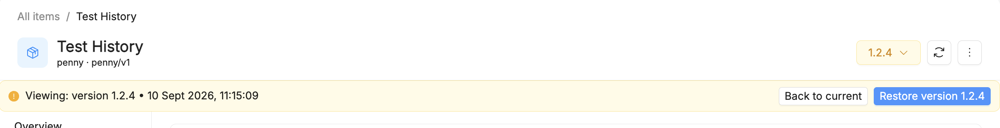
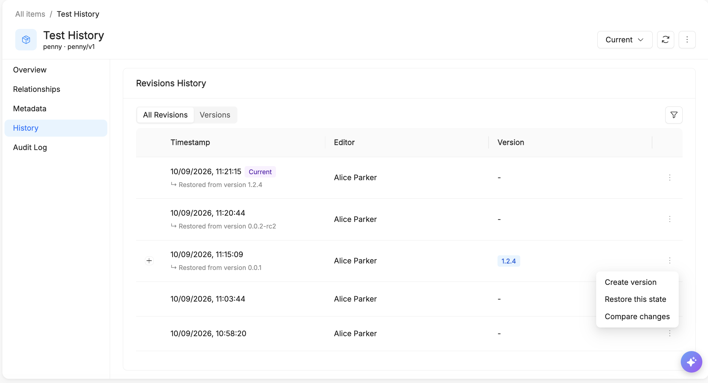
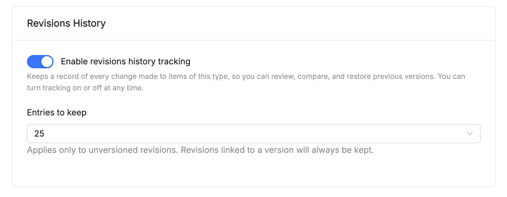
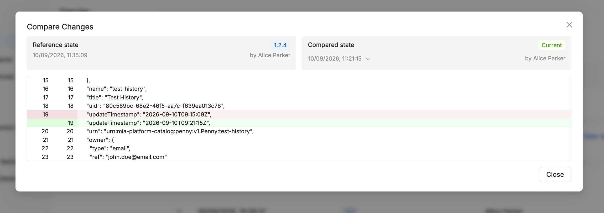

# History and Item Versioning

The **Item Versioning** feature in the Catalog lets you track changes to an [item](/products/catalog/basic-concepts/10_items.md) over time, compare revisions, browse its history, and roll back to a previous version.

## User interface and history management

Selecting an item in the Catalog opens its detail view, which includes a **History** section with two tabs:

- **All Revisions** — a continuous log of every save and change made to the item, showing its timestamp, editor, and the version it's linked to (if any).
- **Versions** — the subset of revisions that have been promoted and saved under a dedicated name (e.g. `1.2.4`), together with the author and, when provided, a description of that version.

The banner at the top right — showing **Current** by default — lets you switch to viewing any past version or revision. While viewing a non-current state, a banner shows which version/revision you're looking at and its timestamp, with shortcuts to go **Back to current** or **Restore** that state directly.

## Operations on versions

From the row actions menu (**⋮**) on an entry in **All Revisions** or **Versions**, the following actions are available:

- **Create version** — promote that revision to a named version.
- **Restore this state** — roll the item back to that revision or version.
- **Compare changes** — open a line-by-line diff against another state.

## Configurability per Item Type

Versioning is configured on the [Item Type](/products/catalog/basic-concepts/20_item-types.md) itself, under **Revisions History**:

- **Enable revisions history tracking** — a toggle that turns tracking on or off for every item of that type. It keeps a record of every change, so it can be reviewed, compared, and restored, and it can be switched on or off at any time.
- **Entries to keep** — how many revisions to retain (e.g. `25`). This limit applies only to **unversioned** revisions: any revision linked to a named version is always kept, regardless of this setting.

### Creating a version

- The version **name is mandatory**: submitting the form with an empty name must block the action and show an error.
- **Uniqueness**: creating two versions with the same name (e.g. `1.0.0`) should either be rejected or handled with a clear error message 
- **Name format**: it is unclear whether the name field validates a specific format (e.g. semver) or accepts free text — *to be verified* by trying non-semver strings (`abc`, strings with spaces, special characters, emoji, very long strings). The observed examples (`1.2.4`, `0.0.2-rc2`, …) are semver-like, but this doesn't confirm the field enforces that format.
- **Description** is optional: it should be possible to save a version without a description, as well as with a very long or Markdown-formatted description.
- **Permissions**: only a user with item editor role can "Create a version", or should get an error if they attempt the action.

### Navigating between versions

- The version selector at the top lets you switch between **Current** and a specific version, and back; all tabs (Overview, Relationships, Metadata, History) must consistently reflect the state of the selected version.
- While "viewing version X", fields must be **read-only** (no accidental change should be savable).
- The **"Back to current"** banner must restore exactly the Current state, without side effects.
- **Deep link/refresh**: reloading the page while viewing a non-current version — *to be verified* whether the navigation state persists in the URL, or is lost (falling back to Current).
- With many versions, **pagination/scrolling** in the table and in the dropdown should be verified.

### Comparing versions (Compare changes)

The **Compare Changes** dialog lets you pick a **Reference state** and a **Compared state** (each a specific version, revision, or Current) and shows the two JSON snapshots as a line-by-line diff, with changed lines highlighted.

- Compare Current vs. a previous version, and two previous versions against each other.
- For an item with **no real differences**, the diff should show "no changes" rather than an error or a misleading empty diff.
- Compare versions with changes on **relationships/metadata**, not just the main content, to check whether the diff covers all sections or only some — the observed diff is a raw JSON line diff of the whole snapshot, so it likely covers everything serialized on the item, but this should be confirmed for relationships specifically.
- Fields **added/removed** between the two versions (not just modified) — the diff should flag them as add/remove rather than ignoring them.

### Restore

- Restoring a previous version onto the current item should create a new entry in **All Revisions** (audit trail), rather than silently overwriting the history.
- **Repeated restore** of the same version must be idempotent and must not produce errors.
- Restoring while the item has **relationships** with other items (there is a dedicated "Relationships" tab) — relationships should be restored consistently, or flagged if broken.

### Editing a version

- Editing only the name, only the description, or both, should only change the version's metadata, never the underlying content/snapshot.
- Renaming a version to a **name already used** by another version.
- It's not possible to delete a version
