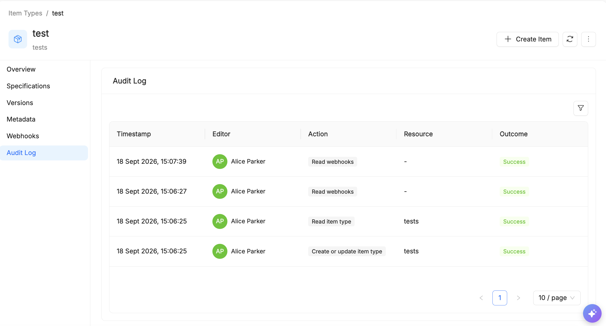
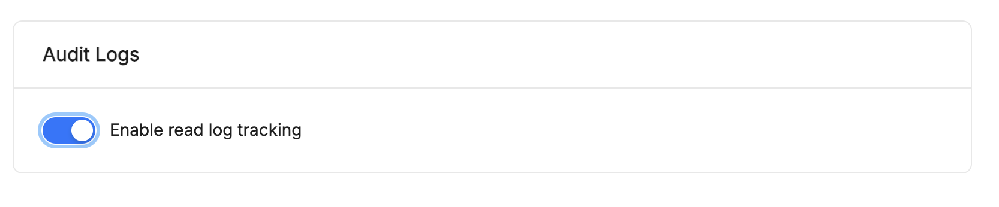

# Audit Logs

**Audit Logs** is the Catalog section, reachable from the side menu at **Activity > Audit Logs** within the currently selected tenant (shown at the top left, e.g. "Default"), that lets you review every action performed within the Catalog, for security and compliance purposes. Each row represents an event tracked by the system, sorted from most recent to least recent.

Viewing Audit Logs requires the **Auditor** role (see [Catalog roles](/products/mia-platform-suite/rbac_management.md#catalog-roles) in the RBAC documentation) — users without it, or another role that includes it, can't access either `Activity > Audit Logs` or the per-Item Type Audit Log tab described further down.

## What the table shows

For each event, the following columns are shown:

| Column | Description |
| :---- | :---- |
| **Timestamp** | Date and time the action occurred (e.g. `16 Sept 2026, 10:38:36`). |
| **Editor** | The user who performed the action, shown with initials/avatar and full name. |
| **Action** | The type of operation performed (see below). |
| **Resource** | The resource the action was performed on (may show "Unknown" if not applicable or not tracked). |
| **Outcome** | The result of the operation: **Success** or **Error**. |

## Available actions

A filter icon above the table opens a panel to narrow down the list by **Time range** (a "From → To" date range), **Editor** (the user who performed the action), **Action** (from a wide, granular list, e.g. *Count item types, List item types, Read item type, Create or update item type, Update item type history settings, Update item type audit settings, Delete item type, Read webhooks, Delete item, Read item OpenAPI, List item revisions, Read item revision, List item versions, Create item version, Count item versions, Read item version, Read/Update tenant settings*, and other governance/item-related actions), and **Result** (**Success** or **Error**).

Next to the filter icon, a download icon lets you export the log — optionally filtered — for sharing or external archiving, and a button with a lock icon lets you **disable audit log recording**. This action is global: it turns off audit logging for **every Item Type** in the tenant at once, and — being this disruptive — it's reserved for users with adequate privileges. For finer-grained control over a single Item Type without affecting the others, see [Enabling read tracking](#enabling-read-tracking) below — note that it only lets you turn *read* tracking on or off for that type; write operations remain tracked regardless.

## Example

An administrator wants to check who changed the tenant settings in the last week:

1. Open the filter panel.
2. Set the **Time range** to the last 7 days.
3. Select **Action = Update tenant settings**.
4. *(Optional)* Select **Result = Error** to isolate only the failed attempts.
5. Review the results and, if needed, export them to share with the compliance team.

## Notes

- The **Resource** column can show "Unknown" for some action types (e.g. reading tenant settings), since they are not associated with a specific object.
- The list of tracked actions covers both read and write operations on items, item types, versions, revisions, webhooks, and tenant settings.

## Per-Item Type Audit Log

Besides the tenant-wide `Activity > Audit Logs` view, each [Item Type](/products/catalog/basic-concepts/20_item-types.md) has its own **Audit Log** tab, showing the same kind of events (Timestamp, Editor, Action, Resource, Outcome) filtered to that type.

### Enabling read tracking

Write operations on an Item Type (create, update, delete, and the like) are always tracked. Whether **read** operations are also tracked is configurable per Item Type, under **Audit Logs**:

- **Enable read log tracking** — when enabled, read operations on items of that type (e.g. `Read item type`, `Read webhooks`) are logged as well; when disabled, only write operations appear in the audit log.

Read tracking is **disabled by default** on Item Types, since reads are typically much more frequent than writes and would otherwise flood the audit log. The one exception is Mia-Platform's own built-in AI-related resources (e.g. the AI Foundry Item Types), for which read tracking is **enabled by default**.
