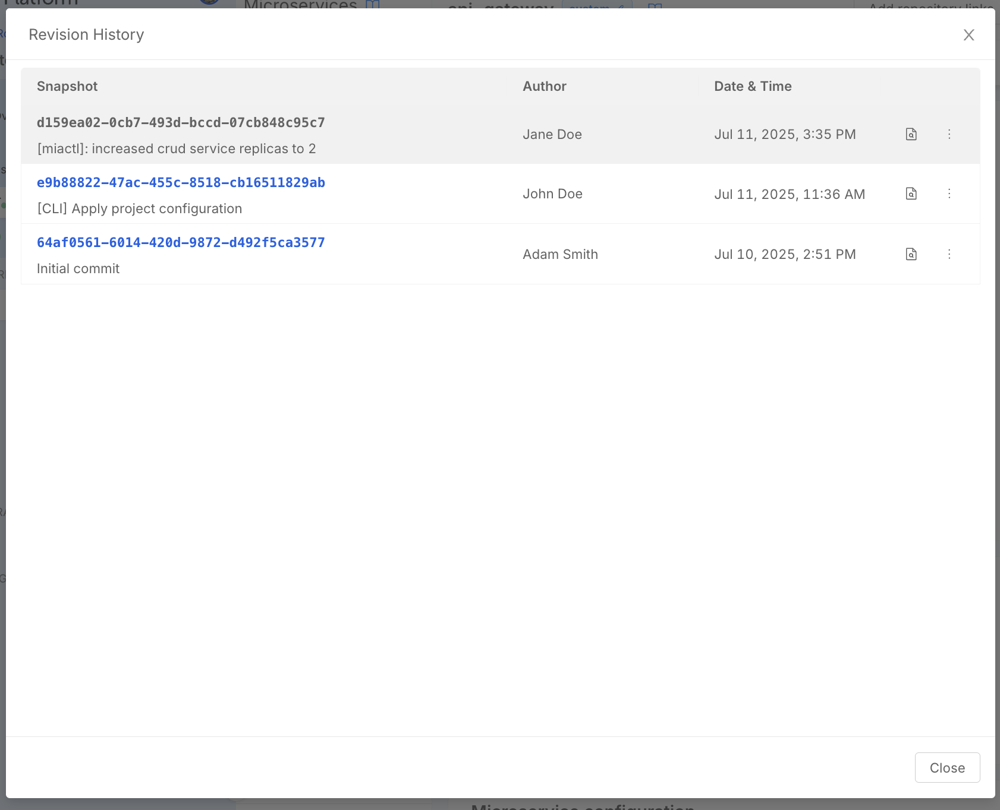

With [miactl][docs-miactl] you can manage your Project configurations locally on your machine.  
This is particularly useful in a few scenarios, such as:

- troubleshooting misconfiguration issues
- migrate the Project configuration into another Project
- create templates bundling together workload configurations to quickly kickstart similar Projects
- use AI to edit configuration or fix misconfigurations

You can make these and many more operations possible by using the `miactl project describe` and `miactl project apply` commands.

## Describe

The `miactl project describe` command shows the current configuration of a specific revision of an Application Project. More details in the [command documentation][docs-miactl-project-describe].

Specify the target ref, using the relative [command arguments][docs-miactl-project-describe] depending on whether the Application Project is using the Enhanced Workflow or not as shown in the example below:

```bash
miactl project describe --project-id <PROJECT_ID> --revision <REVISION_NAME> -o yaml > my-project.yaml
```

## Apply

:::warning
This command only supports Application Projects using Enhanced Workflow. 
:::

With the `miactl project apply` command you can apply a configuration from a local file to update an already existing Application Project.  
Executing this command overrides the Project configuration with the provided one. A new snapshot is created and it is visible from the [Revision History page][docs-revision-history] as shown in the example below:

```bash
miactl project apply --project-id <PROJECT_ID> --revision <REVISION_NAME> -f my-project.yaml -m "[miactl]: increased crud service replicas to 2"
```



For more details on how to use this command, check out the [command documentation][docs-miactl-project-apply].

## Use cases

### Migrate a Project from a Company to another one

Migrating an already existing Application Project (namely Project in Company A) into a newly created Application Project (namely Project in Company B) is as simple as:

```bash
# 1. Describe the project A (old project)
miactl project describe --project-id <PROJECT_ID_A> --revision main -o yaml > project-to-migrate.yaml

# 2. Apply the project configuration to Project B (new project)
miactl project apply --project-id <PROJECT_ID_B> --revision main -f project-to-migrate.yaml
```

:::info
In order to make the new Project work as expected, ensure to correctly configure Providers, Secrets and Environments in the new Company as well.
:::

[docs-miactl]: /products/console/cli/miactl/10_overview.md
[docs-miactl-project-describe]: https://docs.mia-platform.eu/docs/cli/miactl/commands#describe
[docs-miactl-project-apply]: https://docs.mia-platform.eu/docs/cli/miactl/commands#apply
[docs-revision-history]: /products/console/set-up-infrastructure/revisions-and-versions.md#revision-history
