## Introduction

:::info
All Microservices of the platform as a default are internally exposed on the **80 port** with **hostname equal to the service name**.  
So for example the [CRUD Service](/runtime-components/plugins/crud-service/10_overview_and_usage.md) will be reachable at the url `http://crud-service`. This is applied to all microservices.
:::

In this section you can learn how to create and manage Microservices on Mia-Platform Console.

You can create a Microservice from the Marketplace section of Console. To learn more about Marketplace, you can read [this page](/runtime-components/overview_marketplace.md) of Mia-Platform Docs.

You can create a Microservice by:

- **using a Plugin**: a ready-to-use Microservice

- **using a Template**: a starting point to create a new Microservice

- **using an Example**: an existing and ready-to-use model

- **uploading a Docker Image Name**: an existing Docker image of a Microservice


You can search for Microservices, filtering by Plugins, Templates and/or Examples.

Otherwise, you can search for them by category.

The results of your search will appear **organized by category**.

## How to create a Microservice from an Example or from a Template

The Microservice can be created starting from existing and ready-to-use Examples or Templates.

In the [Marketplace](/runtime-components/overview_marketplace.md) you can find a list of Examples or Templates powered and supported by Mia-Platform that allows you to set-up microservices with a tested and pre-defined function.

Whether you select Example or Template, you can create your microservice by filling in the following information:

- **Name of the Microservice** (*required*): this is the internal hostname

- **Description** (*optional*): this is the description of your microservice

- **GitLab Repository owner** (*required*): you have to select, from a list of options, where you want to save your microservice

:::caution
If you are using GitLab and don't see any option in *Git repository owner*, it probably means that you have no access to the GitLab group where the project resides: please contact your console administrator to solve this issue.
:::

- **Git Repository Name** (*required*): name of the git repository of the service

- **Docker Image Name** (*required*): docker image of the service. It should not have the docker host (e.g. "company/service-name:tag"). It will be filled with the docker host during the service generation


Finally to create the Microservice push **create**.

:::warning

Once the service is created on your Git provider, the Console won't be able to delete it. In case you need to delete the service, you have to do it manually from your Git provider.

:::

:::info
When creating your microservice, the Console also generates a CI/CD file (e.g. `.gitlab-ci.yml`) alongside the service files.
This file is used to instruct your pipeline provider for continuous integration and continuous deployment.

You can set up the CI file by yourself or use instead Mia-Platform pipeline templates.
In order to use the templates provided by Mia-Platform you can contact your referent to configure the pipeline templates within your Console installation.
:::

:::info
At this [link](/products/console/api-console/api-design/custom_microservice_get_started.md) you can find a more detailed guide and overview about how to create new service starting from Templates.
:::

## How to create a Microservice from a Docker Image

The only requirement to import an external Microservice is that the Docker Image needs to be already built.
Once you select the card to upload a Docker image, you can see a new tab where you need to fill in the following information:

- **Name** (*required*): this is the internal hostname;
- **Docker Image Name** (*required*): the complete docker image name of the service. The docker image repository must be accessible by the k8s cluster;
- **Repository URL** (*optional*): the URL to the repository hosting the microservice code. The user will be able to easily clone the repository from the service detail page later.
- **Description** (*optional*): this is the description of your microservice.

:::info

  Docker image names have the format `hostname/imagename:tag`, where hostname and tag are optional.

- `hostname` is the registry hostname where the docker image is hosted
- `imagename` is the docker image name
- `tag` is the version of the docker image

:::

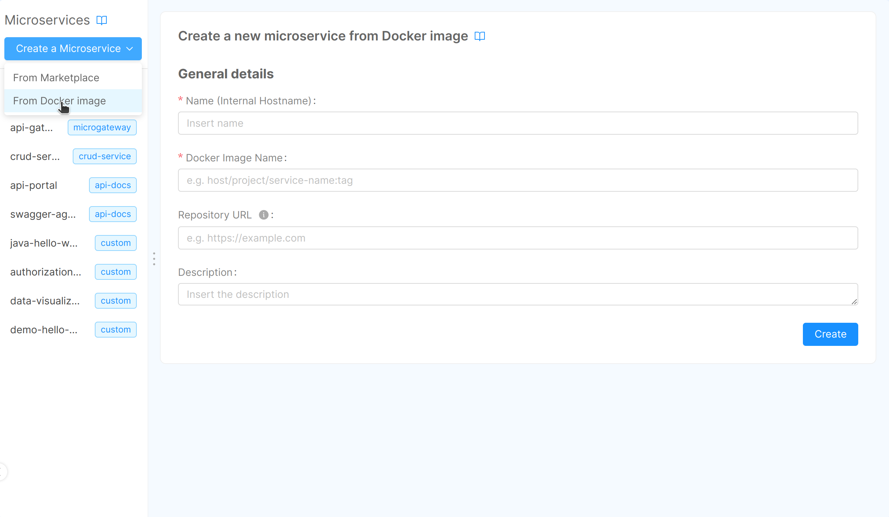

Finally to create the Microservice click **Create**.

:::info
For a step-by-step guide on creating a microservice using a Docker image, refer to the [dedicated tutorial](/products/console/tutorials/microservice-from-docker-image.md).
:::

## Manage Microservices

Microservices, and workloads in general, are the most important entity in your Project architecture as they hold the core business
logics. In the Console you can manage all the configuration that you may need in your Project lifecycle: from configuration variables to files, exposed ports and many others.

- **View Repository**: this button, present only in microservices created from Examples and Templates, allows you to go directly to your git repository from the Console.
- **Clone**: this button, present only in microservices created from Examples and Templates, enables to clone code repository directly from Console. The code repository can be copied with both `ssh` and `https`.

:::info
The supported IDEs to clone your repository are the following:
* VS Code
* IntelliJ
* Cursor AI

Please note that in order to enable the support to Cursor AI IDE, the Feature toggle `ENABLE_CLONE_REPO_WITH_CURSOR_AI` with Console scope should be activated from CMS.
:::

The following paragraphs explain each section of the Microservice detail page.

### Microservice

In this section, you can review and update some base information about the microservice, like the description and the API documentation path.

#### Microservice Details

The Details card contains and lets you manage information such as the version, the docker image and the description of the microservice.

In case your microservice has been created from a Plugin, the *Docker Image Name* is shown in *read-only* mode and cannot be changed, since the it is managed by the Plugin itself.

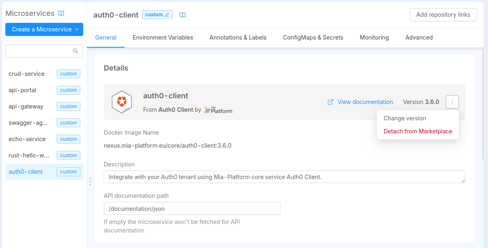

Otherwise, if your microservice has been created manually from a Docker Image or from a Marketplace Template/Example, you can also configure the *Docker Image Name* through a dedicated input field.


The *Docker Image Name* is the name of the Docker image that will be used to deploy the microservice. It is composed by the container registry hostname, the image name and the tag.

The container registry hostname can be changed with a dropdown list, which contains the [Container Registries configured in the Project Settings](/products/console/project-configuration/project-settings.md#container-registries).

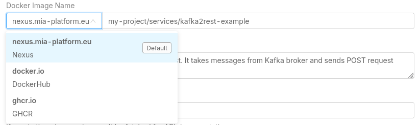

The image name and the tag can be manually inserted in the dedicated input field.

:::caution

Starting from version v13.5.0, the container registry hostname is not part anymore of the Docker Image Name manual input field, but it can only be selected from the dropdown list.

If you need to use a container registry hostname that is not present in the dropdown list, you have to create it in the Project Settings, or contact your Project Administrator or Company Owner to do it for you.

In case a service already uses a container registry not in the list, an informative badge will suggest the user to create it, or to choose a new one from the list. The project can still be saved with the unknown container registry, to avoid disruption.

:::

:::info

Anytime you access to the configuration page of your plugin, you will be informed if the related Marketplace item have updates with an icon next to the version name.

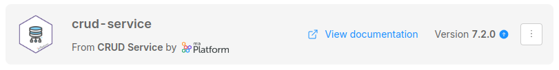

This is the best way to be aware of updates of your Marketplace plugins.

:::

In case you want to manually update the Docker Image Name, you can click on the right-side menu button where a menu will pop-up.
From there you can either *select a different version* or *detach the microservice from the Marketplace plugin*.

Selecting a different version will open a modal window where all the versions available for that Marketplace plugin will be listed.

You can use this modal window also to get more information about the versions, such as the release note and the Docker Image name referenced, plus also to be aware of versions that are flagged with the *Coming Soon* badge.

A small tag will also inform you which is the *latest* version of the plugin, the latest stable version released.

From there you can select one of the available versions in order to update the Docker Image.

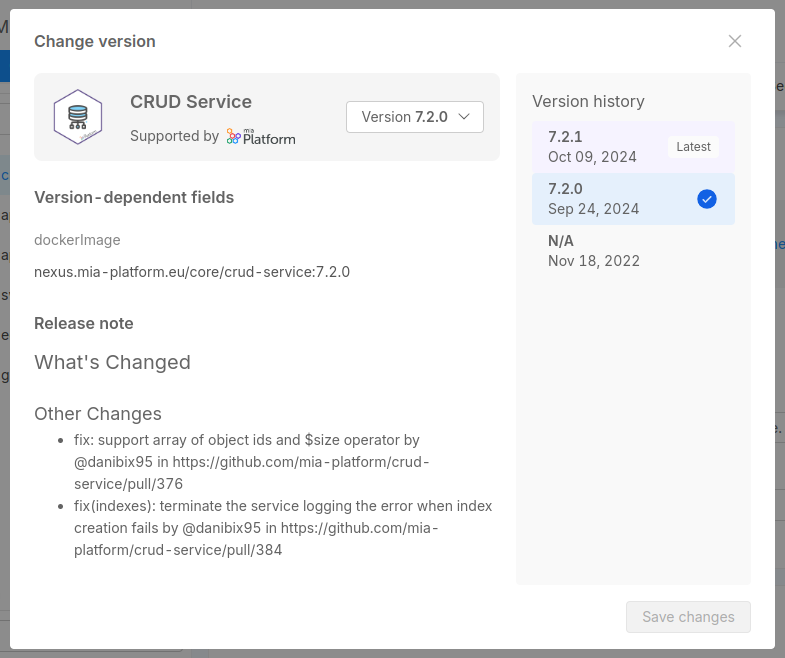

*Detach from Marketplace* will cause the microservice to be separated from the Marketplace plugin and becoming a manually configured microservice. Read more in the [dedicated section below](#detach-a-service-from-the-marketplace).

:::info
A version labelled with *N/A* refers to a Marketplace item that did not include a version when it was created. This means that it has been created before the support of versioning in the Marketplace was implemented.

However, it does not mean that this version is not supported anymore, or that it is less secure: check out the available versions and choose the one that fits your needs.
In case of further questions, please contact the Marketplace item creator.
:::

### Detach a service from the Marketplace

Services created starting from Marketplace are shown in the detail page with a badge that notifies the user the original Marketplace item.
This will allow the user to always be aware of the original Marketplace item, to have certain fields set as *read-only* (like the *Docker Image* field) but also to check if there are any updates on the service.

In case you need full control of the service, you can decide to *detach* the service from the Marketplace item. This will allow you to edit the service as you wish, without any restrictions.

You can do that by clicking on the *Detach from Marketplace* button in the menu located to the right side of the page, in the *Detail* tab of the service:this will detach the Custom Resource from the original Marketplace item, causing the resource to be fully editable.
However, you will not be able to use the Marketplace versioning feature anymore, and you will not be notified by any update made by the Marketplace creator of that item.

:::info
Detaching a microservice is an operation that cannot be reverted, causing to lose any information about updates on this item.
:::

### Microservice Configuration

In this section, you can manage the resources dedicated to your microservice:

- **Memory Resources**: You have to specify the minimum number of mebibytes (Mi) that the container needs and the maximum number of mebibytes (Mi) that it can use.

- **CPU Resources**: You have to specify the minimum number of 'thousandth of a core' (m) that the container needs and the maximum number of 'thousandth of a core' (m) that it can use.

- **Static replicas**: You have to specify the number of replicas of your microservice.  
  When a new microservice is created its default value is *1*.

  It is possible to have two different behaviors when a microservice has a [hpa](/products/console/api-console/api-design/replicas.md) configured.
  - *static replicas greater than 0*: the *hpa replicas* has priority and so they will be used.
  - *static replicas equals 0*: the *static replicas* has priority and so no microservice will be deployed.

  :::note
  A static replicas value can not be interpolated by an environment variable
  :::

- **Log Parser** (*required*): You can select which parser will handle your microservice logs.  
  Currently, you can parse log in the following ways:
  - *mia-json*: it parses json logs based on the documented format
  - *mia-nginx*: it parses logs of nginx that were created using templates and services of Mia-Platform (website and api-gateway)
  - *mia-plain*: it collects logs but it does not parse them
  - *not collected*: it is the default option, it does not collect logs and they are not sent to Elastic

:::info
  See more about the log parsers on the [guidelines](/products/console/api-console/api-design/guidelines-for-logs.md)
:::

- **Args**: You can specify the arguments for the [command](https://kubernetes.io/docs/tasks/inject-data-application/_print/#define-a-command-and-arguments-when-you-create-a-pod) of your microservice container.  
Each argument should be on a new line and by default no arguments are specified.

 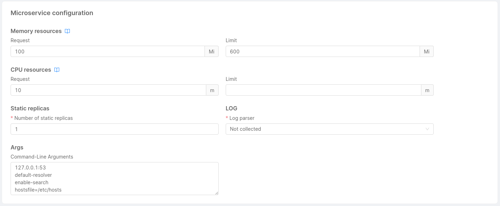

:::info
 If you are searching for information about microservice's probes and other runtime options you should visit [this page](/products/console/api-console/api-design/microservice-runtime-resources.md).
:::

### Container Ports Configuration

In this section you can manage the microservice container ports. Note that if no container port is set, the microservice will be unreachable by any other service in the Project.

For each container port, you have to define:

- **Port name** (*required*)
- **Port** (*required, default value: 80*)
- **Target port** (*default value: 3000*)
- **Protocol** (*default: TCP*)

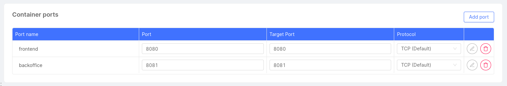

:::info
If you want more information about configuring the microservice container ports, visit [this page](/products/console/api-console/api-design/microservice-container-ports.md).
:::

### Service Account Configuration

In this section you can set the name of the service account connected to the microservice. By default a service account with the same name of the service will be created.

The service account can be used to set permission on cloud resources or on kubernetes API if needed.

### Environment Variables Configuration

In this section, you can manage, add and delete the environment variables associated with a microservice.
The environment variable will be available at runtime within the microservice container.

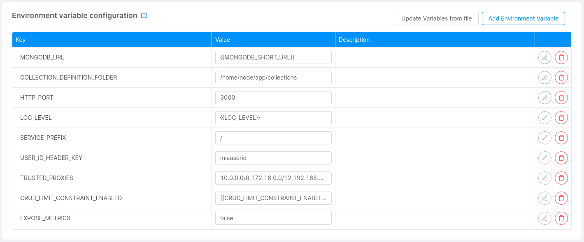

To add a new environment variable, you must specify which type of value you will use, among **Plain Text**, **From Secret**, **From ConfigMap** and **From Downward API**, as explained in the next paragraphs.

#### Plain Text

For a **Plain Text** value, you have to specify the **Key** and the **Value** of the environment variable, along with an optional **Description**.

**Value** can also be an interpolated string, to do so the value to be interpolated needs to be enclosed by two pairs of curly braces, for example `{{VALUE_TO_INTERPOLATE}}`.

As usual, the `VALUE_TO_INTERPOLATE` can be a [Public Variable](/products/console/api-console/api-design/public_variables.md) key or a [Project Environment Variable](/products/console/project-configuration/manage-environment-variables/index.md) key.

#### From Secret

This type represents a value that is obtained from a Kubernetes Secret.

You need to specify the **Key**, **Secret Name** and the **Secret Key** from which this value can be retrieved, along with an optional **Description**.

Only Secrets configured in the Project configuration are suggested, but you can also insert a custom Secret Name if you know it is deployed on the cluster, making sure it is accessible from the namespace where the microservice is deployed.

#### From ConfigMap

Use this type to load a file of a ConfigMap into an environment variable; the **Key**, **ConfigMap Name** and **ConfigMap File Name** must be provided, along with an optional **Description**.

The ConfigMap can be chosen among the ones configured in the Project configuration.

:::warning

We always suggest mounting ConfigMaps on the files system and using environment variables *From ConfigMap* when necessary and only with small-sized files.

:::

:::info
Please refer to the dedicated [ConfigMaps](/products/console/api-console/api-design/services.md#configmaps) and [Secrets](/products/console/api-console/api-design/services.md#secrets) sections for more information about how to manage them using the Console.
:::

#### From Downward API

This type represents a value that is obtained from the Kubernetes [Downward API](https://kubernetes.io/docs/concepts/workloads/pods/downward-api/).

Downward API allows you to expose information about a Pod to itself, such as the Pod's name, namespace, IP address, resource limits, label and annotations values or other information.

##### Why should I use the Downward API?

The fact that the information are provided through environment variables **decouples the application in the container from the Kubernetes API**, 
because environment variables are a standard way to provide configuration to applications.

This is particularly useful in scenarios where your application needs to know information about the Pod it is running in, 
but you don't want it or you can't access the Kubernetes APIs to obtain them or to hardcode that information into the application itself.

It is also useful for accessing to Console Project specific information, which are always available
through dedicated [annotations](/products/console/api-console/api-design/services.md#annotations-configuration) and [labels](/products/console/api-console/api-design/services.md#labels-configuration).

This can allow you, for example, to know the name of the Console Project where the Microservice is deployed, the name of the environment and other information 
that you can use for monitoring, logging or even application logic purposes.

Pods for example can also communicate their name to other Pods in the same namespace, so that it can be used as a unique identifier for purposes such as leader-election among multiple replicas.

##### Configuration

You need to specify the **Key** and the **Field Path** from which this value can be retrieved, along with an optional **Description**.
Other information may be required according to the selected Field Path value, as explained in the following paragraphs.

##### Available Field Paths

The Field Path can be selected from a dropdown list, which contains a subset of the [Downward API available fields](https://kubernetes.io/docs/concepts/workloads/pods/downward-api/#available-fields).

All the [Pod-level fields](https://kubernetes.io/docs/concepts/workloads/pods/downward-api/#downwardapi-fieldRef) are available, except for the ones not injectable through environment variables.

If one of `metadata.labels['<KEY>']` or `metadata.annotations['<KEY>']` is selected, the **Label Key** or **Annotation Key** form field must be filled with the `<KEY>` value. 
Labels and Annotations configured in the current Microservice are suggested, but you can also insert any custom label or annotation key; Kubernetes will populate the value at runtime if it exists.

Along with Pod-level fields, [Container-level fields](https://kubernetes.io/docs/concepts/workloads/pods/downward-api/#downwardapi-resourceFieldRef) are also available, except for `requests.hugepages-*` and `limits.hugepages-*`.

If one of the Container-level fields is selected, the **Container Name** must be filled with the name of a container in the Pod. A dropdown list with the available containers is provided.

#### Editing an Environment Variable

If the variable is not read-only, it can be edited with the according button on the right side of the table.

A form will appear with the current value of the variable.

:::info

The **Key** field is not editable, if you need to change the key you have to delete the variable and create a new one.

:::

#### Import Environment Variables from a `.env` file

It is possible to import multiple **Plain Text** variables from a `.env` file by using the dedicated button.  
A variable definition in the `.env` file has to be contained in a single line and must follow one of the formats below:

- Basic: `ENV_VAR_KEY=env_var_value`
- Single Quoted: `ENV_VAR_KEY='env_var_value'`
- Double Quoted: `ENV_VAR_KEY="env_var\nvalue"`, where the string `"\n"` is converted to a newline character

### Labels Configuration

In this section, you can manage, add and delete the labels associated to your microservice.

The labels are only of type *Plain Text*.

For each label, you have to define:

- **Key** (*required*)
- **Value** (*required*)
- **Description**

:::info
**Label keys** are composed by a prefix and a name, separated by a slash (/). The prefix part is optional and cannot be longer than 253 characters. The name segment is required and must be 63 characters or less.
For more information regarding the syntax check out the official [Kubernetes documentation](https://kubernetes.io/docs/concepts/overview/working-with-objects/labels/#syntax-and-character-set).
:::

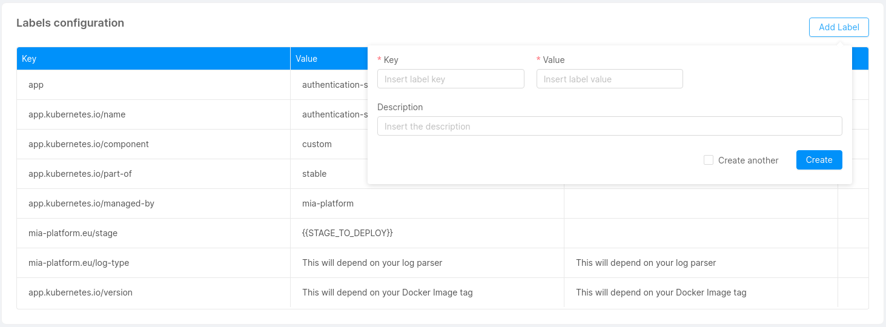

#### Default labels

By default, we set for you these labels for each service that you are going to save:


:::caution
These labels are inserted when you create a new microservice. For the existing one they will be inserted with the next save.  
If you try to overwrite these labels, its original value will be restored on the next save.
:::

:::note
The labels that starts with `mia-platform.eu` are reserved, you are not allowed to use them.
:::

### Annotations Configuration

In this section, you can manage, add and delete the annotations associated to your microservice.

The annotations are only of type *Plain Text*.

For each annotation, you have to define:

- **Key** (*required*)

- **Value** (*required*)

- **Description**

:::info
**Annotation keys** are composed by a prefix and a name, separated by a slash (/). The prefix part is optional and cannot be longer than 253 characters. The name segment is required and must be 63 characters or less.
For more information regarding the syntax check out the official [Kubernetes documentation](https://kubernetes.io/docs/concepts/overview/working-with-objects/annotations/#syntax-and-character-set).
:::

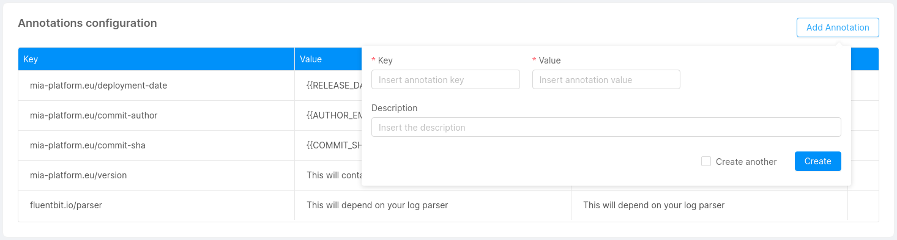

#### Default annotations

By default, we set for you these annotations for each service that you are going to save, **only if you don't use MLP**:
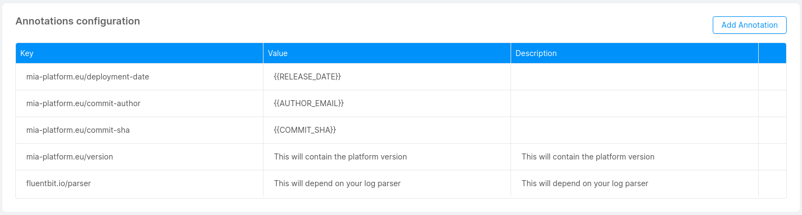

**If you use MLP**, the default annotations are:
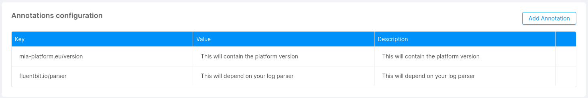

:::caution
These annotations are inserted when you create a new microservice. For the existing one they will be inserted with the next save.
If you try to overwrite these annotations, its original value will be restored on the next save.
:::

:::note
The annotations that starts with `mia-platform.eu` are reserved, you are not allowed to use them.
:::

### Custom Configuration

In this section, you can add custom configurations to your microservice without the need of using the advanced service configuration. This feature can be useful in different occasions, either when your microservice requires a specific functionality or to have access to particular kubernetes files.

In other words, if your microservice can not be managed in a usable way from environment variables, you can use Custom Configuration to add a configuration to your microservice.

:::info
You can use Custom Configuration if you want to write deployment files with a maximum of one container.
:::

There are two kinds of custom configurations: **ConfigMaps** and **Secrets**.

#### Add a Configuration

 With the button 'Add a Configuration', you can add a custom configuration by defining:

- **Type** (*required*): This is the type of your configuration: *configmap* or *secret*.
- **Configuration Name** (*required*): This is the name of your configuration.
- **Runtime Mount Path**: Path inside the service where you want to mount the directory.

Moreover, you can decide to preserve files and directories already existing in the Runtime Mount Path directory, by activating the related checkbox.

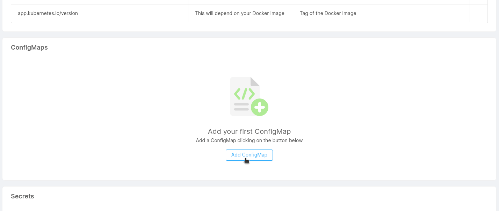

For each configuration created, a new card will be visible.

#### ConfigMaps

You can mount files to your microservice using *configmaps*. This feature can be useful if your microservice requires a particular configuration that can be read from a certain type of file (e.g. a complex configuration file that can't be provided via simple environment variables).

Check out the files service [example](/runtime-components/plugins/files-service/configuration.mdx) to further understand the role of configmaps in microservices.

You can click _Add file_ to generate a new custom file (e.g. a JSON or YAML file, but could be anything you need) and start writing your custom configurations. With the _Delete File_ button you can remove the file from your custom configuration.

When a new file is added, if the preservation of already existing files and directories has been activated, into the deployment file it is possible to verify the existence of the `subPath` property, whose value has been attached at the end of the Mount Path.
In this way, all the files of the ConfigMap are loaded in the position defined as Runtime Mount Path, without however deleting any existing files (unless they have the same name as the files of the ConfigMap, in which case they are overwritten).

:::note
Custom services configuration now supports ConfigMaps larger than __1MB__ (this limit is imposed by Kubernetes). Large ConfigMaps will be automatically split into multiple parts and joined back together during deployment.
:::

 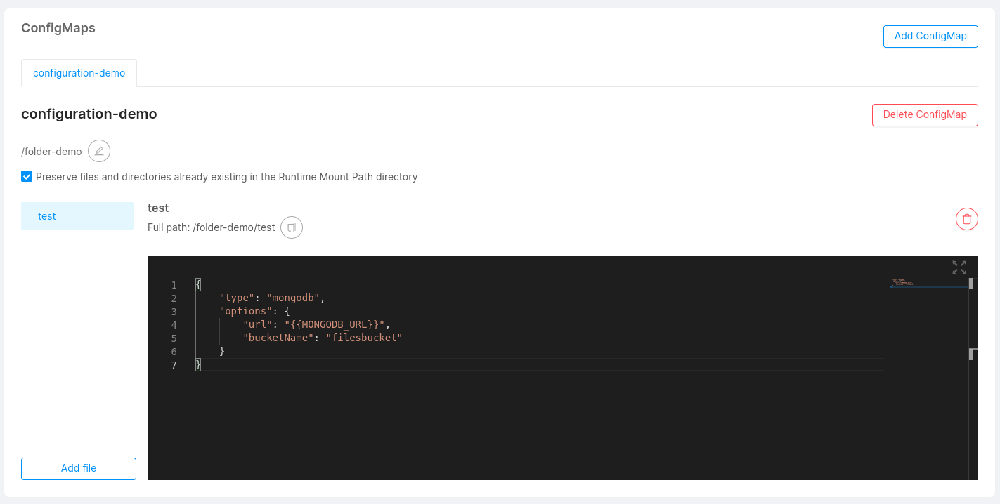

#### Shared ConfigMaps

In the same project, different microservices could need to use the same ConfigMap (i.g. ER schema in a Fast Data project). Therefore, it is possible to use the ConfigMaps which already exist inside the project. To do that, you have to create a new ConfigMap for a microservice, selecting from the dropdown the name of the desired ConfigMap you want to use.
In this way, you link the microservice to a ConfigMap shared by other microservices. 

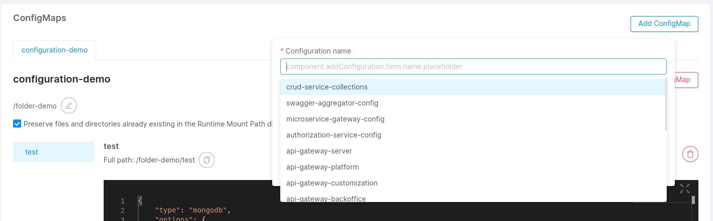

Digital projects are often in evolution, and for this reason, the user could need to modify his microservices, even the shared ConfigMaps. 
This process is easy because if a shared ConfigMaps is modified the changes will affect also the other microservices. With the same freedom, it is possible to delete a shared ConfigMaps from a microservice if you need to develop a new custom configuration. In this case, the elimination will not affect all the microservices but only the edited one.

#### Secrets

You can use this type of configuration in order to mount Kubernetes Secrets to your microservice.
Kubernetes secrets let you store and manage sensitive information (such as passwords, OAuth tokens, ssh keys, etc).

:::note
Check out the official [Kubernetes documentation](https://kubernetes.io/docs/concepts/configuration/secret/) for more information about secrets.
:::

:::warning
Secrets associated to microservices must exists on your Kubernetes namespace.

:::
If your projects uses `mlp`, the Mia-Platform cli deploy tool, you can configure the `mlp.yaml` file inside your project configuration repository to generate secrets for you on the namespace.

To release custom secrets with mlp, add these lines to the mlp.yaml file:

```yaml
secrets:
  - name: "client-credential-private-key"
    when: "always"
    data:
      - from: "file"
        file: "/tmp/private.key"
```

Once you have created a secret file on your kubernetes namespace, you can use this feature to associate it to your microservice.

When secrets are linked to a microservice, its deployment files are accordingly modified to automatically mount your secret files on kubernetes. This will allow you to use their private content directly from your microservice.

:::info
Once you'll add a secret to one of your microservices, the secret's name will be recorded and you'll be able to reuse it by easily adding the same secret to multiple microservices.
:::

:::warning
You need to give **additional permissions** to the console service account in order to be able to get the list of the secrets on the cluster.
:::

It is also possible to use Kubernetes secrets to setup specific environment variables, follow this [link](/products/console/api-console/api-design/services.md#environment-variable-configuration) to understand how to do so.  

#### Empty dirs

You can use this section to define special mounting points in your services.  
This mountpoints can be used to create an actual empty directory on the generated Kubernetes pod. This can be useful if
the service run with low privileges and cannot change anything in its default file system because the generated folder
will be readwritable by the process.  
Another common use case is to allow sharing data between the different containers of the service, because if you use
the same empty dir in one or more container of the same service. This can be useful if one of the container can generate
files that must be consumed by another container.

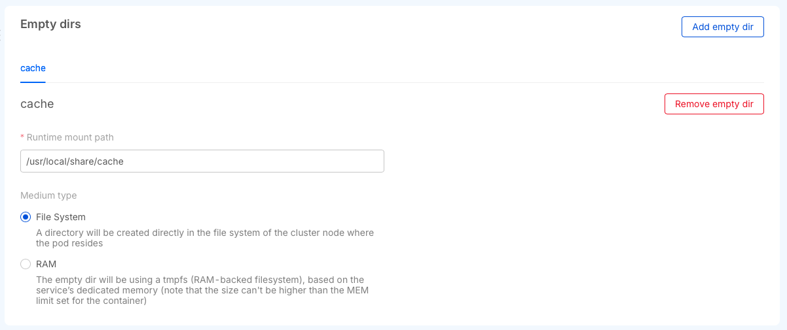

You can create two different types of empty dirs, the first one will use space on the disks of the kubernetes node where
the workload will run or using the part of the dedicated memory to the service saving the data directly in the RAM.

The main difference is that using the RAM is faster and the data will be lost after a pod restart, using the file system
will preserve the data between pod crashes but the speed of the read writes are tied to the medium used by the node disk.

### Provide a CA Certificate to a custom service

In an enterprise environment, to encrypt SSL connections, there could be a set of custom certificates signed by one or more trusted certificates.
By following this guide you'll be able to provide one or more trusted certificates in PEM format in a single file for your **custom** services.

To configure a custom CA certificate for a custom service you should:

1. Verify if the service you want to provide an additional certificate with supports this feature by visiting its dedicated documentation page.
2. Have the CA certificate in `pem` format, and rename the file in `additional-ca.pem`.
3. Create a Kubernetes Secret in the namespace (replace `YOUR_NAMESPACE` with your namespace name) of the project that needs it using the command:

```sh
kubectl -n YOUR_NAMESPACE create secret generic additional-ca-certificates --from-file=additional-ca.pem
```

This command will create a secret like the following:

```yml
apiVersion: v1
kind: Secret
metadata:
  name: additional-ca-certificates
data:
  additional-ca.pem: "base64-content"
```

The `additional-ca.pem` content is created in base64.

In the Console, access to your project and enter in the design section, select the working branch and click on the custom service in the `Microservices` section.

Once here, you should add a [custom configuration](#add-a-configuration) to your microservice. In particular, to create the configuration necessary to add `additional-ca.pem`, you should fill the form with data that depends on the service for which you want to add this feature.

Lastly, you should add a new environment variable to your custom service. To do so, go to the [environment variables card](#environment-variable-configuration) of your service and click on the button to add a new one. In the form that will open you should add data that may vary based on the service for which you want to add this feature.

Next paragraph will give you the correct data that you need to create both the custom configuration and the environment variable necessary to add a CA certificate based on which service you are working on.

#### Custom configuration and environment variable data

In this section, we will list all the information necessary to correctly configure additional CA certs for services that support this feature.

##### Node Services

In order to correctly configure your Node service to handle additional CA certs, you should add a custom configuration with the following data:

- **Type**: `Secret`
- **Configuration Name**: `additional-ca-certificates` (which is the name of the previously generated secret)
- **Runtime Mount Path**: `/home/node/app/tls`

Then, click on the submit button to confirm your choices.

Finally, you should create a new environment variable passing the following data:

- **Key**: `NODE_EXTRA_CA_CERTS`
- **Value Type**: `Plain Text`
- **Value**: `/home/node/app/tls/additional-ca.pem` (which is the mountpath of your configuration file concatenated with your certificate file)
- **Description** (*optional*): any description that may help you.

Once saved all these changes, you should see the volume correctly mounted in the generated deployment file.

## Raw Manifest configuration

If, for any reason, the Console lacks some functionality that you may need, you can switch to the Raw Manifest configuration mode and write your own kubernetes manifest files:

- *Deployment file*: defines how the pod in Kubernetes is built (container, probes, ports).
- *Service file*: defines how to contact your deployment.
- *Configmaps*: configuration files that are mounted on the containers.

### Enabling raw manifest configuration mode

You can enable the **Raw Manifest mode** in the Advanced tab of your Microservice configuration page

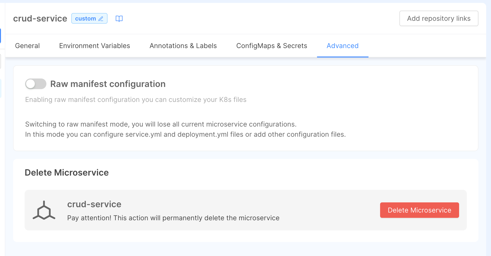

:::warning
By switching from standard to raw manifest configuration mode, you will lose every standard configuration set before.
:::

### Enable standard managed mode

in the Advanced tab, you can also **switch back** from raw manifest mode to the standard Console-managed configuration.

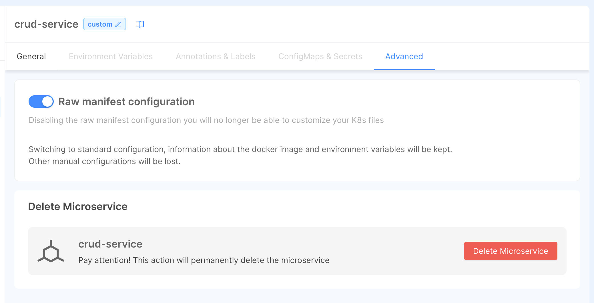

:::tip
You can convert to standard configuration without losing your advanced settings like your docker image, variables, ConfigMaps and other configurations.
:::

## Deleting a service

To delete a microservice head to the Advanced tab and use the **Delete** button.

:::warning
By deleting a microservice, you are also deleting each associated depency (e.g. endpoints, decorators, etc.)
:::
