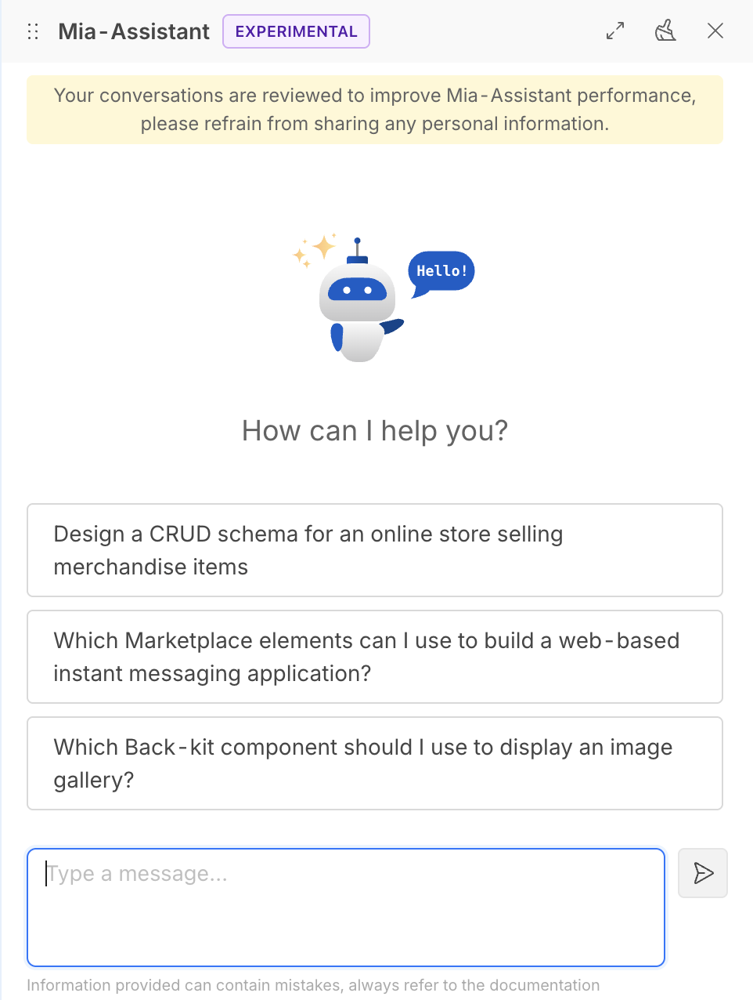

The **Mia Assistant** is a powerful tool that can help you with various tasks related to your projects. It can assist you in generating code, debugging, and providing suggestions based on your input.

It can also help you with documentation, searching for information, and answering questions related to your projects.

## Agentic Features are coming!

With Mia Assistant AI-powered features, you can leverage advanced capabilities that extend far beyond mere documentation lookup. Here some common use cases:

- **Gain insights on your data**: ask Mia Assistant to show comprehensive insights from your Company and Projects data, with contextual information and analytics
- **Edit Projects intelligently**: Use AI features to manage and configure your Projects with intelligent suggestions and automated assistance
- **Explore Marketplace**: Receive suggestions and solutions tailored to your specific project context and requirements
- **Debug efficiently**: Utilize the debug command to troubleshoot your Runtime environment, analyze logs, and quickly identify issues affecting your services

:::info
In order to use AI-powered features, enable them from the Company settings page. See [Company Settings](/products/console/company-configuration/settings.md) for more information.
:::

### MCP Server

Mia-Assistant is now empowered with the [Mia-Platform MCP Server](https://github.com/mia-platform/console-mcp-server)!

This MCP Server exposes a handful set of tools that allows to retrieve information and operate against your Company/Projects by just chatting with the Mia-Assistant. Here some tasks you can do with the power of these tools:

- **inspect insights** from your Tenants and Projects
- **deploy** your Project directly on any Environment
- **debug** services at runtime by inspecting logs and service status and receiving suggestions from the Assistant

### Debug Command

The `/debug` command allows you to debug the Runtime of your Project. It fetches the Runtime logs and provides you a response to the query you provided.
It is possible to filter by service name and request id to get more specific information.

:::info
Since the Debug command acts at the Project level, make sure you are within a Project to use it.
:::

#### Examples

Some examples in the usage of the command are:

- `/debug` Are there any errors in api-gateway service?
- `/debug` Trace the request with id 1234567890 in the api-gateway and crud-service services
