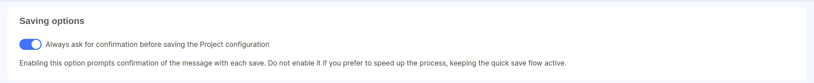
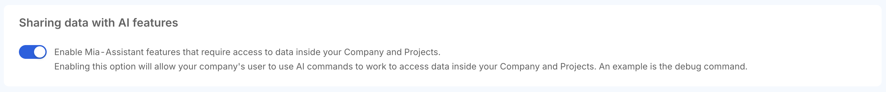

The **Settings** section allows you to view and define various configurations and settings related to your Company.

### Rules

The **Rules** tab allows the user to customize rules defined for the Company and its Projects.

#### Saving options

This rule allows users to manage the **Saving options** for all Projects in the Company: in particular, Company Owners can decide to add a confirmation constraint on the commit message inserted by users before each save in the Project Design area.  
This setting can be useful if your Company must comply with specific regulations regarding the information associated to each save of the Project configuration.

:::info  
If the setting is enabled on the Company, it cannot be overridden at Project level. On the other hand, if more strict constraints are needed only on a specific Project, this setting can be enabled selectively from the [Rules tab of the Project Settings page](/products/console/project-configuration/project-settings.md#rules), keeping it disabled at Company level.
:::

#### AI Settings

Enable **AI Settings** for the Company to grant Mia-Assistant the permission to use data from your Company and Projects to become even more powerful!  
When this setting is enabled, Mia-Assistant can help you performing a wide set of tasks, from inspecting Projects insights to manage user access or even deploy your Projects in production!

Learn more on the [Agentic Features documentation](/products/console/assistant/overview.md#agentic-features-are-coming).

