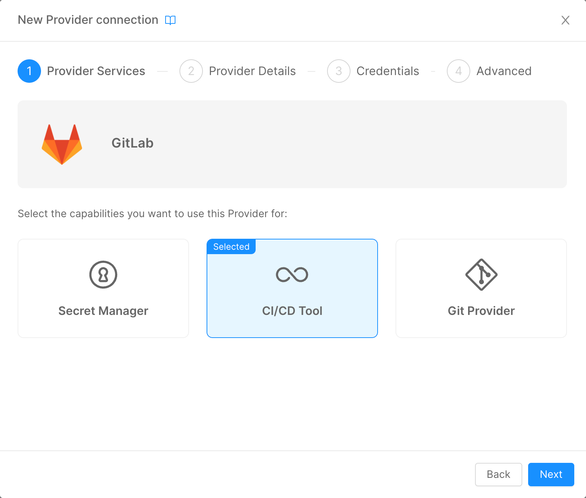

Mia-Platform Console can be configured to deploy your Project using GitLab CI.

To deploy your projects using GitLab CI, you must add the GitLab CI Provider in the Company Overview page, selecting the CI/CD Tool option, and then follow the [standard Provider configuration](/products/console/company-configuration/providers/configure-provider.mdx).



## Workflow

In the Git repository Configuration of your Mia-Platform Console Project, create a new file called `.gitlab-ci.yml`.

If `mlp` is configured to be the Pipeline runner in the Deployment options of the Project, the file should be structured as follows:

- a section to setup the variables used by `mlp` to locate the various configuration files generated by the Mia-Platform Console;
- a section to setup the secrets variables used by `mlp` to authenticate to the Kubernetes Cluster;
- a section to launch `mlp` to apply the manifests into Kubernetes.

:::info
It is possible to add more sections to the pipeline to check optional stages, like security and compliancy checks.
:::

Let's dive into these sections.

### Repository Variables Setup

In order to make `mlp` aware of the configuration files generated by the Mia-Platform Console, the following variables should be declared in the `variables` field of the pipeline:

```yaml
variables:
  ENVIRONMENT_VARIABLES_PREFIX: MIA_
  BASE_PATH: "${CI_PROJECT_DIR}/configuration"
  OVERLAY_PATH: "${CI_PROJECT_DIR}/overlays/${ENVIRONMENT_TO_DEPLOY}"
  DESTINATION_PATH: "${CI_PROJECT_DIR}/interpolated-files"
  GENERATE_FILE: "${CI_PROJECT_DIR}/mlp.yaml"
  VARIABLES_FILE: "${CI_PROJECT_DIR}/overlays/${ENVIRONMENT_TO_DEPLOY}/variables.env"
```

Where:

- `ENVIRONMENT_VARIABLES_PREFIX`: is used as the **Global prefix** for the variables managed in the Project section of the Console (check [here](/products/console/project-configuration/manage-environment-variables/manage-environment-variables-with-gitlab.md#how-to-differentiate-your-variable-from-one-environment-to-another) for more details);
- `BASE_PATH`: points to the folder of the repository where the Mia-Platform Console is saving the workload's manifests;
- `OVERLAY_PATH`: points to the `overlays` folder relative to the selected deploy environment. This folder contains the Kustomize configuration files (check [here](/products/console/project-configuration/kustomize-your-configurations/manage-a-kustomize-project.md) for details);
- `DESTINATION_PATH`: the folder where `mlp` will store the manifests after the [`interpolate`](/runtime-components/tools/mlp/50_interpolate.md) process;
- `GENERATE_FILE`: points to the `mlp.yaml` file that contains the configuration of the Kubernetes secrets that will be [generated](/runtime-components/tools/mlp/30_generate.md) by `mlp`;
- `VARIABLES_FILE`: points to the `variables.env` file for the selected deploy environment. This file contains the configuration of the Public Variables created via Mia-Platform Console (check [here](/products/console/api-console/api-design/public_variables.md) for more details);

:::info
The `CI_PROJECT_DIR` placeholder is automatically interpolated by GitLab: it will be replaced with the full path of the configuration repo where the pipeline is triggered.
:::

### Infrastructure Secrets Setup

In order to make `mlp` able to connect to the Kubernetes Cluster, the following variables should be declared:

```yaml
variables:
  DEPLOY_TYPE: deploy_all
  FORCE_DEPLOY_WHEN_NO_SEMVER: "false"
  KUBE_URL: "${KUBE__URL}"
  KUBE_TOKEN: "${KUBE__TOKEN}"
  KUBE_CA_PEM: "${KUBE__CA_PEM}"
  ENVIRONMENT_PREFIX: <<ENV_ID>>_
```

Where:

- `DEPLOY_TYPE`: used by `mlp` to perform a **Smart** or **Full Deploy** - this feature is available from the Mia-Platform Console ([here](/products/console/deploy/overview.md#smart-deploy)'s the details);
- `FORCE_DEPLOY_WHEN_NO_SEMVER`: used by `mlp` to force deployment without semver - this toggle is available in the Mia-Platform Console;
- `KUBE_URL`: the URL to the API Server of the Kubernetes Cluster target of the deploy;
- `KUBE_TOKEN`: the JWT Token used by `mlp` to authenticate into the Kubernetes Cluster (it should be relative to a Service Account created in the Cluster);
- `KUBE_CA_PEM`: the certificate used by `mlp` to authenticate into the Kubernetes Cluster (it should be relative to the same Service Account above);
- `ENVIRONMENT_PREFIX`: the **Differentiate prefix** used to filter the secret variables configured in the Project section of the Console (check [this](/products/console/project-configuration/manage-environment-variables/manage-environment-variables-with-gitlab.md#how-to-differentiate-your-variable-from-one-environment-to-another) page for more details);

:::info
In the example above, some Pipeline variables are used. These variables can be created in the _Settings_ > _CI/CD_ > _Variables_ section of a GitLab Group. In order to keep this data secure, and to be able to share them between different Project Pipelines, it is adviced to create them at the higher GitLab Group level from the Subgroups relative to the Projects as **Masked** and **Expanded**.
:::

#### Environment Specific Secrets

When a Deploy is performed from the Mia-Platform Console, it is possible to choose in which Runtime Environment apply the workloads configurations managed with it.
Since every Runtime Environment configured in the Project could point to a different Kubernetes Cluster, it is adviced to define the Infrastructure variables in such a way that the Pipeline can load the correct values relative to that specific Environment.

In order to do so, it is possible to override those values leveraging the `envId`, which is provided by the Mia-Platform Console when the pipeline is triggered.

You can define this behavior as follows:

```yaml
DEV:
  variables:
    KUBE_URL: "${KUBE_NOPROD_URL}"
    KUBE_TOKEN: "${KUBE_NOPROD_TOKEN}"
    KUBE_CA_PEM: "${KUBE_NOPROD_CA_PEM}"
    ENVIRONMENT_PREFIX: "DEV_"

  only:
    variables:
      - $ENVIRONMENT_TO_DEPLOY == "DEV"

PROD:
  variables:
    KUBE_URL: "${KUBE_PROD_URL}"
    KUBE_TOKEN: "${KUBE_PROD_TOKEN}"
    KUBE_CA_PEM: "${KUBE_PROD_CA_PEM}"
    ENVIRONMENT_PREFIX: "PROD_"

  only:
    variables:
      - $ENVIRONMENT_TO_DEPLOY == "PROD"
```

In the example above, we use the `only` directive to ensure that the pipeline will only execute the instructions defined in the parent parameter, which for semplicity can be named after the `envId`. As you can see, the rule used by the `only` directive checks for the `ENVIRONMENT_TO_DEPLOY` parameter, which is provided by the Mia-Platform Console when it triggers the pipeline.

### Apply Config with mlp

The last required section of the pipeline is based on a script that will launch various `mlp` commands to perform Public Variables interpolation, Kustomize operations and the application of the manifests into the Kubernetes Cluster.

You can find [here](/docs_files_to_download/gitlab-ci-mlp-template.yml) an example of this script that uses the variables defined in the previous sections.

### Template & Include

GitLab CI is able to import sections of Pipelines from external files using the `include` command. This command is useful to keep pipelines organized and to share common logic between different Projects without duplications.

For the three sections seen above, we suggest to make the section relative to the Repository Variables and the `mlp` script two templates, and include them in the Project Pipeline, which will contain only the section relative to the definition of the Infrastructure Secrets based on the Runtime Environment.

With this knowledge in mind, here is an example of the definition of a GitLab CI Pipeline used with Mia-Platform Console:

```yaml
include:
  # job template
  - project: "gitlab/pipelines-templates-repository"
    file: "/deploy-job.yml"
    ref: "master"

DEV:
  stage: release
  extends: .deploy_job

  variables:
    KUBE_URL: "${KUBE_NOPROD_URL}"
    KUBE_TOKEN: "${KUBE_NOPROD_TOKEN}"
    KUBE_CA_PEM: "${KUBE_NOPROD_CA_PEM}"
    ENVIRONMENT_PREFIX: "DEV_"

  only:
    variables:
      - $ENVIRONMENT_TO_DEPLOY == "DEV"

PROD:
  stage: release
  extends: .deploy_job

  variables:
    KUBE_URL: "${KUBE_PROD_URL}"
    KUBE_TOKEN: "${KUBE_PROD__TOKEN}"
    KUBE_CA_PEM: "${KUBE_PROD_CA_PEM}"
    ENVIRONMENT_PREFIX: "PROD_"

  only:
    variables:
      - $ENVIRONMENT_TO_DEPLOY == "PROD"
```
