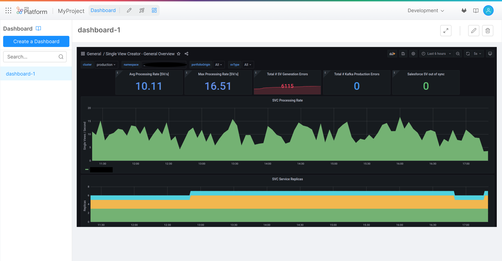
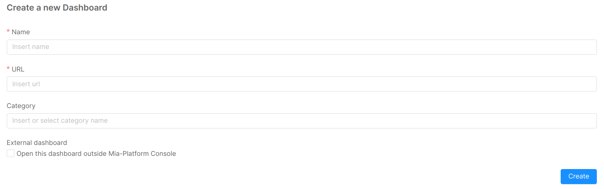
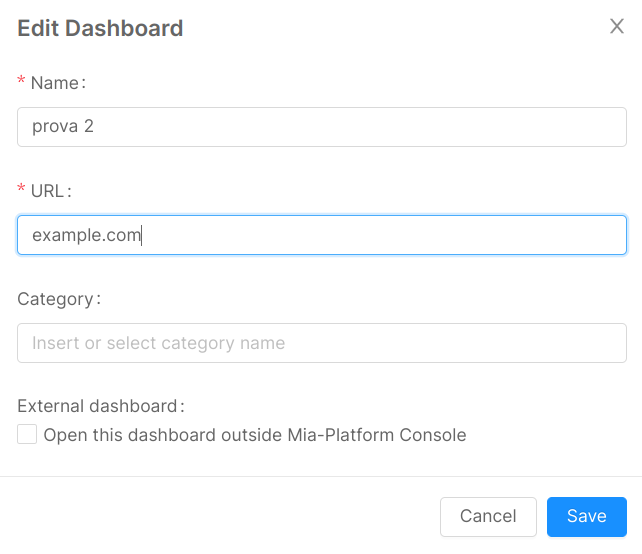

## Overview

The Dashboard Area of Mia-Platform Console allows you to keep the tools you use to monitor your project close to its configuration. In this section, which is accessible from the main menu, you can visualize as IFrames the dashboards you created with your monitoring tools (such as Grafana, Kibana, etc.).

## Managing Dashboards

From the Dashboard Area, you can add, edit, and delete dashboards. Each environment has its own dashboards, since you usually want to monitor a specific environment. Changes to dashboards in one environment will not affect dashboards in the other environments.

All of the following instructions are intended for the Dashboard Area.

### Add a Dashboard

In the side menu, using the 'Create a dashboard' button, it is possible to add an existing dashboard to the selected environment. To do so, the required fields are:

* A `Name`, which defines the dashboard label that will be displayed in the user interface;
* An `Url`, that will be used to render the dashboard IFrame;
* An optional `Category` name, used to group dashboards, if already existing the dashboard will be inserted in the specified category, otherwise a new category will be created.

:::note
Some websites may not support `Iframes`, so you can enable the `External dashboard` checkbox to open the dashboard outsite the Mia-Platform Console
:::

### Edit a Dashboard

When a dashboard is selected, you can use the edit button (represented by a pencil icon) placed in the right side of the header to edit a dashboard in the selected environment. To do so, the required fields are:

* A `label`, which defines the dashboard name that will be displayed in the user interface;
* An `url`, that will be used to render the dashboard IFrame;
* An optional `Category` name, used to group dashboards, if already existing the dashboard will be inserted in the specified category, otherwise a new category will be created.

### Delete a Dashboard

When a dashboard is selected, you can use the delete button (represented by a trash bin icon) placed in the right side of the header to remove a dashboard from the selected environment. When clicking on the delete button, a confirmation dialog will open, and after inserting the label of the dashboard, you can remove effectively remove it.
