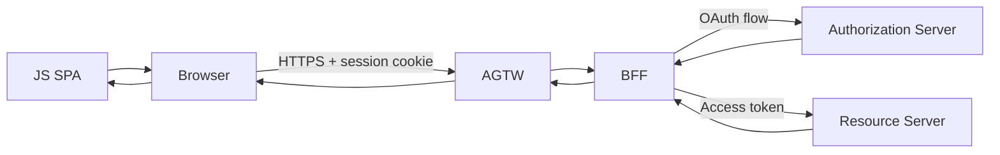
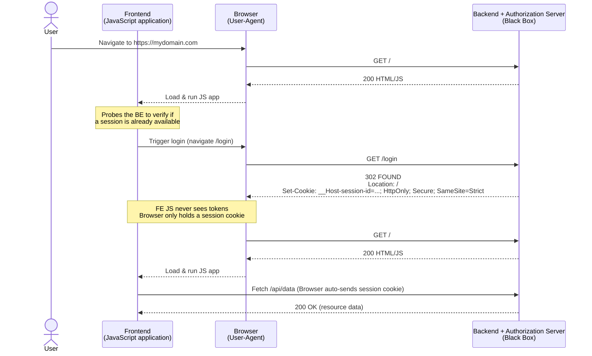
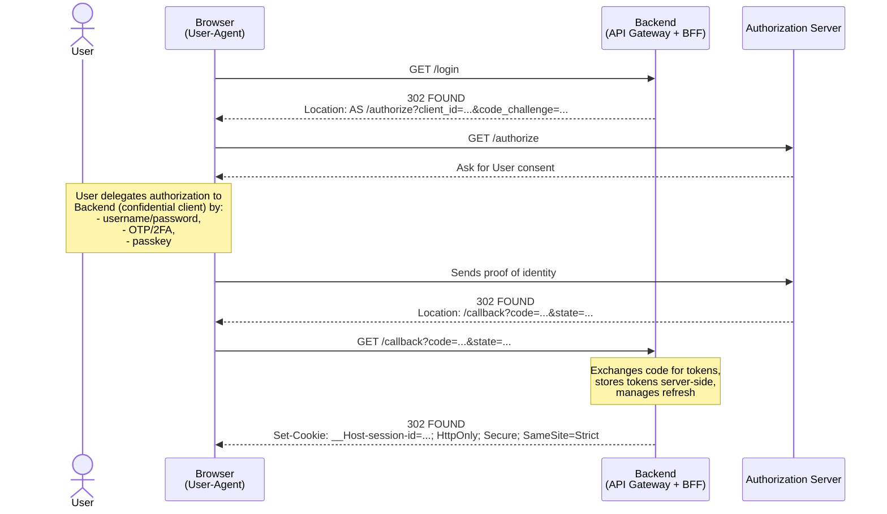
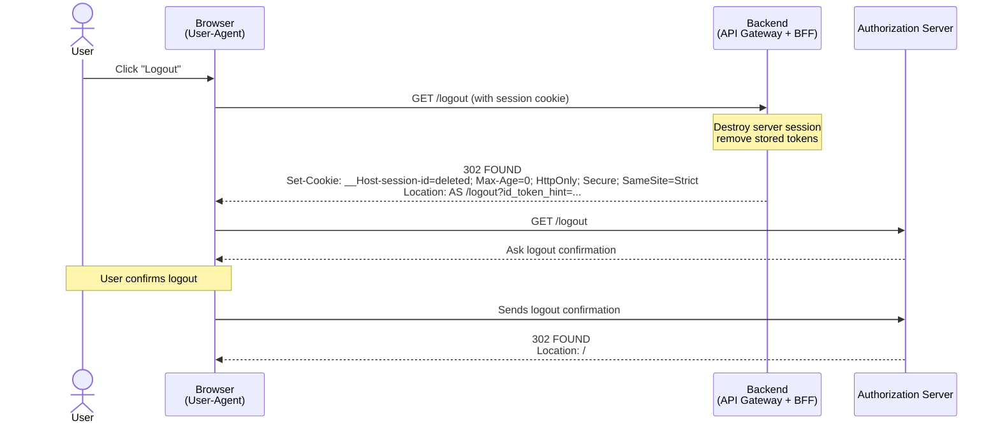

:::info
This authorization flow is in **preview** and requires the **Advanced** or **Customization** section of the Console Project configuration.
:::

## How This Differs from the Standard Authorization Flow

The [Authorization Flow](/products/console/project-configuration/auth-flow/authorization-flow.md) shipped with the Console relies on a chain of
platform services — **API Gateway → Authorization Service → Authentication Manager** (e.g. Auth0
Client) — where the browser-side client already holds a token and every request is validated
through those services before reaching your microservices.

This **BYO Provider** flow takes a fundamentally different approach:

| | Standard Authorization Flow | Auth Flow BYO Provider |
|---|---|---|
| **Identity provider** | Pre-integrated (Auth0 Client, Client Credentials, …) | Any OIDC / OAuth 2.x provider you control |
| **Token handling** | Token lives in the browser; client sends it on every request | Tokens **never reach the browser**; a server-side BFF stores them in Redis |
| **Session mechanism** | Bearer token in `Authorization` header | `HttpOnly` / `Secure` / `SameSite=Strict` session cookie |
| **API Gateway** | Mia-Platform API Gateway (nginx-based) | Envoy API Gateway with Lua + JWT filters |
| **Authorization layer** | Authorization Service + optional Rönd sidecars | Envoy `jwt_authn` filter validates the AT; optional `ext_authz` for policy checks |
| **Client library** | Any HTTP client (token already available) | `@mia-platform-internal/authtool-client-js` manages login/logout redirects and (optionally) short-lived access tokens |
| **Best for** | Services that already have tokens (M2M, mobile apps, existing SPAs) | New SPAs where you want the highest browser-security posture and full control over the identity provider |

:::tip
The two flows are **not mutually exclusive**. You can run the standard Authorization Flow for
machine-to-machine traffic and the BYO Provider flow for browser-facing applications within the
same project.
:::

## TL;DR

This page describes how to secure frontend applications using a **Backend-For-Frontend (BFF)** pattern instead of handling OAuth tokens directly in the browser.

- The **`authtool_bff`** service acts as an OAuth 2.0 confidential client, managing Authorization Code flow, token storage (in Redis), and session cookies — so tokens never reach the browser.
- The **Envoy API Gateway** exchanges the session cookie for an access token via a Lua filter, then validates the token with a JWT filter before forwarding requests upstream.
- The **`@mia-platform-internal/authtool-client-js`** library provides a framework-agnostic client and React bindings to handle login/logout redirects, session state, and (optionally) short-lived access tokens for direct API calls.

Two session modes are supported: **`bff`** (cookie-only, tokens stay server-side) and **`tokenExchange`** (cookie session + short-lived access token returned to JavaScript).

## Authentication for Public Applications

Exposing frontend applications as OAuth 2.x public clients raises significant security
concerns.

[Current best-practice guidance](https://www.ietf.org/archive/id/draft-ietf-oauth-browser-based-apps-26.html) considers storing OAuth tokens — access token (AT)
and/or refresh token (RT) — directly in a public client the least secure way to maintain an
authorized session in the browser.

### SPA Authorization

To authorize your single page application (SPA) directly in the browser you [need](https://www.ietf.org/archive/id/draft-ietf-oauth-browser-based-apps-26.html#name-browser-based-oauth-20-clie) to:

- Implement the Authorization Code flow in the frontend — libraries such as [oidc-client-ts](https://www.npmjs.com/package/oidc-client-ts) or [openid-client](https://www.npmjs.com/package/openid-client) can help
- Configure your API Gateway or authorization layer to validate tokens from your issuer of choice (Okta, Auth0, Keycloak, social login providers, etc.)
- Register a **public** application on your AS with:
  - Short-lived AT
  - Rotated RT

In this scenario the frontend application running in the browser must:

- Know the Authorization Server (AS) and/or OpenID Connect Provider (OP) endpoints
- Or discover them via [OAuth 2.0 Server Metadata](https://datatracker.ietf.org/doc/html/rfc8414) or [OpenID Connect 1.0 Server Metadata](https://openid.net/specs/openid-connect-discovery-1_0.html)
- Store the AT (and optional RT) in memory
- Ensure the website is hardened against XSS attacks

While this approach reduces operational costs — the SPA can call the resource server (RS) API
directly — it places a significant security burden on the frontend and requires careful maintenance.

For completeness, such an application is not vulnerable to traditional CSRF attacks since cross-site
requests do not carry any cookie.

### Cookie-Based Authorization

The alternative approach relies on cookies. Instead of handling tokens in the browser, the user
delegates authorization to a **confidential client** that stores tokens safely behind an API Gateway.

This confidential client is commonly known as a Backend-For-Frontend (BFF).

The BFF maintains a long-lived session with the JavaScript application running in the browser
through an opaque session cookie.

The high-level architecture looks like this:

For now, treat the backend as a black box that handles token storage
and browser redirects for the OAuth 2.0 Authorization Code Flow (with PKCE).

The flow goes as follows:

1. The user navigates to the website.
2. The browser loads and executes the JavaScript application.
3. The JS app checks with the backend whether a session already exists.
4. If no session is found, the app redirects the browser to the backend login endpoint (`/login`), which is treated here as a black box.
5. Once login completes, the backend redirects back to the frontend and sets a session cookie.
6. The browser reloads the JS app, which can now fetch resources from REST APIs.

From the frontend perspective, the JavaScript application needs to know three BFF endpoints:

- **`/session`** — check whether a session exists (may return userinfo)
- **`/login`** — initiate the login flow
- **`/logout`** — terminate the session

:::caution
The BFF is not an OpenID Provider and is not bound to expose a
`/userinfo` endpoint
:::

Now, let's open the black box. The BFF acts as a confidential client that carries out the
server-side half of the [Authorization Code Grant](https://www.rfc-editor.org/rfc/rfc6749.html#section-4.1)
with the Authorization Server.

This flow relies on HTTP redirects (`302 Found` or `303 See Other`) and on the browser security
model, which prevents JavaScript from inspecting the content of redirected responses.

The OAuth 2.x specification requires the backend to:

- Know the AS authorization endpoint (`/authorize`)
- Implement a callback route to complete authorization (`/oauth/callback`)
- Exchange the authorization code for tokens at the AS token endpoint via a back-channel call (no browser redirect)
- Manage the cookie session

Optionally, in OpenID Connect 1.0 the backend may implement [RP-Initiated Logout](https://openid.net/specs/openid-connect-rpinitiated-1_0.html):

- A logout endpoint (`/logout`) that redirects to the AS end-session endpoint
- A logout callback route to complete the session termination after the AS acknowledges logout

### Token Exchange

Token exchange is a hybrid variation of cookie-based authorization:

- The session is still maintained by a cookie
- A short-lived access token is also returned to the JavaScript application

The BFF retains responsibility for token refresh, and the long-lived refresh token
is never disclosed to the browser. At the same time, the frontend can call the
resource server (RS) API directly using the short-lived AT.

---

Continue to:

- [Configuration](/products/console/project-configuration/auth-flow/configuration.mdx) — Envoy API Gateway and BFF setup
- [Frontend Application](/products/console/project-configuration/auth-flow/frontend-application.mdx) — JavaScript client library and React integration

