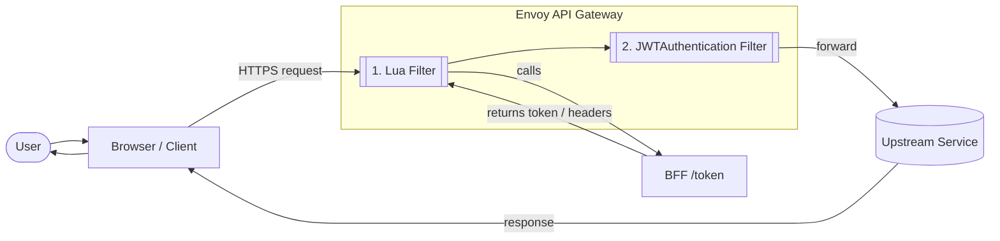
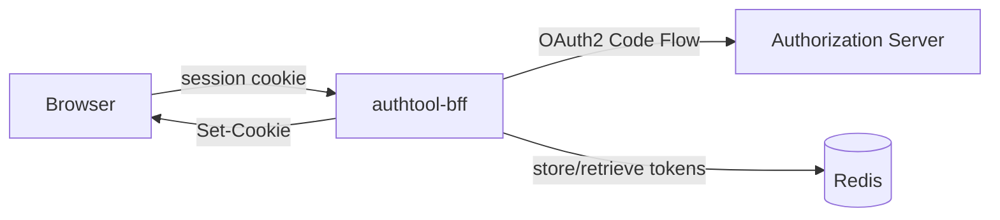

import Schema from "@site/static/schemas/platform/auth/authtool/authtool-bff/0.2.1/authtool_bff.schema.json"
import Example from "@site/static/schemas/platform/auth/authtool/authtool-bff/examples/example1.json"
import SchemaViewer from "@site/src/components/SchemaViewer"

:::info
This authorization flow is in **preview** and requires the **Advanced** or **Customization** section of the Console Project configuration.
:::

The **Mia Marketplace** provides components that implement both cookie-based and token-exchange patterns.
Two main components are involved:

- The BFF
- The API Gateway

The BFF (`authtool_bff`) handles:

- Session management
- Authorization code flow with AS
- Secure storage of tokens
- OIDC logout flow

The API Gateway (`envoy`) handles:

- Token validation
- Cookie \<-> Token exchange



## Envoy API Gateway

To set up filters in Envoy, refer to [`on-request-scripts.yaml`](/products/console/api-console/advanced-section/api-gateway-envoy/extensions.md#lua-scripts)
and [`http-filters.yaml`](/products/console/api-console/advanced-section/api-gateway-envoy/extensions.md#http-filters)
in the Console Project advanced configuration for **API Gateway Envoy**.

The Lua filter that exchanges the token can be downloaded from [Mia CDN](https://cdn.mia-platform.eu/runtime/platform/auth/authtool/token-exchange/latest/init.lua)
or by specific version:

```shell
# available versions are
# -> latest
# -> 0.1.0 (=latest)
version=0.1.0
curl -o token-exchange.lua "https://cdn.mia-platform.eu/runtime/platform/auth/authtool/token-exchange/${version}/init.lua"
```

Mount the script on the envoy microservice as a configmap on path `/etc/lua/lib` as
a file named `token-exchange.lua`.

Then update `on-request-scripts.yaml` with:

```yaml
- listener_name: frontend
  body: |-
    package.path = '/etc/lua/lib/?.lua;' .. package.path
    local token_exchange = require('token-exchange')

    -- Configuration
    local config = {
      token_service_cluster = "authtool-bff",
      token_service_endpoint = "/bff/token",
      session_cookie_name = "__Host-session_id",
    }

    token_exchange.on_request(request_handle, config)
```

Keep in mind that:

- `authtool-bff` is the name of the microservice associated with the `authtool_bff`
  confidential client in your project
- The `authtool_bff` API is served under a `/bff/` path prefix
- The cookie name must match your `sessionIdHardening` setting (here, `__Host-session_id`)

Token validation is handled by the [JwtAuthentication filter](https://www.envoyproxy.io/docs/envoy/latest/configuration/http/http_filters/jwt_authn_filter),
which verifies JWT signatures against your AS / OpenID Provider public key or JWK Set.

Add a filter in `http-filters.yaml` as in the following non-normative example:

```yaml
- listener_name: frontend
  order: 65
  name: envoy.filters.http.jwt_authn
  typed_config:
    "@type": type.googleapis.com/envoy.extensions.filters.http.jwt_authn.v3.JwtAuthentication
    providers:
      "<provider_name>":
        issuer: "<issuer_url>"
        audiences: [
          # your token audiences
        ]
        remote_jwks:
          http_uri:
            uri: "<authorization_server_uri>"
            cluster: "<authorization_server_cluster>"
            timeout: 1s
        #
        # refer to envoy documentation to
        # decide how to handle to token after validation,
        # for instance:
        #
        forward: false
        forward_payload_header: x-jwt-payload
        #
    rules: [
      # add rules to match
      # the part of the API
      # that must be Authorized by
      # a valid token Authorization header
      #
      # for instance:
      #
      - match:
          prefix: "/api"
        requires:
          provider_name: "<provider_name>"
    ]
```

Finally, add the issuer as a cluster in `clusters.yaml` as in
the following non-normative example:

```yaml
- "@type": type.googleapis.com/envoy.config.cluster.v3.Cluster
  name: "<authorization_server_cluster>"
  connect_timeout: 30s
  type: LOGICAL_DNS
  lb_policy: ROUND_ROBIN
  dns_lookup_family: V4_ONLY
  load_assignment:
    cluster_name: "<authorization_server_cluster>"
    endpoints:
    - lb_endpoints:
      - endpoint:
          address:
            socket_address:
              address: "<address>"
              port_value: 443
  #
  # handle TLS here:
  #
  transport_socket:
    name: envoy.transport_sockets.tls
    typed_config:
      '@type': type.googleapis.com/envoy.extensions.transport_sockets.tls.v3.UpstreamTlsContext
      common_tls_context:
        validation_context:
          trusted_ca:
            filename: /etc/ssl/certs/ca-certificates.crt
```

## BFF

The BFF is implemented by a service called `authtool_bff`, available as an OCI image:

```text
<image_registry_domain>/platform/auth/authtool/authtool_bff:<tag>
```

or as a **Mia Marketplace** plugin.

The full configuration schema is available on
[Mia CDN](https://cdn.mia-platform.eu/runtime/platform/auth/authtool/authtool-bff/0.2.1/authtool_bff.schema.json)
and rendered below:

<SchemaViewer schema={Schema} example={Example} />

Architecturally, `authtool_bff` interacts with four components:

- **Session** — browser cookie
- **Cache** — token storage (Redis)
- **Client** — HTTP calls to the Authorization Server
- **REST API server** — exposes endpoints to the frontend



### Session Management

The `session` configuration block controls how `authtool-bff` creates, secures, and maintains the cookie-based session with the browser.

#### Cookie Creation

When the OAuth2 callback completes, the BFF sets a session cookie. The `mode` property determines how:

- **`bff`** — the cookie carries only an opaque session ID; tokens never reach the browser
- **`tokenMediation`** *(default)* — the cookie still maintains the session, but a short-lived access token can be returned to JavaScript

Cookie attributes are configured under `mode`:

```json
{
  "session": {
    "mode": {
      "type": "bff",
      "sessionIdHardening": "host",
      "sameSite": "strict",
      "secure": true,
      "http_only": true,
      "path": "/",
      "domain": null,
      "partitioned": false,
      "expirationSecs": 3600
    }
  }
}
```

This produces a cookie like:

```
Set-Cookie: __Host-session_id=<opaque>; HttpOnly; Secure; SameSite=Strict; Path=/
```

#### Cookie Hardening

The `sessionIdHardening` field controls the cookie name prefix (defaults to `host`):

| Value    | Cookie name prefix | Effect                                                  |
|----------|-------------------|---------------------------------------------------------|
| `host`   | `__Host-`          | Forces `Secure`, `Path=/`, no `Domain` *(default)*     |
| `secure` | `__Secure-`        | Forces `Secure`                                        |
| `none`   | *(no prefix)*      | No enforcement, useful for local development over HTTP |

:::info
The `http_only` cookie attribute defaults to `true` but can only be set to `false` in **debug builds**.
In release builds it is always enforced to `true`.
:::

#### Cookie Signing and Token Encryption

Two keys protect session integrity and token storage:

```json
{
  "session": {
    "signingKey": { "type": "env", "key": "SESSION_SIGNING_KEY" },
    "encryptionKey": { "type": "env", "key": "SESSION_ENCRYPTION_KEY" },
    "encryptAccessToken": true
  }
}
```

- **`signingKey`** — signs the cookie value so the BFF can detect tampering
- **`encryptionKey`** — encrypts **both** access tokens and refresh tokens at rest in Redis
- **`encryptAccessToken`** — can be set to `false` to skip AT encryption for performance when tokens are short-lived (default: `true`)

#### Token Storage and Expiration

The BFF stores tokens in Redis and controls their lifecycle:

```json
{
  "session": {
    "authorizationFlowCache": { "connectionName": "redis-session" },
    "refreshTokenExpirationSecs": 604800,
    "refreshTokenRotation": false,
    "sessionJitterSecs": 7
  }
}
```

- **`authorizationFlowCache`** — points to a Redis connection either by reference (`connectionName`) or inline Redis config, where tokens and authorization state are persisted
- **`refreshTokenExpirationSecs`** — TTL for stored refresh tokens (default: 7 days / `604800`)
- **`refreshTokenRotation`** — when `true`, each refresh issues a new RT and invalidates the old one (default: `false`)
- **`refreshTokenExpirationPayloadField`** — optional key in the token response containing the RT expiration (not mandated by OAuth 2.0 spec)
- **`sessionJitterSecs`** — subtracts seconds from token expiry to avoid using tokens that expire mid-flight (default: `7`)

#### Subsequent Requests

On every request carrying the session cookie:

1. BFF verifies the cookie signature using `signingKey`
2. Looks up the session in Redis
3. Decrypts the stored access token using `encryptionKey`
4. If the AT is expired (minus jitter), uses the RT to refresh
5. Returns the valid AT (in BFF mode, only internally; in token mediation mode, to the caller)

#### User Claims

The `userClaims` array selects which ID token claims are stored in the session and exposed via `/session`:

```json
{
  "session": {
    "userClaims": ["email", "name", "picture"]
  }
}
```

Defaults to `["email"]`.

#### Error Handling

The `errorRedirects` field accepts a URL where users are redirected when session or token errors occur:

```json
{
  "session": {
    "errorRedirects": "https://mydomain.com/error"
  }
}
```

### OpenID Connect Integration

The `authtool_bff` acts as an OAuth 2.0 confidential client that manages the Authorization Code flow with an external Identity Provider (IdP) or Authorization Server (AS). The BFF securely stores tokens and user claims in the session, never exposing sensitive material to the browser.

**Configuration options:**

- **Issuer and Metadata Discovery:**  
  The `issuer` field specifies the base URL of the IdP/AS. The `issuerMetadataSegment` (default: `/.well-known/openid-configuration`) is appended to discover OIDC endpoints automatically.

- **Client Registration:**  
  The `clientId`, `redirect_uri`, and `credentials` fields register the BFF as an OIDC client. Credentials can be a client secret or a private key.

- **Scopes and Extra Parameters:**  
  The `scope` field defines requested scopes (e.g., `openid`, `profile`, `email`). The `extra` field allows custom query parameters (e.g., `audience` for Auth0).

- **Token Endpoint Authentication:**  
  The `preferredTokenEndpointAuthMethod` and `preferredTokenEndpointSigningAlgorithm` fields let you override the default authentication and signing algorithms, supporting providers with non-standard requirements.

- **ID Token Validation:**  
  The `idTokenValidationIssuer` field allows custom issuer validation, useful when the IdP issues tokens with a different issuer than advertised in metadata.

- **Logout Flow:**  
  The `postLogoutRedirectUri` field enables OIDC-compliant logout, redirecting users to a registered URI after logging out at the IdP.

**How OIDC integrates with session management:**

- After successful authentication, the BFF stores access and refresh tokens (encrypted) in Redis and sets a secure, signed session cookie.
- User claims from the ID token (as configured in `userClaims`) are extracted and exposed via the `/session` endpoint.
- The session lifecycle (creation, refresh, expiration, logout) is managed transparently using OIDC endpoints.
- All sensitive operations (token exchange, refresh, logout) happen server-side.

### Redis Integration

The BFF uses Redis as a centralized cache for session data, access tokens, and refresh tokens. The `authorizationFlowCache` field in the session configuration references a Redis connection, either by name or inline.

- **Token Storage:**  
  Access and refresh tokens are encrypted and stored in Redis, keyed by the session identifier.
- **Session Lookup:**  
  On each request, the BFF retrieves and decrypts session data from Redis to validate and refresh tokens as needed.
- **Configuration:**  
  Redis connections are defined in the `connections` block and referenced via `authorizationFlowCache`.

This design supports horizontal scaling, as all BFF instances share the same session store.

### Server Settings

The `server` section configures the BFF REST API server:

- **Listening Address and Port:**  
  Controls which network interface and port the BFF binds to, suitable for deployment behind a reverse proxy or API gateway.
- **API Prefix:**  
  The `apiPrefix` setting groups all BFF endpoints under a common URL path (e.g., `/bff/`), simplifying routing and API gateway integration.

### BFF Key Setup Script

The `setup_bff_keys.sh` script automates the generation of cryptographic keys required by the BFF for cookie signing and token encryption.

The script generates values for the `SESSION_SIGNING_KEY` and `SESSION_ENCRYPTION_KEY` environment variables, which the BFF configuration references to sign session cookies and encrypt tokens at rest in Redis.

You can download the latest version of the script using:

```shell
version=latest
curl -o setup_bff_keys.sh "https://cdn.mia-platform.eu/runtime/platform/auth/authtool/authtool_bff/${version}/setup_bff_keys.sh"

# enable execution
chmod +x setup_bff_keys.sh
```

### Private Key / Public Key for `private_key_jwt` Assertion

When configuring the BFF to use `private_key_jwt` authentication, the client proves its identity by signing a JWT with its private key instead of sending a client secret. The Authorization Server verifies the JWT using the registered public key.

**How it works:**
- The private key is referenced in the configuration under `credentials` (type: `privateKey`).
- During the token exchange, the BFF creates and signs a JWT assertion, presenting it to the token endpoint as proof of identity.
- The Authorization Server must have the matching public key registered for the client.

**Key points:**
- This method is more secure than a client secret because the private key never leaves the BFF.
- The private key should be generated and stored securely, using the `setup_bff_keys.sh` script or a similar process.
- The public key must be registered with the IdP during client registration.

**Example configuration snippet:**
```json
{
  "client": {
    "credentials": {
      "privateKey": {
        "type": "file",
        "path": "/path/to/key.pem"
      }
    },
    "preferredTokenEndpointAuthMethod": "private_key_jwt"
  }
}
```

This setup provides strong asymmetric authentication between the BFF and the Authorization Server.

### Endpoint Rewrites

Due to how the **Mia Platform** Console manages Envoy routing, every BFF route must be explicitly declared in the `endpoints.yaml` advanced configuration file. Each route needs both a `path` match (exact) and a `prefix` match (with trailing slash) to handle requests correctly.

All BFF routes must disable the Lua token-exchange filter, since these endpoints handle authentication themselves and must not go through the token-exchange pipeline. Depending on your setup, you may also need to disable `jwt_authn` (when JWT validation covers the whole listener) and/or `ext_authz` (when external authorization is active).

Add the following entries to `endpoints.yaml`:

```yaml
## BFF ##

### login
- listener_name: frontend
  match:
    prefix: /bff/login/
  route:
    prefix_rewrite: /bff/login/
    cluster: "authtool-bff"
    timeout: "0s"
  typed_per_filter_config:
    envoy.filters.http.lua:
      "@type": type.googleapis.com/envoy.extensions.filters.http.lua.v3.LuaPerRoute
      disabled: true
    # activate when jwt_authn covers the whole listener
    # envoy.filters.http.jwt_authn:
    #   "@type": type.googleapis.com/envoy.extensions.filters.http.jwt_authn.v3.PerRouteConfig
    #   disabled: true
    # activate when ext_authz is active
    # envoy.filters.http.ext_authz:
    #   "@type": "type.googleapis.com/envoy.extensions.filters.http.ext_authz.v3.ExtAuthzPerRoute"
    #   disabled: true
- listener_name: frontend
  match:
    path: /bff/login
  route:
    prefix_rewrite: /bff/login
    cluster: "authtool-bff"
    timeout: "0s"
  typed_per_filter_config:
    envoy.filters.http.lua:
      "@type": type.googleapis.com/envoy.extensions.filters.http.lua.v3.LuaPerRoute
      disabled: true
    # activate when jwt_authn covers the whole listener
    # envoy.filters.http.jwt_authn:
    #   "@type": type.googleapis.com/envoy.extensions.filters.http.jwt_authn.v3.PerRouteConfig
    #   disabled: true
    # activate when ext_authz is active
    # envoy.filters.http.ext_authz:
    #   "@type": "type.googleapis.com/envoy.extensions.filters.http.ext_authz.v3.ExtAuthzPerRoute"
    #   disabled: true

### logout
- listener_name: frontend
  match:
    prefix: /bff/logout/
  route:
    prefix_rewrite: /bff/logout/
    cluster: "authtool-bff"
    timeout: "0s"
  typed_per_filter_config:
    envoy.filters.http.lua:
      "@type": type.googleapis.com/envoy.extensions.filters.http.lua.v3.LuaPerRoute
      disabled: true
    # activate when jwt_authn covers the whole listener
    # envoy.filters.http.jwt_authn:
    #   "@type": type.googleapis.com/envoy.extensions.filters.http.jwt_authn.v3.PerRouteConfig
    #   disabled: true
    # activate when ext_authz is active
    # envoy.filters.http.ext_authz:
    #   "@type": "type.googleapis.com/envoy.extensions.filters.http.ext_authz.v3.ExtAuthzPerRoute"
    #   disabled: true
- listener_name: frontend
  match:
    path: /bff/logout
  route:
    prefix_rewrite: /bff/logout
    cluster: "authtool-bff"
    timeout: "0s"
  typed_per_filter_config:
    envoy.filters.http.lua:
      "@type": type.googleapis.com/envoy.extensions.filters.http.lua.v3.LuaPerRoute
      disabled: true
    # activate when jwt_authn covers the whole listener
    # envoy.filters.http.jwt_authn:
    #   "@type": type.googleapis.com/envoy.extensions.filters.http.jwt_authn.v3.PerRouteConfig
    #   disabled: true
    # activate when ext_authz is active
    # envoy.filters.http.ext_authz:
    #   "@type": "type.googleapis.com/envoy.extensions.filters.http.ext_authz.v3.ExtAuthzPerRoute"
    #   disabled: true

### oidc/logout/callback
- listener_name: frontend
  match:
    prefix: /bff/oidc/logout/callback/
  route:
    prefix_rewrite: /bff/oidc/logout/callback/
    cluster: "authtool-bff"
    timeout: "0s"
  typed_per_filter_config:
    envoy.filters.http.lua:
      "@type": type.googleapis.com/envoy.extensions.filters.http.lua.v3.LuaPerRoute
      disabled: true
    # activate when jwt_authn covers the whole listener
    # envoy.filters.http.jwt_authn:
    #   "@type": type.googleapis.com/envoy.extensions.filters.http.jwt_authn.v3.PerRouteConfig
    #   disabled: true
    # activate when ext_authz is active
    # envoy.filters.http.ext_authz:
    #   "@type": "type.googleapis.com/envoy.extensions.filters.http.ext_authz.v3.ExtAuthzPerRoute"
    #   disabled: true
- listener_name: frontend
  match:
    path: /bff/oidc/logout/callback
  route:
    prefix_rewrite: /bff/oidc/logout/callback
    cluster: "authtool-bff"
    timeout: "0s"
  typed_per_filter_config:
    envoy.filters.http.lua:
      "@type": type.googleapis.com/envoy.extensions.filters.http.lua.v3.LuaPerRoute
      disabled: true
    # activate when jwt_authn covers the whole listener
    # envoy.filters.http.jwt_authn:
    #   "@type": type.googleapis.com/envoy.extensions.filters.http.jwt_authn.v3.PerRouteConfig
    #   disabled: true
    # activate when ext_authz is active
    # envoy.filters.http.ext_authz:
    #   "@type": "type.googleapis.com/envoy.extensions.filters.http.ext_authz.v3.ExtAuthzPerRoute"
    #   disabled: true

### session
- listener_name: frontend
  match:
    prefix: /bff/session/
  route:
    prefix_rewrite: /bff/session/
    cluster: "authtool-bff"
    timeout: "0s"
  typed_per_filter_config:
    envoy.filters.http.lua:
      "@type": type.googleapis.com/envoy.extensions.filters.http.lua.v3.LuaPerRoute
      disabled: true
    # activate when jwt_authn covers the whole listener
    # envoy.filters.http.jwt_authn:
    #   "@type": type.googleapis.com/envoy.extensions.filters.http.jwt_authn.v3.PerRouteConfig
    #   disabled: true
    # activate when ext_authz is active
    # envoy.filters.http.ext_authz:
    #   "@type": "type.googleapis.com/envoy.extensions.filters.http.ext_authz.v3.ExtAuthzPerRoute"
    #   disabled: true
- listener_name: frontend
  match:
    path: /bff/session
  route:
    prefix_rewrite: /bff/session
    cluster: "authtool-bff"
    timeout: "0s"
  typed_per_filter_config:
    envoy.filters.http.lua:
      "@type": type.googleapis.com/envoy.extensions.filters.http.lua.v3.LuaPerRoute
      disabled: true
    # activate when jwt_authn covers the whole listener
    # envoy.filters.http.jwt_authn:
    #   "@type": type.googleapis.com/envoy.extensions.filters.http.jwt_authn.v3.PerRouteConfig
    #   disabled: true
    # activate when ext_authz is active
    # envoy.filters.http.ext_authz:
    #   "@type": "type.googleapis.com/envoy.extensions.filters.http.ext_authz.v3.ExtAuthzPerRoute"
    #   disabled: true

### oauth/callback
- listener_name: frontend
  match:
    prefix: /bff/oauth/callback/
  route:
    prefix_rewrite: /bff/oauth/callback/
    cluster: "authtool-bff"
    timeout: "0s"
  typed_per_filter_config:
    envoy.filters.http.lua:
      "@type": type.googleapis.com/envoy.extensions.filters.http.lua.v3.LuaPerRoute
      disabled: true
    # activate when jwt_authn covers the whole listener
    # envoy.filters.http.jwt_authn:
    #   "@type": type.googleapis.com/envoy.extensions.filters.http.jwt_authn.v3.PerRouteConfig
    #   disabled: true
    # activate when ext_authz is active
    # envoy.filters.http.ext_authz:
    #   "@type": "type.googleapis.com/envoy.extensions.filters.http.ext_authz.v3.ExtAuthzPerRoute"
    #   disabled: true
- listener_name: frontend
  match:
    path: /bff/oauth/callback
  route:
    prefix_rewrite: /bff/oauth/callback
    cluster: "authtool-bff"
    timeout: "0s"
  typed_per_filter_config:
    envoy.filters.http.lua:
      "@type": type.googleapis.com/envoy.extensions.filters.http.lua.v3.LuaPerRoute
      disabled: true
    # activate when jwt_authn covers the whole listener
    # envoy.filters.http.jwt_authn:
    #   "@type": type.googleapis.com/envoy.extensions.filters.http.jwt_authn.v3.PerRouteConfig
    #   disabled: true
    # activate when ext_authz is active
    # envoy.filters.http.ext_authz:
    #   "@type": "type.googleapis.com/envoy.extensions.filters.http.ext_authz.v3.ExtAuthzPerRoute"
    #   disabled: true
```

:::tip
Each route requires **two entries** — one with `path` (exact match) and one with `prefix` (trailing slash) — to ensure that both `/bff/login` and `/bff/login/?redirect_uri=...` are routed correctly.
:::

### Alternative: Cluster-Based Routing

Instead of declaring every BFF route individually in `endpoints.yaml`, you can skip the Console [Endpoints](/products/console/api-console/api-design/endpoints.md) section entirely and route all `/bff` traffic through a single catch-all entry. This approach requires three steps:

**1. Do not create a BFF endpoint in the Console Design section**

The `authtool-bff` microservice should still be deployed in your project, but you should **not** create an endpoint for it in the Console's **Design > Endpoints** section. Routing will be handled entirely via Envoy advanced configuration.

**2. Add the `authtool-bff` cluster in `clusters.yaml`**

Since the Console is not managing the endpoint, you need to register the BFF as an Envoy cluster manually:

```yaml
- "@type": type.googleapis.com/envoy.config.cluster.v3.Cluster
  name: "authtool-bff"
  connect_timeout: 30s
  type: LOGICAL_DNS
  lb_policy: ROUND_ROBIN
  dns_lookup_family: V4_ONLY
  load_assignment:
    cluster_name: "authtool-bff"
    endpoints:
    - lb_endpoints:
      - endpoint:
          address:
            socket_address:
              address: "authtool-bff"
              port_value: 3000
```

Adjust `address` and `port_value` to match your service name and listening port.

**3. Add a single `/bff` prefix route in `endpoints.yaml`**

Instead of one entry per BFF route, add a single prefix match that catches all `/bff` traffic:

```yaml
## BFF (catch-all)
- listener_name: frontend
  match:
    prefix: /bff
  route:
    prefix_rewrite: /bff
    cluster: "authtool-bff"
    timeout: "0s"
  typed_per_filter_config:
    envoy.filters.http.lua:
      "@type": type.googleapis.com/envoy.extensions.filters.http.lua.v3.LuaPerRoute
      disabled: true
    # activate when jwt_authn covers the whole listener
    # envoy.filters.http.jwt_authn:
    #   "@type": type.googleapis.com/envoy.extensions.filters.http.jwt_authn.v3.PerRouteConfig
    #   disabled: true
    # activate when ext_authz is active
    # envoy.filters.http.ext_authz:
    #   "@type": "type.googleapis.com/envoy.extensions.filters.http.ext_authz.v3.ExtAuthzPerRoute"
    #   disabled: true
```

This single entry replaces all the per-route declarations from the previous section. The trade-off is that the BFF service is not visible in the Console's Endpoints UI, and any future BFF routes are automatically covered without configuration changes.
