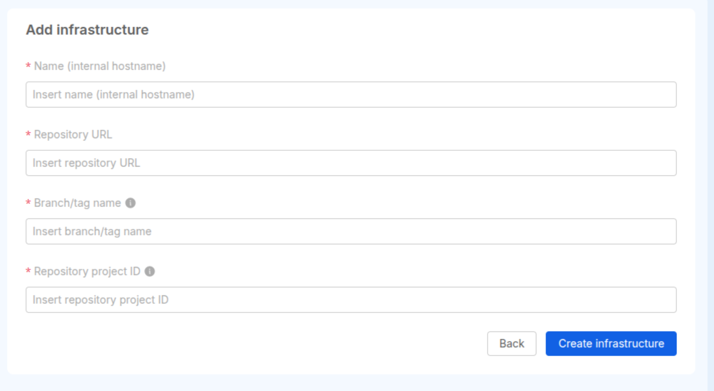
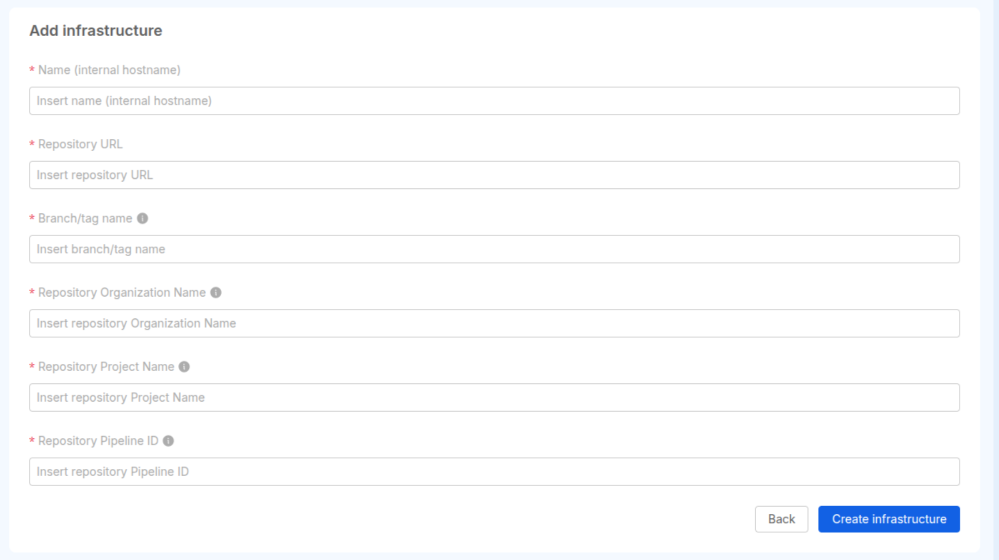
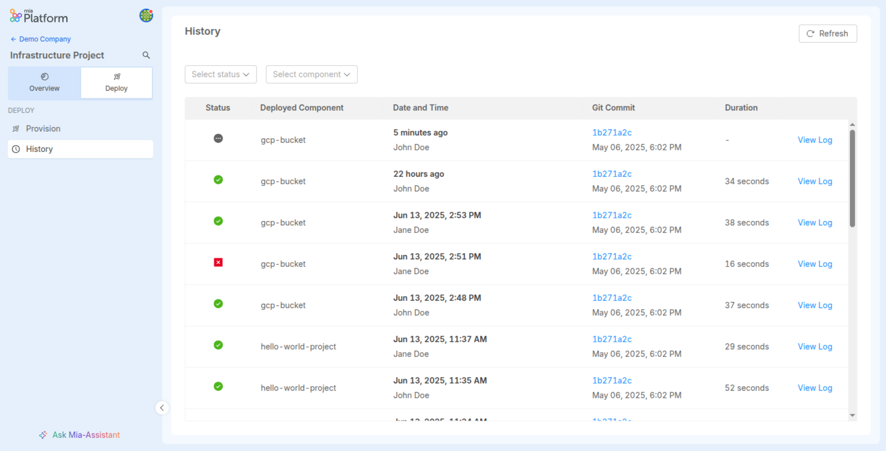
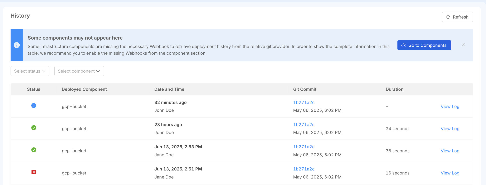
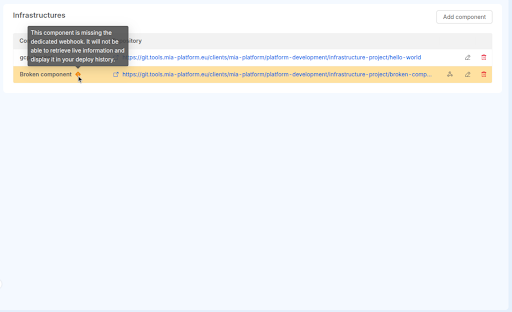

import Tabs from '@theme/Tabs';
import TabItem from '@theme/TabItem';

**Infrastructure Projects** are a dedicated Project type in the Console for provisioning and managing infrastructure, following the *Infrastructure as Code* (IaC) paradigm.

They are designed primarily for **Operations teams**, who can use them to define, version, and deploy infrastructure resources while ensuring consistency, transparency, and control over infrastructure changes.

For example, DevOps teams can use Infrastructure Projects to group all repositories that use tools like [Terraform](https://www.hashicorp.com/en/products/terraform), [OpenTofu](https://opentofu.org), [Microsoft Bicep](https://learn.microsoft.com/en-us/azure/azure-resource-manager/bicep/overview?tabs=bicep), or others to manage resources.

By consolidating these repositories, Infrastructure Projects simplify the release and monitoring process. They allow you to deploy a component and follow a two-part process: a validation phase (e.g., the `plan` phase in a Terraform pipeline), where you can review proposed changes and decide whether to proceed, and an execution phase (e.g., the `apply` phase in a Terraform pipeline), where the changes are actually applied.

These Projects are distinct from traditional [Application Projects](/products/console/project-configuration/application-project.md) as they are specifically designed to manage infrastructure resources, enabling better control, automation, and governance in the context of IaC. They can be connected to multiple repositories containing code and scripts to deploy resources in your infrastructure, providing the ability to deploy quickly with a review of the affected resources.

:::info
Infrastructure Projects are currently a [**BETA** feature](/release-notes/info/version_policy#feature-preview-and-beta) and are under active development.

At this time, they only support **GitLab** and **Azure DevOps** repositories with a specific pipeline configuration. Support for other providers will be added in future Console releases. You can find out more in the [technical limitations](#technical-limitations) section below.

If you want to share your feedback, you can head to the [Community discussion post](https://github.com/mia-platform/community/discussions/612).
:::

## Creating an Infrastructure Project

When creating a new Project in your Company, you can select the **Infrastructure** type.
This option unlocks a dedicated setup flow and enables the creation of a Project tailored to infrastructure workflows.


## Managing Infrastructure Components

Each Infrastructure Project includes a specific section for managing **infrastructure components**.

:::info
Currently, it is possible to add components from scratch, referencing existing repositories in the provider of the project.

In the near future components will be available in the [Software Catalog](/products/software-catalog/overview.md), to quickly install components simplifying the configuration and allowing to share
these configurations with other users.
:::

To create a new infrastructure component from scratch, you need to provide several information, which depends on the type of provider of the project.

<Tabs>
<TabItem value="GitLab-Example" label="GitLab" default>
If you have a project using GitLab as a provider, these are the information that are required to add a component:

- **Name**: The name of the component.  
- **Repository URL**: The URL of the Git repository where the component's code is hosted. This is used to provide a reference to the user.
- **Branch/tag Name**: The Git branch, tag, or commit that the deployment pipeline will run on.  
- **Repository Project ID**: The project ID associated with the Git repository. This is actually used to interact with the Git Provider.



As example:

- **Repository URL**: `https://my.gitlab.host/some/repo`
- **Branch/tag name**: `main`
- **Repository Project ID**: `some/repo`

:::info
As a _Repository Project ID_, you can use the relative path of the repository or the numeric identifier that you can find in the _Settings_ section of the repository.
:::

</TabItem>

<TabItem value="Azure-Example" label="Azure DevOps">
If you have a project using Azure DevOps as a provider, these are the information that are required to add a component:

- **Name**: The name of the component.  
- **Repository URL**: The URL of the Git repository where the component's code is hosted. This is used to provide a reference to the user.
- **Branch/tag Name**: The Git branch, tag, or commit that the deployment pipeline will run on.  
- **Repository Organization Name**: The name of the Organization that contains the repository.
- **Repository Project Name**: The name of the repository that contains the code to be deployed.
- **Repository Pipeline ID**: As Azure DevOps allows to configure different pipelines, this is the numeric identifier of the pipeline configured



As example:

- **Repository URL**: `https://dev.azure.com/my-organization/my-project`
- **Branch/tag name**: `main`
- **Repository Organization Name**: `my-organization`
- **Repository Project Name**: `my-project`
- **Repository Pipeline ID**: `1`

:::info
The _Repository Pipeline ID_ is not the name of the pipeline, but the identifier that can be found in the settings of the pipeline itself.

You can alternatively find it by navigating into your pipeline page: on the address bar the `definitionId` value is the pipeline identifier.
:::
</TabItem>
</Tabs>


## Deploying your Infrastructure

From within your Project, you can manage the deployment flow of your infrastructure components by:

- Running a **plan** to preview proposed infrastructure changes  
- Executing an **apply** to confirm and release your infrastructure changes

This enables control and consistency in your infrastructure.

### Deploy History

The **Deploy History** page is useful to better understand which actions have been executed for each infrastructure component of your Project.  
In particular this view traces which component has been deployed, together with some additional information.



#### Pipeline Webhook

In order to correctly fill up the Deploy History view, an Infrastructure Component must have a webhook associated to its repository on the git Provider.

The webhook is automatically created upon the Infrastructure Component creation. However, in case the webhook creation fails, a warning message will inform to manually retry the webhook creation from the Infrastructure Components Overview page.



If an Infrastructure Component is missing the related webhook on the git Provider, the Component will show highlighted to inform of this issue. On the right side of the Component row, a dedicated action appears to manually retry the webhook creation.



## Runtime Visibility

This feature is currently in [BETA](/info/version_policy.md#feature-preview-and-beta), so the visualization of runtime resources is not natively implemented.

To get the infrastructure components generated after deployment for each project, you can generate an [Infrastructure Component Runtime Software Catalog item type](/software-catalog/items-manifest/infrastructure-component-runtime.md) on the software catalog from the same pipeline via [miactl](/software-catalog/items-management/miactl.md).

Subsequently, this information can be retrieved either by using the Marketplace API or by creating a [Composer extension](/console/company-configuration/extensions.md#add-new-extension).

:::info
To retrieve the information of the available [Infrastructure Component Runtime Software Catalog item type](/software-catalog/items-manifest/infrastructure-component-runtime.md), you can use the following software catalog endpoint and filter by the project of interest:

```shell
curl -X GET \
  -H "Authorization: Bearer <YOUR_TOKEN>" \
  '<console-url>/api/marketplace?tenantId=<your-tenant-id>&types=infrastructure-component-runtime'
```  

:::

## Access and Permissions

Currently, all members of a Company can view Infrastructure Projects.  
However, only users with the role of **Project Administrator** or **Company Owner** are allowed to perform changes within them.

## Technical limitations

As mentioned above, there are still some technical limitations that repositories must conform to in order for Infrastructure Projects to work.

:::note
All of the following limitations will be soon resolved
:::

- the repository must be on one of the following:
  - _GitLab_ and use _GitLab CI_
    - the GitLab CI pipeline must be composed of two separate jobs named `plan` and `apply`
  - _Azure_ and use _Azure Pipelines_
    - the Azure pipeline must be composed of three stages: the first stage has to be named `plan`, the second stage must be a `ManualApproval`, and the thirs stage must be named `apply`
- creation from Marketplace is not supported yet, so you need to create your repository beforehand
