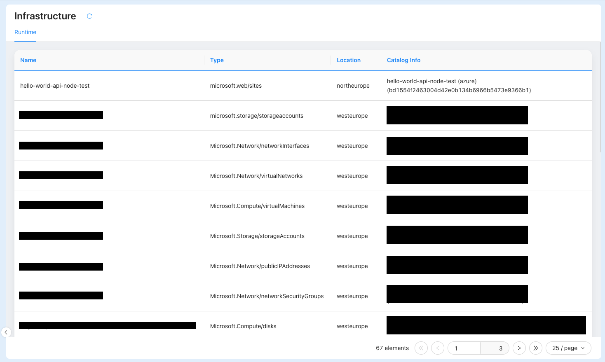

This tutorial will show you how to build a powerful, automated system to check if your services meet your organization's infrastructure standards. We will use the Mia-Platform Console and the [Integration Connector Agent](https://github.com/mia-platform/integration-connector-agent) to create a **dynamic scorecards** that gives you a clear view of your compliance status.

## What is a Scorecard in this Tutorial?

In this guide, a scorecard is a [custom extension](/products/console/company-configuration/extensions.md) you will build and add to the Mia-Platform Console. It is not just a static checklist. It is a dynamic dashboard that uses real, live data from your cloud infrastructure to automatically evaluate your services.

### Use Cases

The primary goal of building this system is to gain centralized visibility into all our technical assets, from the infrastructure they run on to the processes used to deploy them. By following this tutorial, we will enable a powerful monitoring capability that covers two critical domains:

1. **Monitoring our existing infrastructure** across different cloud providers, giving us a single pane of glass for all our cloud resources.

2. **Monitoring our DevOps systems**, allowing us to track the status, configuration, and health of essential tools like CI/CD pipelines.

## The Overall Workflow

This tutorial will guide you through the entire process, which can be broken down into three main steps:

1. **Data Scraping**: First, we will configure the [Integration Connector Agent](https://github.com/mia-platform/integration-connector-agent). Its job is to automatically scan your cloud providers (like AWS, GCP, or Azure) to "scrape" and collect data about your infrastructure.

2. **Enriching the Software Catalog**: The data collected by the agent will then be saved and organized into your [Mia-Platform Software Catalog](/products/software-catalog/overview.md). This creates a centralized, single source of truth for all your infrastructure assets. But this catalog does more than just hold data. By centralizing this information, you are also performing a crucial enrichment step. Thanks to the [Mia-Platform Console MCP Server](https://github.com/mia-platform/console-mcp-server), this enriched, contextual data becomes available to power advanced AI tools. It provides the necessary context for [Mia-Assistant](/products/console/assistant/overview.md) and other **Large Language Models (LLMs)**, enabling you to ask complex questions about your infrastructure in natural language and get intelligent, accurate answers.

3. **Creating the Scorecard Extension**: Finally, you will use the data from the catalog to build your scorecard. We will show you how to create a custom extension for the Mia-Platform Console that reads the catalog data and displays the compliance status of your infrastructure components, instantly showing you what meets the standard and what needs attention.

By following this guide, you will create a fully automated system that not only helps you govern your infrastructure but also unlocks new AI-driven capabilities for managing and understanding your systems.


## Pre-requisites

To follow this tutorial, you'll need:

1. A Mia-Platform Console project updated to at least **v.14.0.x**.
2. It's recommended to read the official documentation on configuring and using the [Integration Connector Agent](/runtime-components/plugins/integration-connector-agent/10_overview.md).
3. A **Azure Subscription** available

## Configure the Integration Connector Agent


The first step is to configure the **Integration Connector Agent**.
For detailed instructions on how to set up the agent and configure scraping for different cloud providers, follow the [official service documentation](/runtime-components/plugins/integration-connector-agent/10_overview.md) and this [tutorial](/products/console/tutorials/infrastructure-project/visualize-infrastructure-project-components-runtime-data-in-console.mdx).

For the purpose of our tutorial, we will configure the **Integration Connector Agent** to interact with an *Azure subscription* and scrape information from **Azure Cloud** and **Azure DevOps**.

To get data from your configured resources in Azure, we will use the [Azure Activity Log](https://learn.microsoft.com/en-us/azure/azure-monitor/platform/activity-log?tabs=log-analytics) configured to save data to an **Azure Event Hub**. For more information on how to configure the Integration Connector Agent with Azure, refer to this [documentation](/runtime-components/plugins/integration-connector-agent/sources/40_azure_activity_log_event_hub.md).

First, you will need the following information to successfully configure the Integration Connector Agent with **Azure**:

1. An Azure Subscription ID
2. Your Azure Tenant ID
3. Your Azure Client ID
4. Your Azure Client Secret
5. The Event Hub Namespace where the Azure Activity Log will save information
6. The Event Hub Topic where the Azure Activity Log will save information
7. The Azure Activity Log Checkpoint
8. The Azure Activity Log Container Name

Next, for the Integration Connector Agent configuration with **Azure DevOps**, you will need:

1. An Azure DevOps Access Token

Finally, you will also need:

1. A Mia-Platform Console Tenant ID
2. A Mia-Platform Console [Service Account](/products/console/identity-and-access-management/manage-service-accounts.md) Client ID
3. A Mia-Platform Console Service Account Client Secret

All of this information will be saved as secret variables within your Console project.

Once you have gathered this data and saved it as secret variables in the project, you can proceed with initializing the **Integration Connector Agent** service from the Marketplace and configuring it.
For the initial setup and basic configuration, please refer to this [documentation](/products/console/tutorials/infrastructure-project/visualize-infrastructure-project-components-runtime-data-in-console.mdx).

For this tutorial, you will need to configure the `config.json` ConfigMap as follows:


```json
{
  "integrations": [
    {
      "source": {
        "type": "azure-activity-log-event-hub",
        "subscriptionId": "{{AZURE_SUBSCRIPTION_ID}}",
        "eventHubNamespace": "{{AZURE_ACTIVITY_LOG_NAMESPACE}}",
        "eventHubName": "{{AZURE_ACTIVITY_LOG_TOPIC}}",
        "checkpointStorageAccountName": "{{AZURE_ACTIVITY_LOG_CHECKPOINT}}",
        "checkpointStorageContainerName": "{{AZURE_ACTIVITY_LOG_CONTAINER_NAME}}",
        "tenantId": "{{AZURE_TENANT_ID}}",
        "clientId": { "fromEnv": "AZURE_CLIENT_ID" },
        "clientSecret": { "fromEnv": "AZURE_CLIENT_SECRET" },
        "webhookPath": "/import"
      },
      "pipelines": [
        {
          "processors": [
            {
              "type": "cloud-vendor-aggregator",
              "cloudVendorName": "azure",
              "authOptions": {
                "tenantId": "{{AZURE_TENANT_ID}}",
                "clientId": { "fromEnv": "AZURE_CLIENT_ID" },
                "clientSecret":{ "fromEnv": "AZURE_CLIENT_SECRET" }
              }
            },
            {
              "type": "mapper",
              "outputEvent": {
                "name": "{{name}}",
                "runtimeData": {
                  "name": "{{name}}",
                  "type": "{{type}}",
                  "provider": "{{provider}}",
                  "location": "{{location}}",
                  "relationships": "{{relationships}}",
                  "tags": "{{tags}}",
                  "timestamp": "{{timestamp}}"
                }
              }
            }
          ],
          "sinks": [
            {
              "type": "console-catalog",
              "url": "<your-console-url>",
              "tenantId": "{{CONSOLE_TENANT_ID}}",
              "clientId": "{{CONSOLE_SERVICE_ACCOUNT_CLIENT_ID}}",
              "clientSecret": { "fromEnv": "CONSOLE_SERVICE_ACCOUNT_CLIENT_SECRET" },
              "itemType": "infrastructure-component-runtime",
              "itemNameTemplate": "{{name}} ({{runtimeData.provider}})"
            }
          ]
        }
      ]
    },
    {
      "source": {
        "type": "azure-devops",
        "webhookPath": "/import/devops",
        "azureDevOpsOrganizationUrl": "<your-azure-devops-organization-url>",
        "azureDevOpsPersonalAccessToken": { "fromEnv": "AZURE_DEVOPS_PERSONAL_ACCESS_TOKEN" }
      },
      "pipelines": [
        {
          "processors": [
            {
              "type": "mapper",
              "outputEvent": {
                "name": "{{name}}",
                "runtimeData": {
                  "name": "{{name}}",
                  "type": "repository",
                  "provider": "azure-devops",
                  "location": "{{project.name}}"
                }
              }
            }
          ],
          "sinks": [
            {
              "type": "console-catalog",
              "url": "<your-console-url>",
              "tenantId": "{{CONSOLE_TENANT_ID}}",
              "clientId": "{{CONSOLE_SERVICE_ACCOUNT_CLIENT_ID}}",
              "clientSecret": { "fromEnv": "CONSOLE_SERVICE_ACCOUNT_CLIENT_SECRET" },
              "itemType": "infrastructure-component-runtime",
              "itemNameTemplate": "{{name}} ({{runtimeData.provider}})"
            }
          ]
        }
      ]
    }
  ]
}
```

## Create the extension

Now that the **Integration Connector Agent** is configured, the next step is to create our extension to display the scorecards.

In this tutorial, we will create a simple **Composer** extension to display the data in a table format.

For more information on how to create extensions or add custom frontends to the Mia-Platform Console, follow these two tutorials:

1. [Create your extension](/products/console/tutorials/create-extension.md)
2. [Create extension with console SSO](/products/console/tutorials/create-extension-with-sso.md)

For this tutorial, we will create a simple Composer extension. To do so, follow these steps:

1. In your Company's view, navigate to the "Extensions" menu under the *Platforge* section. Create a new *Composer* extension and name it *Azure Scorecards*.
2. Once the extension is created, use the [Micro-Frontend Composer](/products/microfrontend-composer/overview.md) to design the UI. You can start with the table template and customize it as you like.
3. To connect the data gathered by the **Integration Connector Agent**, create a new *shared property* that the table will use. Configure it with the following values:


```json
{
  "type": "object",
  "properties": {
    "resName": {
      "type": "string",
      "label": "Name",
      "order": 10,
      "formOptions": {
        "readOnly": true,
        "hidden": true
      },
      "visualizationOptions": {
        "tag": "div",
        "properties": {
          "innerHTML": "{{args.[1].resources.runtimeData.name}}"
        },
        "sortable": false
      }
    },
    "resType": {
      "type": "string",
      "label": "Type",
      "order": 20,
      "formOptions": {
        "readOnly": true,
        "hidden": true
      },
      "visualizationOptions": {
        "tag": "div",
        "properties": {
          "innerHTML": "{{args.[1].resources.runtimeData.type}}"
        },
        "sortable": false
      }
    },
    "resLocation": {
      "type": "string",
      "label": "Location",
      "order": 25,
      "formOptions": {
        "readOnly": true,
        "hidden": true
      },
      "visualizationOptions": {
        "tag": "div",
        "properties": {
          "innerHTML": "{{args.[1].resources.runtimeData.location}}"
        },
        "sortable": false
      }
    },
    "catalogInfo": {
      "type": "string",
      "label": "Catalog Info",
      "order": 30,
      "formOptions": {
        "readOnly": true,
        "hidden": true
      },
      "visualizationOptions": {
        "tag": "div",
        "properties": {
          "innerHTML": "{{args.[1].name}} <br> ({{args.[1].itemId}})"
        },
        "sortable": false
      }
    },
    "resources": {
      "type": "object",
      "label": "Runtime asset",
      "order": 66,
      "formOptions": {
        "readOnly": true
      },
      "visualizationOptions": {
        "hidden": true,
        "sortable": false
      }
    }
  }
}
```

That's the result:



## Conclusion

With these final steps, we have now successfully built a fully automated **scorecard system** within the Mia-Platform Console, pulling real-time data directly from our Azure environment. We've created more than just a static dashboard; we've built a dynamic system that gives us immediate visibility into the compliance and health of our infrastructure.

The true power of what we have built goes beyond the visual scorecard. By configuring the **Integration Connector Agent** to populate **the Software Catalog**, we have created a rich, centralized source of truth. This is the critical foundation for unlocking advanced AI capabilities.

Thanks to the **Mia-Platform Console MCP Server**, this enriched catalog data is now available to power tools like **Mia-Assistant** and other *Large Language Models (LLMs)*. We can now move beyond simply viewing our data and begin to interact with it intelligently. This enables us to ask complex questions in natural language.

We have not only automated compliance tracking but have also transformed our software catalog into an intelligent system ready to answer our most challenging questions. We can now continue exploring by adding more data sources and leveraging the full power of AI to manage our systems with greater insight and efficiency.


