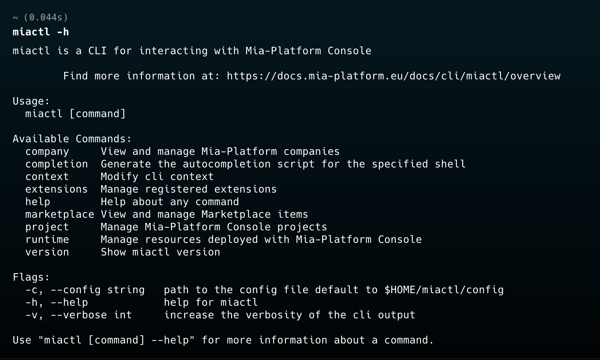
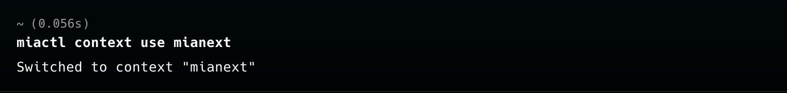

# Import Brownfield Project

Starting from version `0.17` of `miactl` and version `13.6.0` of Mia-Platform Console, the `import` command is supported. This command allows you to import declarative YML definitions of Kubernetes resources into an empty project in the Mia-Platform Console. 

The `import` command takes one or more YML files describing Kubernetes resources as input and converts them into configurations for the Mia-Platform Console, so they can be used within the project where they are being imported.

This feature is very useful when migrating a `brownfield project` into a Mia-Platform console project, as it helps avoid long and tedious initial manual setup steps.

In this tutorial, we will see how to import import the manifests to build and deploy a simple (not production ready), multi-tier web application composed of a single-instance `Redis` and multiple web frontend instances into the mia-platform console.

## Prerequisites

To continue with this tutorial, you first need to `install miactl locally`. To install the CLI, follow the section dedicated to your operating system in [this guide](/products/console/cli/miactl/20_setup.md).

After installing miactl, before proceeding with the import of Kubernetes resources into our project, we need to configure miactl with the context of our target Console instance. Configuring a `context` means providing miactl with the necessary information to connect to the console instance we want to target, such as the `console URL`, the `tenant ID` of the company we want to work with, and the `authentication method`.

For the authentication method, you can choose to use either your personal account or a `service account`. For instructions on creating a service account, refer to [this documentation page](/products/console/identity-and-access-management/manage-service-accounts.md). To learn in detail how to configure the `context` for miactl, refer to [this documentation page](/products/console/cli/miactl/30_commands.md#context).

## Import Kubernetes resources into an empty Mia-Platform Console Project

:::caution
Kubernetes resources can only be imported into an empty project. Additionally, at the time of writing this tutorial, the `import` command is lossy, meaning that some advanced configurations might be lost during the process. We recommend reviewing the generated files before attempting a deployment to ensure that nothing is missing or incorrect.
:::

### Setting up miactl

After installing miactl, the first step is to verify that the installation was successful. To do this, run the command: 

```bash
miactl -h
``` 

The output of this command should display a help message with a list of available commands, similar to the image below:



Now that we’ve verified that miactl is installed correctly, we need to select the context to use for the import.

To view all available contexts in miactl, run the following command:

```bash
miactl context list
```

The output of this command should display a list of available contexts, similar to the image below:


If no context is configured, or if you want to create a new one, follow the steps described on [this documentation page](/products/console/cli/miactl/30_commands.md#context).

Once you have verified the existence of a context or created a new one, you can set it as the active context using the following command:

```bash
miactl context use <context-name>
```

The output of this command should confirm the context switch, showing a message similar to the image below.



### Prepare the Kubernetes manifests

Now that miactl is configured, before running the import command, we need to retrieve the YML manifests describing the Kubernetes resources we want to import into the console.

For this tutorial, we will import the manifests to build and deploy a simple (not production ready), multi-tier web application composed of a single-instance `Redis` and multiple web frontend instances.
You can also find more information about this example in the official Kubernetes documentation at [this link](https://kubernetes.io/docs/tutorials/stateless-application/guestbook/).

The manifest we are going to import in our project are:

1. `redis-leader-deployment.yml`

```yaml 
apiVersion: apps/v1
kind: Deployment
metadata:
  name: redis-leader
  labels:
    app: redis
    role: leader
    tier: backend
spec:
  replicas: 1
  selector:
    matchLabels:
      app: redis
  template:
    metadata:
      labels:
        app: redis
        role: leader
        tier: backend
    spec:
      containers:
      - name: leader
        image: "docker.io/redis:6.0.5"
        resources:
          requests:
            cpu: 100m
            memory: 100Mi
        ports:
        - containerPort: 6379
```
2. `redis-leader-service.yml`

```yaml 
apiVersion: v1
kind: Service
metadata:
  name: redis-leader
  labels:
    app: redis
    role: leader
    tier: backend
spec:
  ports:
  - port: 6379
    targetPort: 6379
  selector:
    app: redis
    role: leader
    tier: backend

```

3. `redis-follower-deployment.yml`

```yaml 
apiVersion: apps/v1
kind: Deployment
metadata:
  name: redis-follower
  labels:
    app: redis
    role: follower
    tier: backend
spec:
  replicas: 2
  selector:
    matchLabels:
      app: redis
  template:
    metadata:
      labels:
        app: redis
        role: follower
        tier: backend
    spec:
      containers:
      - name: follower
        image: us-docker.pkg.dev/google-samples/containers/gke/gb-redis-follower:v2
        resources:
          requests:
            cpu: 100m
            memory: 100Mi
        ports:
        - containerPort: 6379

```

4. `redis-follower-service.yml`

```yaml 
apiVersion: v1
kind: Service
metadata:
  name: redis-follower
  labels:
    app: redis
    role: follower
    tier: backend
spec:
  ports:
    # the port that this service should serve on
  - port: 6379
  selector:
    app: redis
    role: follower
    tier: backend

```

5. `frontend-deployment.yml`

```yaml 
apiVersion: apps/v1
kind: Deployment
metadata:
  name: frontend
spec:
  replicas: 3
  selector:
    matchLabels:
        app: guestbook
        tier: frontend
  template:
    metadata:
      labels:
        app: guestbook
        tier: frontend
    spec:
      containers:
      - name: php-redis
        image: us-docker.pkg.dev/google-samples/containers/gke/gb-frontend:v5
        env:
        - name: GET_HOSTS_FROM
          value: "dns"
        resources:
          requests:
            cpu: 100m
            memory: 100Mi
        ports:
        - containerPort: 80

```

6. `frontend-service.yml`

```yaml 
apiVersion: v1
kind: Service
metadata:
  name: frontend
  labels:
    app: guestbook
    tier: frontend
spec:
  # if your cluster supports it, uncomment the following to automatically create
  # an external load-balanced IP for the frontend service.
  # type: LoadBalancer
  #type: LoadBalancer
  ports:
    # the port that this service should serve on
  - port: 80
  selector:
    app: guestbook
    tier: frontend
```

### Import the resources

Now that we also have the YML file we want to import into the console, all that’s left is to run the `import` command to bring our workloads directly into the console project.

To import the resources, run the following command:

```bash
miactl project import --filename <path-to-your-manifests> 
  --project-id <your-target-project-id> 
  --company-id <your-target-company-id> 
  --revision <your-target-revision>
```

To learn more about the other optional flags available for this command, refer to [this documentation page](/products/console/cli/miactl/30_commands.md#import).

If everything worked correctly, the output of the command will be similar to the image below:


Moving to the Design section of our project, in the revision where the import was performed, we can see the imported workloads on the Microservices page, ready to be modified or deployed directly using the Mia-Platform Console.


## Conclusion

The import of Kubernetes resources via miactl is a very powerful feature that saves time and manual setup operations when migrating resources generated externally into the console. This feature allows us to automate most of the work by migrating the majority of resources simply by running a command, and then we can focus on manually fine-tuning these resources to ensure they work optimally within the context of a Mia-Platform Console project.