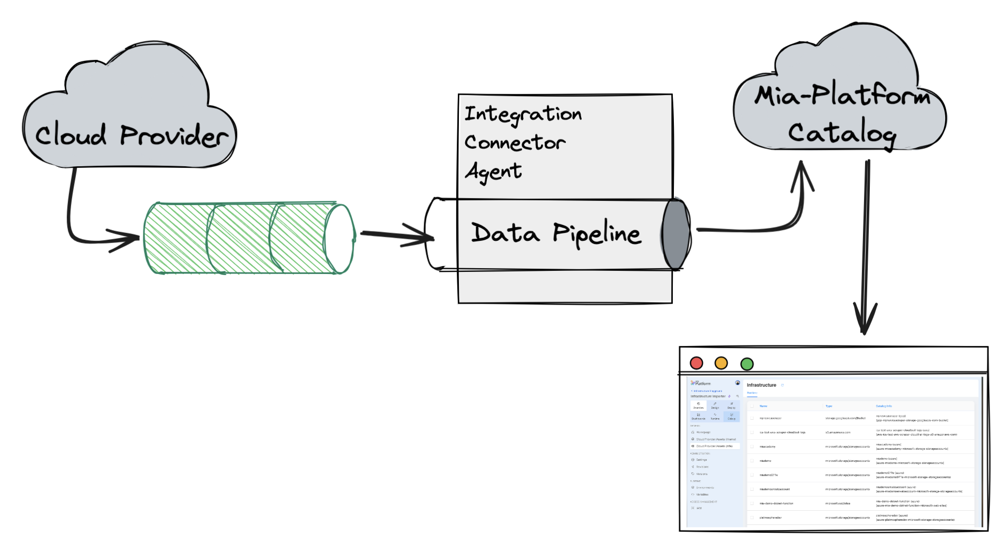
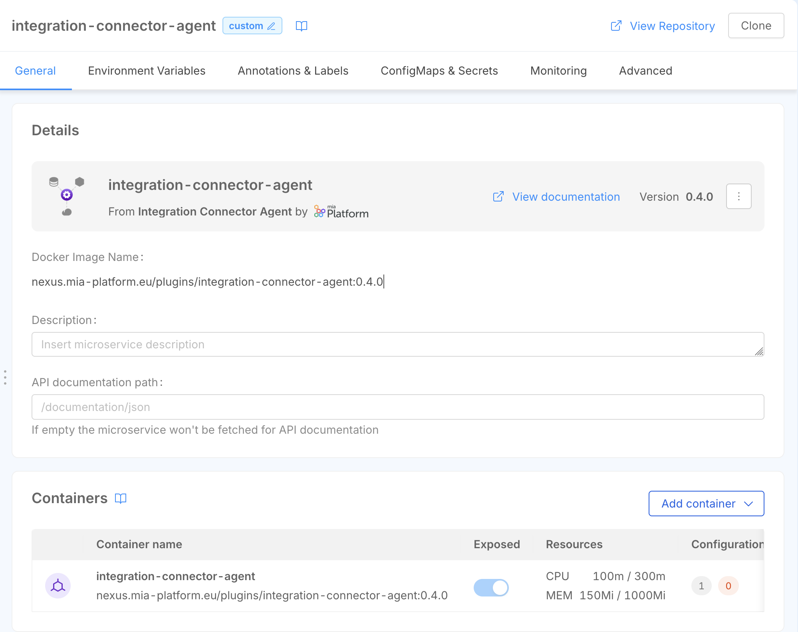
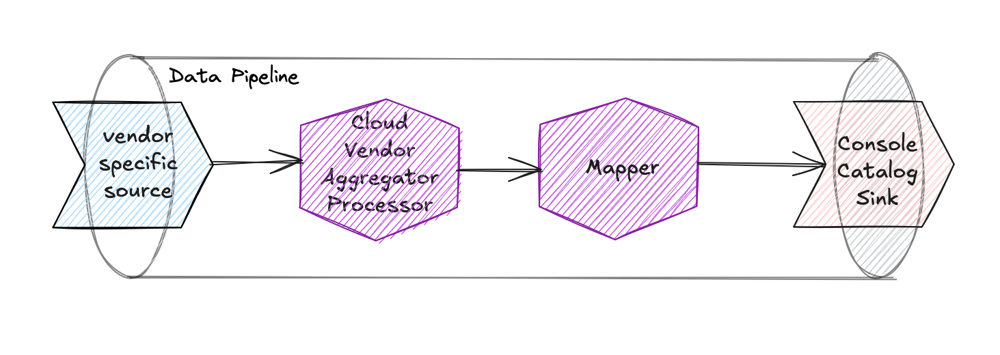
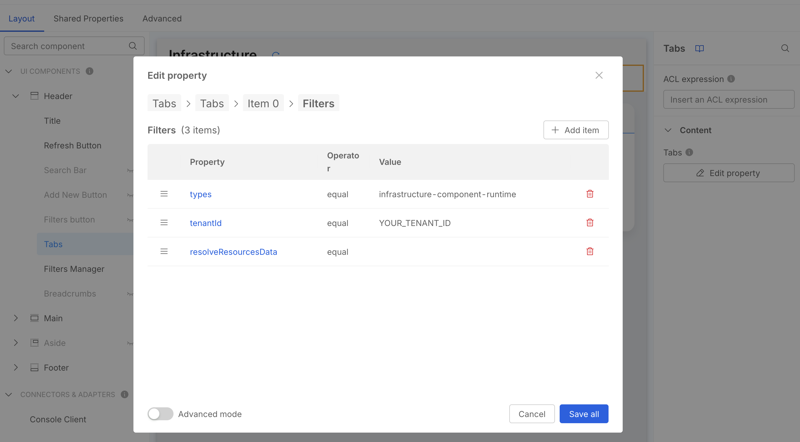
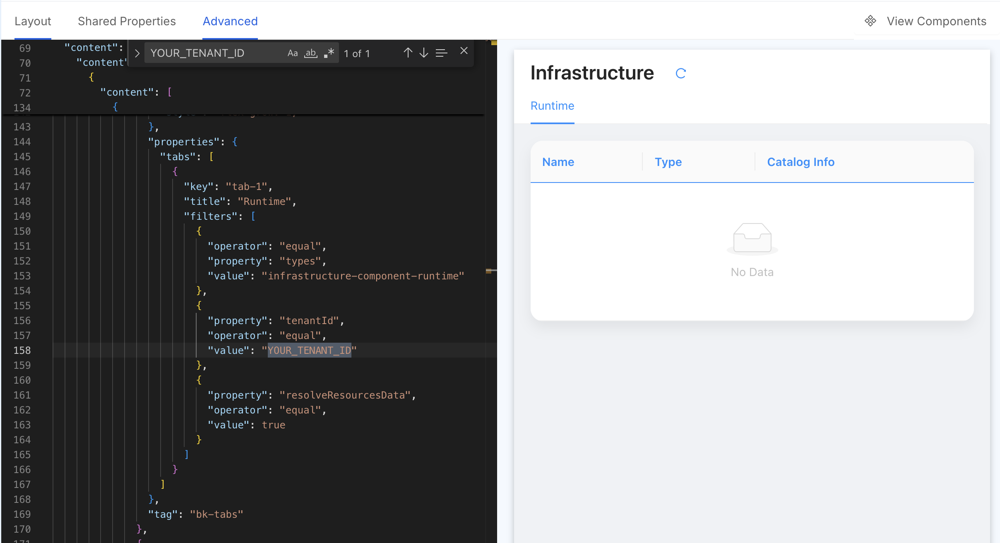
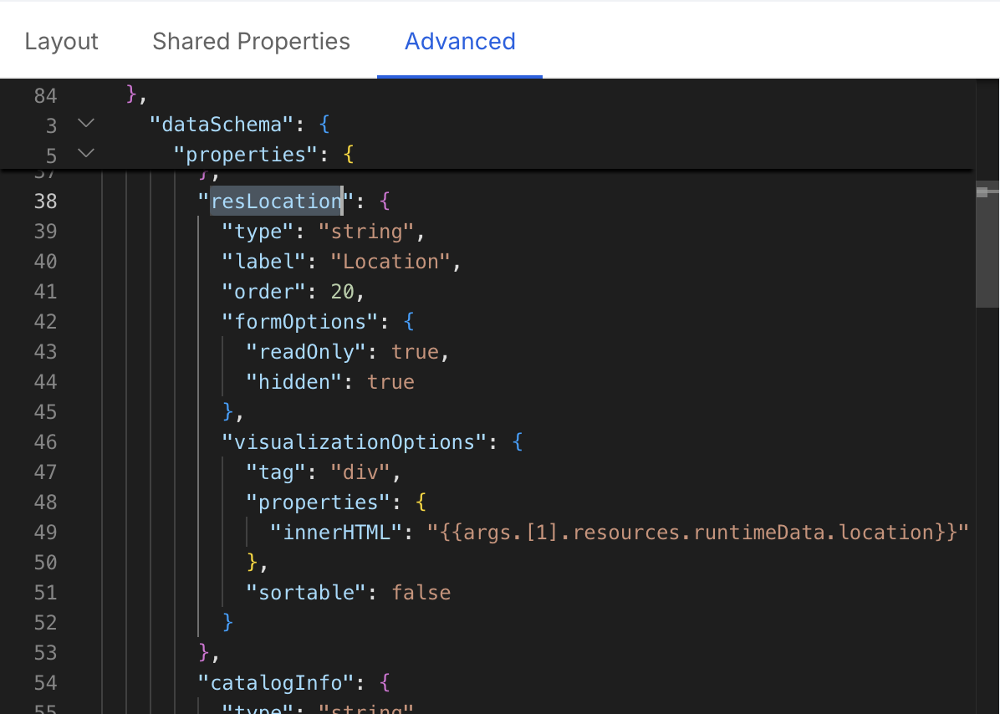

import Tabs from '@theme/Tabs';
import TabItem from '@theme/TabItem';

This tutorial will show you how to collect runtime data from your cloud provider and make it available to your final user in Console.

The tutorial assumes you have the following prerequisites in place:

- you have created an [Infrastructure Project](/products/console/project-configuration/infrastructure-project.md#creating-an-infrastructure-project)
- you have access to an [Application Project](/products/console/project-configuration/application-project.md) where you can create new microservices

## Architectural overview

The objective of this tutorial is to:

- use the Integration Connector Agent to collect runtime data from your cloud provider and save it within the Mia-Platform Catalog
- display the runtime data in the Console using Platforge Composer-based extensions

Data will be processed by the Integration Connector Agent following an event-driven approach,
which means that the agent will listen to events coming from the Cloud Provider and process them to update the runtime data in the Catalog.

To receive events from the Cloud Provider, we will create a set of resources in the Cloud Provider first (such as a Pub/Sub topic in GCP, an EventBridge rule in AWS, or an EventHub in Azure),
then we will configure the Integration Connector Agent to listen to these events and process them.

Therefore, to reach this goal, we will have to set up the following components:

- set up the Cloud Provider to send events
- configure the Integration Connector Agent to listen to these events and save them in the Catalog
- create a Platforge Composer-based extension to visualize the data in the Console



### Set up Cloud Provider integration

As mentioned above, we will need to create some resources in the Cloud Provider in order to receive events from it.

Each Cloud Provider has its own way to send events, so you will have to follow the specific instructions for your Cloud Provider.

:::info
To set up the Cloud Provider resources that will send events to your Integration Connector Agent instance, we have prepared a set of Terraform modules that will assist you,
you can find them in the [GitHub Mia-Platform Terraform Integration Connector Agent](https://github.com/mia-platform/terraform-integration-connector-agent) repository.
:::

<Tabs>
<TabItem value="aws" label="AWS" default>
You will need to:

- create a new CloudTrail
- create a new SQS queue that will be used to receive events by the Integration Connector Agent
- create a new EventBridge rule that will listen to the CloudTrail events and send them to the SQS queue

Create your terraform module using the following code snippet:

```go
module "aws" {
  source = "github.com/mia-platform/terraform-integration-connector-agent//modules/aws"

  cloudtrail_name = "awesome-cloudtrail-name"
  cloudtrail_bucket_name = "awesome-bucket-name"

  eventbridge_rule_name = "awesome-rule-name"
  sqs_queue_name = "awesome-queue-name"
}
```

:::tip
To provision the resources you can use an [Infrastructure Project](/products/console/project-configuration/infrastructure-project.md), just like you would do with any other terraform module.

You can also simply run

```bash
terraform init
terraform plan
terraform apply
```

Check out the full example in the [repository example directory](https://github.com/mia-platform/terraform-integration-connector-agent/tree/main/examples/aws).
:::

:::info
Find out more about the specific steps to create these resources in the [Integration Connector Agent documentation](/runtime-components/plugins/integration-connector-agent/use-cases/infrastructure-import/20_aws_infrastructure_import.md).
:::

</TabItem>

<TabItem value="gcp" label="GCP">
You will need to:

- enable the Cloud Asset Management API
- create a Pub/Sub topic that will be used to receive events by the Integration Connector Agent
- create a feed to send events from the Asset Management API to the Pub/Sub topic

Create your terraform module using the following code snippet:

```go
module "gcp" {
  source = "github.com/mia-platform/terraform-integration-connector-agent//modules/google"

  pubsub_topic_name = "awesome-topic-name"
  cloud_asset_feed_id = "awesome-feed-id"
}
```

:::tip
To provision the resources you can use an [Infrastructure Project](/products/console/project-configuration/infrastructure-project.md), just like you would do with any other terraform module.

You can also simply run

```bash
terraform init
terraform plan
terraform apply
```

Check out the full example in the [repository example directory](https://github.com/mia-platform/terraform-integration-connector-agent/tree/main/examples/gcp).
:::

:::info
Find out more about the specific steps to create these resources in the [Integration Connector Agent documentation](/runtime-components/plugins/integration-connector-agent/use-cases/infrastructure-import/10_gcp_infrastructure_import.md).
:::

</TabItem>

<TabItem value="azure" label="Azure">

You will need to:

- create a new eventhub
- create a monitor diagnostic settings for exporting administrative log to the created eventhub
- create a storage account with a blob container

Create your terraform module using the following code snippet:

```go
module "azure" {
  source = "github.com/mia-platform/terraform-integration-connector-agent//modules/azurerm"

  resource_group = "awesome-resource-group"
  activity_log_diagnostic_setting_name = "awesome-diagnostic-setting-name"

  eventhub_namespace_name = "awesome-eventhub-namespace"
  eventhub_name = "awesome-eventhub-name"

  eventhub_checkpoint_storage_name = "awesome-storage-account-name"
}
```

:::tip
To provision the resources you can use an [Infrastructure Project](/products/console/project-configuration/infrastructure-project.md), just like you would do with any other terraform module.

You can also simply run

```bash
terraform init
terraform plan
terraform apply
```

Check out the full example in the [repository example directory](https://github.com/mia-platform/terraform-integration-connector-agent/tree/main/examples/azure).
:::

:::info
Find out more about the specific steps to create these resources in the [Integration Connector Agent documentation](/runtime-components/plugins/integration-connector-agent/use-cases/infrastructure-import/30_azure_infrastructure_import.md).
:::

</TabItem>
</Tabs>

### Configure the Integration Connector Agent

Now that we have configured the Cloud Provider, we can configure the Integration Connector Agent to listen to the events coming from the Cloud Provider and save them in the Catalog.

To do so, you can create a new microservice in your Project starting from the [Integration Connector Agent](/runtime-components/plugins/integration-connector-agent/10_overview.md) plugin.



Now that the Integration Connector Agent microservice is created, we can configure the data pipeline that will be used to process the events coming from the Cloud Provider and save them in the Catalog.

The Data Pipeline will be configured using already available Integration Connector Agent components, and it will be defined
by a specific [source](/runtime-components/plugins/integration-connector-agent/sources/10_overview.md),
a set of [processors](/runtime-components/plugins/integration-connector-agent/processors/10_overview.md),
and a [sink](/runtime-components/plugins/integration-connector-agent/sinks/10_overview.md) that handles the data processing.



The components that we will use in the Data Pipeline are:

- Vendor-specific source: there are three different sources depending on the Cloud Provider you are using:
  - [`aws-cloudtrail-sqs`](/runtime-components/plugins/integration-connector-agent/sources/50_aws_cloudtrail_sqs.md) for AWS
  - [`gcp-cloud-asset-pubsub`](/runtime-components/plugins/integration-connector-agent/sources/30_gcp_pubsub_asset_inventory.md) for GCP
  - [`azure-event-hub`](/runtime-components/plugins/integration-connector-agent/sources/40_azure_activity_log_event_hub.md) for Azure

  All of them will listen to the events coming from the Cloud Provider and produce events that will be processed by the Integration Connector Agent.
  Additionally, they also provide a webhook that can be used to trigger a full import.
- [`cloud-vendor-aggregator` processor](/runtime-components/plugins/integration-connector-agent/processors/40_cloud_vendor_aggregator.md):
this component will aggregate the events coming from the Cloud Provider and produce a single event for each resource
- [`mapper` processor](/runtime-components/plugins/integration-connector-agent/processors/20_mapper.md): this component will map the event produced by the [`cloud-vendor-aggregator` processor](/runtime-components/plugins/integration-connector-agent/processors/40_cloud_vendor_aggregator.md)
to a format that complies with the [`infrastructure-component-runtime`](/products/software-catalog/items-manifest/infrastructure-component-runtime.md) item type in the Catalog.
- [`console-catalog` sink](/runtime-components/plugins/integration-connector-agent/sinks/15_console-catalog.md): this sink will save the event in the Catalog,
using the [`infrastructure-component-runtime`](/products/software-catalog/items-manifest/infrastructure-component-runtime.md) item type

:::info
We are saving the items using the [`infrastructure-component-runtime`](/products/software-catalog/items-manifest/infrastructure-component-runtime.md) item type,
which is a specific item type used to store runtime data for infrastructure components.

You can find more information about this item type in the [Catalog documentation](/products/software-catalog/items-manifest/infrastructure-component-runtime.md).
:::

<Tabs>

<TabItem value="aws" label="AWS" default>

```json
{
  "integrations": [
    {
      "source": {
        "type": "aws-cloudtrail-sqs",
        "queueUrl": "https://sqs.REGION.amazonaws.com/ACCOUNT_ID/awesome-queue-name",
        "region": "REGION",
        "accessKeyId": "{{AWS_ACCESS_KEY_ID}}",
        "secretAccessKey": { "fromEnv": "AWS_SECRET_ACCESS_KEY" },
        "webhookPath": "/aws"
      },
      "pipelines": [
        {
          "processors": [
            {
              "type": "cloud-vendor-aggregator",
              "cloudVendorName": "aws",
              "authOptions": {
                "accessKeyId": "{{AWS_ACCESS_KEY_ID}}",
                "secretAccessKey": { "fromEnv": "AWS_SECRET_ACCESS_KEY" }
              }
            },
            {
              "type": "mapper",
              "outputEvent": {
                "name": "{{name}}",
                "runtimeData": {
                  "name": "{{name}}",
                  "type": "{{type}}",
                  "provider": "{{provider}}",
                  "location": "{{location}}",
                  "relationships": "{{relationships}}",
                  "tags": "{{tags}}",
                  "timestamp": "{{timestamp}}"
                }
              }
            }
          ],
          "sinks": [
            {
              "type": "console-catalog",
              "url": "https://your-console-url.com",
              "tenantId": "TENANT_ID",
              "clientId": "CLIENT_ID",
              "clientSecret": { "fromEnv": "CONSOLE_SERVICE_ACCOUNT_CLIENT_SECRET" },
              "itemType": "infrastructure-component-runtime",
              "itemNameTemplate": "{{name}} ({{runtimeData.provider}})"
            }
          ]
        }
      ]
    }
  ]
}
```

</TabItem>

<TabItem value="gcp" label="GCP">

```json
{
  "integrations": [
    {
      "source": {
        "type": "gcp-inventory-pubsub",
        "projectId": "GCP_PROJECT_ID",
        "topicName": "awesome-topic-name",
        "subscriptionId": "GCP_PUBSUB_SUBSCRIPTION_ID",
        "ackDeadlineSeconds": 15,
        "credentialsJson": { "fromEnv": "GCP_CREDENTIALS_JSON" },
        "webhookPath": "/gcp"
      },
      "pipelines": [
        {
          "processors": [
            {
              "type": "cloud-vendor-aggregator",
              "cloudVendorName": "gcp",
              "authOptions": {
                "credentialsJson": { "fromEnv": "GCP_CREDENTIALS_JSON" }
              }
            },
            {
              "type": "mapper",
              "outputEvent": {
                "name": "{{name}}",
                "runtimeData": {
                  "name": "{{name}}",
                  "type": "{{type}}",
                  "provider": "{{provider}}",
                  "location": "{{location}}",
                  "relationships": "{{relationships}}",
                  "tags": "{{tags}}",
                  "timestamp": "{{timestamp}}"
                }
              }
            }
          ],
          "sinks": [
            {
              "type": "console-catalog",
              "url": "https://your-console-url.com",
              "tenantId": "TENANT_ID",
              "clientId": "CLIENT_ID",
              "clientSecret": { "fromEnv": "CONSOLE_SERVICE_ACCOUNT_CLIENT_SECRET" },
              "itemType": "infrastructure-component-runtime",
              "itemNameTemplate": "{{name}} ({{runtimeData.provider}})"
            }
          ]
        }
      ]
    }
  ]
}
```

</TabItem>

<TabItem value="azure" label="Azure">

```json
{
  "integrations": [
    {
      "source": {
        "type": "azure-activity-log-event-hub",
        "subscriptionId": "AZURE_SUBSCRIPTION_ID",
        "eventHubNamespace": "awesome-eventhub-namespace",
        "eventHubName": "awesome-eventhub-name",
        "checkpointStorageAccountName": "awesome-storage-account-name",
        "checkpointStorageContainerName": "awesome-storage-container-name",
        "tenantId": "AZURE_TENANT_ID",
        "clientId": { "fromEnv": "AZURE_CLIENT_ID" },
        "clientSecret": { "fromEnv": "AZURE_CLIENT_SECRET" },
        "webhookPath": "/azure"
      },
      "pipelines": [
        {
          "processors": [
            {
              "type": "cloud-vendor-aggregator",
              "cloudVendorName": "azure",
              "authOptions": {
                "tenantId": "AZURE_TENANT_ID",
                "clientId": { "fromEnv": "AZURE_CLIENT_ID" },
                "clientSecret":{ "fromEnv": "AZURE_CLIENT_SECRET" }
              }
            },
            {
              "type": "mapper",
              "outputEvent": {
                "name": "{{name}}",
                "runtimeData": {
                  "name": "{{name}}",
                  "type": "{{type}}",
                  "provider": "{{provider}}",
                  "location": "{{location}}",
                  "relationships": "{{relationships}}",
                  "tags": "{{tags}}",
                  "timestamp": "{{timestamp}}"
                }
              }
            }
          ],
          "sinks": [
            {
              "type": "console-catalog",
              "url": "https://your-console-url.com",
              "tenantId": "CONSOLE_TENANT_ID",
              "clientId": "CLIENT_ID",
              "clientSecret": { "fromEnv": "CONSOLE_SERVICE_ACCOUNT_CLIENT_SECRET" },
              "itemType": "infrastructure-component-runtime",
              "itemNameTemplate": "{{name}} ({{runtimeData.provider}})"
            }
          ]
        }
      ]
    }
  ]
}
```

</TabItem>
</Tabs>

### Composer page

Now that we have configured everything needed to gather runtime data and push it to the Catalog, we can create a Composer page to visualize the data in the Console.

You can create a new [Composer page Extension](/products/console/company-configuration/extensions.md) in your Company using the *Infrastructure Component Runtime Catalog Table* template.


:::caution
The *Infrastructure Component Runtime Catalog Table* template is meant to consume resources from the Catalog of a specific tenant,
therefore you will have to set the `tenantId` filter in order for the page to work properly.

You **MUST** set the filter value in the `Runtime` Tab filters settings,
you can do this via UI or by manually editing the Advanced configuration:

<Tabs>
<TabItem value="ui" label="UI">

- click on `Tabs` in the layout page left sidebar
- in the right sidebar, under Content, press `Edit property`
- this will open a modal where you can see the list of the available Tabs, select `Runtime`
- now press the `Edit property` button in the *filters* sections
- you should now see the preset filters (see the screenshot below), one being `tenantId` with a placeholder value, change it according to your actual Company ID



</TabItem>
<TabItem value="advanced" label="Advanced">

Switch to the Advanced tab and search for the `YOUR_TENANT_ID` placeholder string to change it.


</TabItem>

</Tabs>
:::

#### Add custom columns

The asset data contained by catalog items contains several pieces of information that are only displayed in a Modal.

You can add custom columns to the table by adding a new field in the `dataSchema` property via the Advanced configuration.

For example, if you want to add a column for the `runtimeData.location` field, you can add the following code in the `dataSchema` property:

```json
{
  // ... other data schema properties,
  "resLocation": {
    "type": "string",
    "label": "Location",
    "order": 20,
    "formOptions": {
      "readOnly": true,
      "hidden": true
    },
    "visualizationOptions": {
      "tag": "div",
      "properties": {
        "innerHTML": "{{args.[1].resources.runtimeData.location}}"
      },
      "sortable": false
    }
  }
  // ...
}
```



### Extend asset data

Since we are using the `cloud-vendor-aggregator` Integration Connector Agent Processor the data contained within the event is the
[Asset defined by the processor itself](/runtime-components/plugins/integration-connector-agent/processors/40_cloud_vendor_aggregator.md#processor-overview).

In certain cases, you may want to enrich the data with additional information, such as information relevant to
the same infrastructure component but coming from a different tool (e.g. a monitoring tool that provides additional information about the infrastructure component).

In these cases you can build a custom [RPC Processor](/runtime-components/plugins/integration-connector-agent/processors/30_rpc_plugin.md) that will act within the
Integration Connector Agent data pipeline and enrich the data with additional information.

:::tip
For such a use case consider using the [Integration Connector Agent RPC Plugin Processor Template](https://github.com/mia-platform-marketplace/integration-connector-agent-processor)
to create a new repository containing all the necessary files to build a custom Integration Connector agent image
already paired with a custom RPC Plugin Processor.
:::

In short your Processor implementation could be something like:

```go
package main
import (
  "context"

  "github.com/mia-platform/integration-connector-agent/entities"
)

type Asset struct {
  Name          string            `json:"name"`
  Type          string            `json:"type"`
  Provider      string            `json:"provider"`
  Location      string            `json:"location"`
  Relationships []string          `json:"relationships"`
  Tags          map[string]string `json:"tags"`
  RawData       []byte            `json:"rawData"`
  Timestamp     time.Time         `json:"timestamp"`
}

type AssetWithCustomData struct {
  Asset
  MyCustomField string `json:"myCustomField"`
}

type MyProcessor struct {
  // Add any fields you need for your plugin
}

func (p *MyProcessor) Init(config []byte) error {
  return nil
}

func (p *MyProcessor) Process(input entities.PipelineEvent) (entities.PipelineEvent, error) {
  originalData := input.Data()

  var originalAsset Asset
  if err := json.Unmarshal(originalData, &originalAsset); err != nil {
    g.logger.WithError(err).Error("Failed to unmarshal original asset data")
    return input, err
  }

  newAsset := AssetWithCustomData{
    Asset:         originalAsset,
    MyCustomField: "This is a custom field",
  }
  newPayload, err := json.Marshal(newAsset)
  if err != nil {
    g.logger.WithError(err).Error("Failed to marshal new asset data")
    return nil, err
  }

  output := input.Clone()
  output.WithData(newPayload)
  return output, nil
}
```
