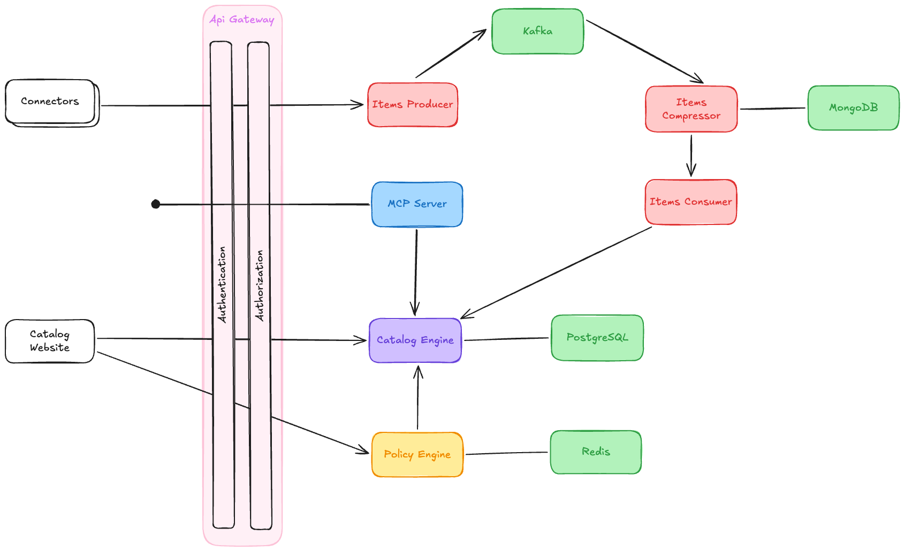

# Architecture

The Context Catalog is composed of a few cooperating services: an edge that authenticates traffic, an asynchronous pipeline that ingests items from external systems, and a backend that stores them, exposes them through APIs, and evaluates them against compliance rules.

## Edge

All client traffic enters through the **API Gateway**, which handles **Authentication** and **Authorization** before routing requests downstream.

Two kinds of clients sit in front of the gateway:

- **Catalog Website**: the browser application that powers the [Catalog Administration](/products/context-catalog/catalog-administration.md), used by humans to browse and configure the catalog.
- **Connectors**: agents that feed the catalog with data from external systems (Mia-Platform Console, source-code hosts, artifact registries, cloud providers, etc.). The reference implementation is [`ibdm`](/products/context-catalog/connectors/10_overview.md).

## Ingestion pipeline

Items pushed by connectors do not land in the database directly: they flow through an asynchronous pipeline built around **Kafka** that absorbs bursts and deduplicates redundant updates before applying them to the catalog. A **MongoDB** instance is used by the pipeline as working memory to collapse repeated changes for the same item.

## Backend

The **Catalog Engine** is the core of the system. It persists items, item types, relationships, and governance objects to its own **PostgreSQL** database, and exposes the public [REST API](/products/context-catalog/api-interactions.md) used by the website, the connectors, and any external integration.

Two more services sit alongside the Catalog Engine and are reached through the API Gateway:

- **MCP Server**: a thin front-end that lets LLM clients query catalog content through the [Model Context Protocol](/products/context-catalog/api-interactions.md#mcp-server) by talking to the Catalog Engine on their behalf.
- **Policy Engine**: the component that runs the rules defined as [evaluation criteria](/products/context-catalog/basic-concepts/30_evaluation-criteria.md), [scorecards](/products/context-catalog/basic-concepts/40_scorecards.md), and [campaigns](/products/context-catalog/basic-concepts/50_campaigns.md), and uses **Redis** to cache hot inputs and intermediate state. Verdicts are returned to the Catalog Engine, stored against the originating rule, and exposed through the API and the UI.

## See also

- [Getting Started](/products/context-catalog/getting-started.md): drive these components from the UI end-to-end.
- [Items](/products/context-catalog/basic-concepts/10_items.md), [Item Types](/products/context-catalog/basic-concepts/20_item-types.md), [Relationships](/products/context-catalog/basic-concepts/60_relationships.md): the data model managed by the Catalog Engine.
- [Evaluation Criteria](/products/context-catalog/basic-concepts/30_evaluation-criteria.md), [Scorecards](/products/context-catalog/basic-concepts/40_scorecards.md), [Campaigns](/products/context-catalog/basic-concepts/50_campaigns.md): what the Policy Engine evaluates.
- [Connectors](/products/context-catalog/connectors/10_overview.md): what feeds the ingestion pipeline.
- [API Interactions](/products/context-catalog/api-interactions.md): the REST and MCP contracts exposed by the Catalog Engine and the MCP Server.
