# Catalog Administration

The **Catalog Administration** is the web interface that lets operators and platform users browse the Context Catalog, inspect the entities it tracks, and oversee compliance activities. It is the human-facing complement to the [Catalog API](./api-interactions.md).

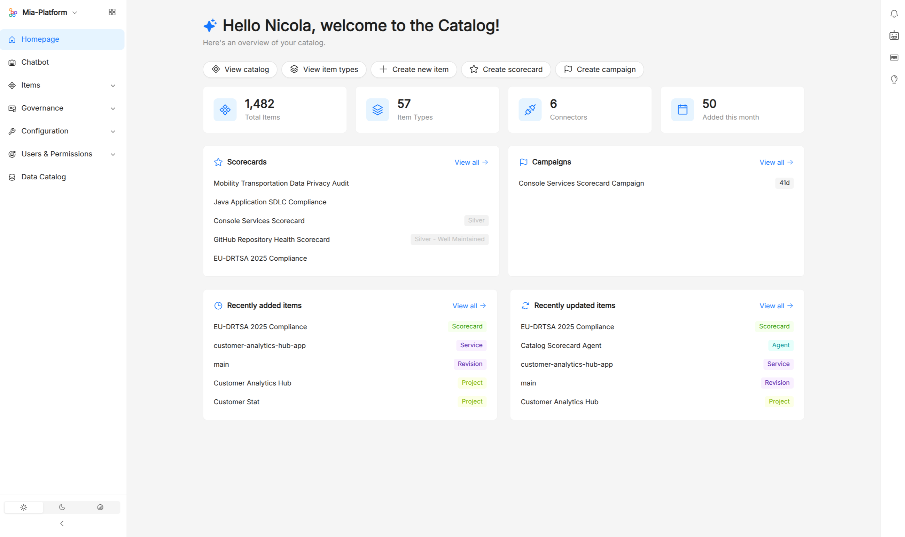

## What you can do

- **Browse items.** Navigate the catalog by item type, filter by labels and fields, and inspect the full manifest of any item.
- **Explore relationships.** Traverse the directed graph of relationships between items to perform impact analysis or discover dependencies.
- **Monitor compliance.** View the results of [Evaluation Criteria](./basic-concepts/30_evaluation-criteria.md) (rule runs) attached to your items, follow [Campaigns](./basic-concepts/50_campaigns.md), and check [Scorecards](./basic-concepts/40_scorecards.md) progress.
- **Curate data.** Edit metadata, labels, and annotations on items where the model allows it, and trigger ad-hoc rule evaluations.

## Architecture

The Catalog Administration is the entry point of a small set of cooperating services:

| Component           | Role                                                                                                          |
| :------------------ | :------------------------------------------------------------------------------------------------------------ |
| **Catalog Website** | Web UI for the catalog. Lets users browse items, view rule evaluation results, and monitor campaign progress. |
| **Catalog Engine**  | Core catalog backend. Stores and manages items and exposes the [Catalog API](./api-interactions.md).          |
| **Policy Engine**   | Stateless rule-evaluation engine that drives compliance evaluations.                                          |

## Organizations

The Catalog Administration allows users to select the organization they want to explore in the Catalog Administration.

## Items

The Catalog Administration offers a full set of operations on items across two main surfaces: the **item list** and the **item detail** page.

### Browse items

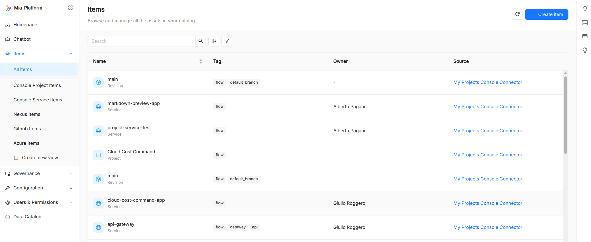

Items are presented in a paginated table that loads more entries as you scroll. From the list you can:

- **Search** items by name using the search bar.
- **Filter** items by type, name, labels, and tags using the filter panel.
- **Sort** items by name.
- **Customize columns** to show or hide the Name, Tag, Owner, and Source columns.
- **Refresh** the list to pull the latest data.

### Create an item

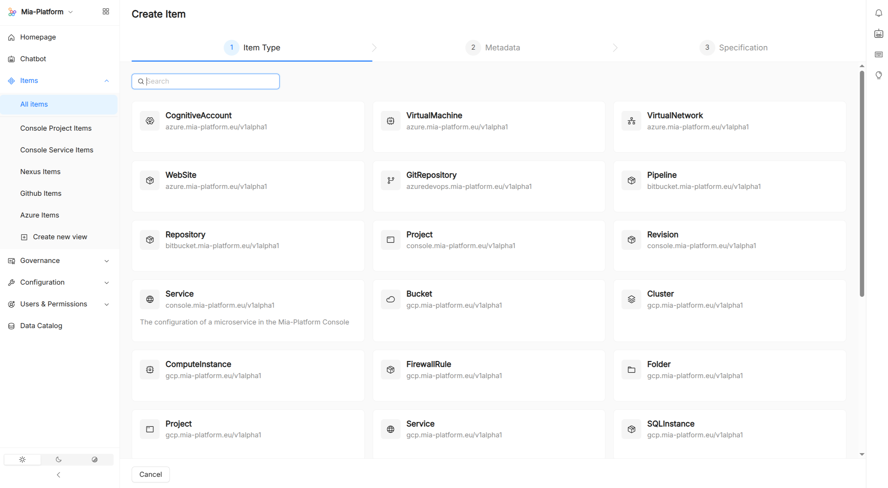

Click **Create item** to open a guided three-step wizard:

1. **Select type** — choose an Item Type Definition (the kind of item you want to create).
2. **Metadata** — provide a title, name, description, tags, and optionally an owner (a User or Team).
3. **Specification** — fill in the item's `spec` as a JSON document, guided by the schema defined in the selected Item Type Definition.

### View an item

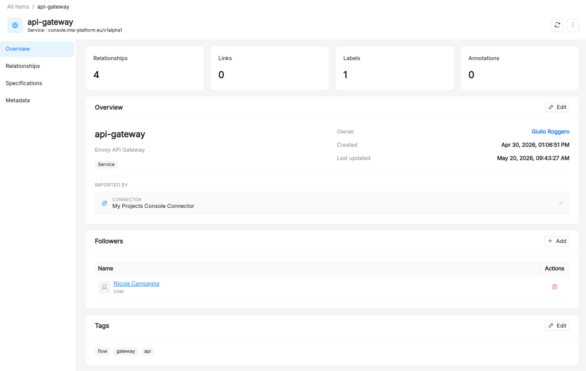

Clicking an item opens its detail page, which is organized into tabs:

| Tab | Content |
| :-- | :------ |
| **Overview** | High-level metadata (title, name, description, kind, owner, tags, linked connector) and a summary of the item's relationships. |
| **Relationships** | The full set of relationships to and from the item, viewable as a table or a visual graph. You can add, edit, and delete relationships from here. |
| **Specifications** | The item's `spec` field, viewable in JSON or interactive tree format. You can edit the spec inline directly from this tab. |
| **Metadata** | Manage annotations, labels, and links attached to the item (add, edit, and delete each). |
| **Connector items** | *(Connector-kind items only)* Items ingested into the catalog through this connector. |

### Edit an item

From the detail page you can also:

- **Edit metadata** — update the title, description, and owner (a User or Team). For Connector-kind items, you can also update the icon.
- **Edit tags** — add or remove tags.
- **Edit followers** — add or remove user following this item.
- **View manifest** — inspect the full raw manifest of the item in a modal, and download it as a JSON file.
- **Delete** — permanently remove the item from the catalog.

## Views

A **view** is a saved filter that scopes the catalog to a subset of items. Each view gets its own page and appears in the sidebar under the **Items** section, letting teams bookmark the slice of the catalog they care about most.

### Create a view

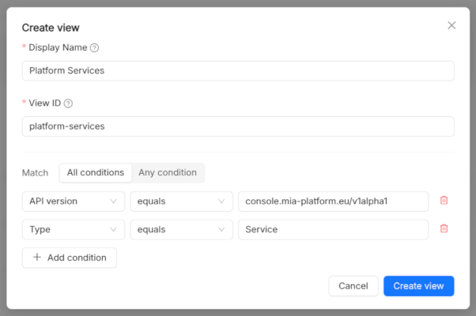

Click **Create new view** at the bottom of the Items section in the sidebar. You will need to provide:

- **Display name** — the label shown in the sidebar navigation.
- **View ID** — a unique identifier for the view, auto-generated from the display name and editable.
- **Filter conditions** — one or more conditions that define which items the view includes:
  - **Fields**: API version, Type, Name, Title, Tags, or Label.
  - **Operators**: equals, not equals, matches, exists (for tags: contains / not contains).
  - **Combinator**: match **All conditions** (AND) or **Any condition** (OR).

### Browse a view

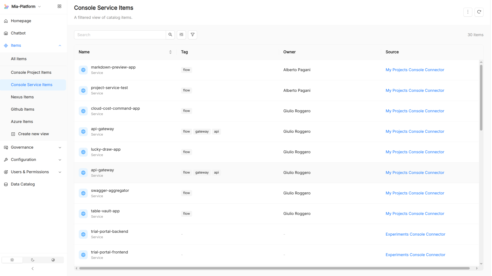

Opening a view shows items that satisfy its filter. The same browsing capabilities available on the full catalog list are also available within a view:

- Search items by name.
- Apply additional filters by type, name, labels, title, and tags.
- Sort by name.
- Customize visible columns (Name, Tag, Owner, Source).
- Refresh to pull the latest data.

### Edit a view

Open the actions menu on the view page and click **Edit view** to update the view's title, description, and filter conditions.

### Delete a view

Open the actions menu on the view page and click **Delete view**. This removes the view and its sidebar entry permanently.

## Governance

### Evaluation Criteria

**Evaluation Criteria** (also called rules) are boolean conditions that can be evaluated against catalog items to determine compliance.

#### Browse evaluation criteria

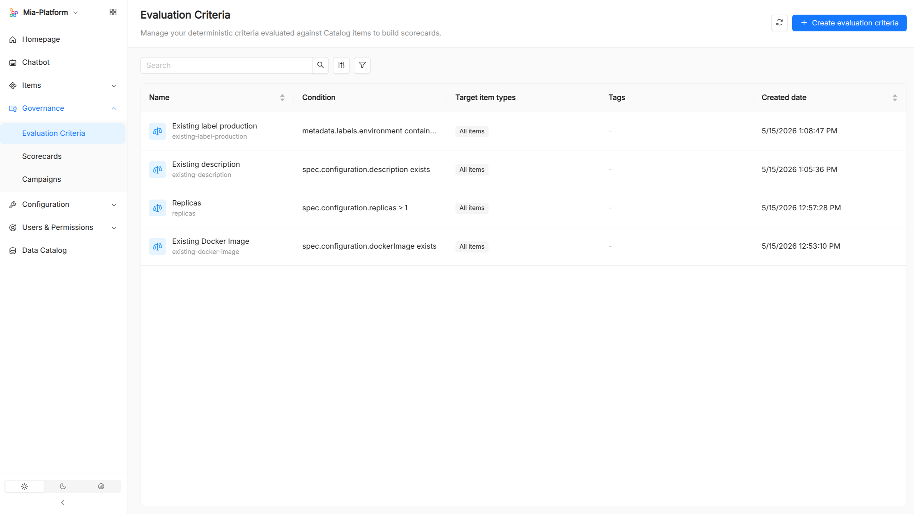

The evaluation criteria list shows all rules with their condition expression and target item types. From the list you can:

- **Search** by title or name.
- **Filter** by title and tags.
- **Sort** by name.
- **Customize columns** to show or hide Name, Condition, and Target item types.

#### Create an evaluation criterion

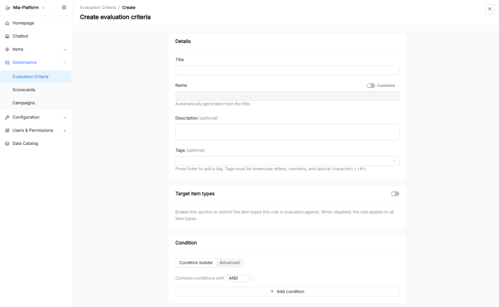

Click **Create evaluation criteria** to open the creation form. You need to provide:

- **Title** and **name** (auto-slugified from the title, editable).
- **Description** and **tags** (optional).
- **Condition body** — the rule expression, in one of three formats:
  - **Visual builder** — pick a field, an operator (equals, not equals, matches, exists, etc.), and a value. Add multiple conditions combined with AND or OR.
  - **JSON AST** — write the condition as a raw JSON expression.
  - **CEL** — write the condition as a [Common Expression Language](https://cel.dev) expression in a code editor.
- **Target item types** (optional) — restrict rule evaluation to a specific set of item types, either including or excluding them.

#### View an evaluation criterion

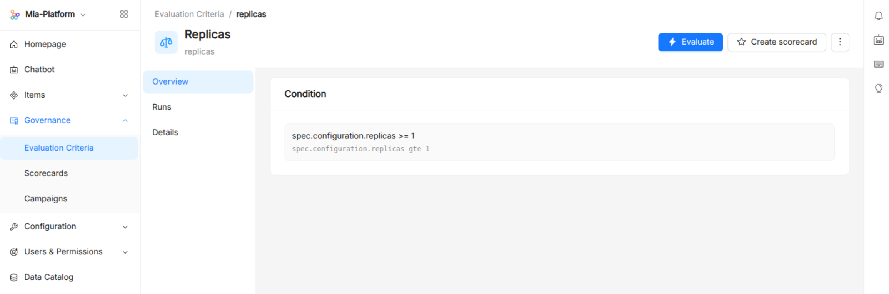

Clicking a rule opens its detail page, which has three sections:

| Section | Content |
| :------ | :------ |
| **Overview** | The rule condition and the target item types it applies to. |
| **Runs** | History of rule evaluations: status (pending, complete, error), number of items that passed, and the run date. Click a run to open a side panel with per-item pass/fail results, run metadata (start time, end time), and the scope that was used. |
| **Details** | Full metadata: name, title, description, tags, and creation timestamp. |

#### Evaluate a rule

Click **Evaluate** to trigger an ad-hoc rule run. You can optionally scope the evaluation to a subset of items (by view reference or raw query) or let it run against all items. The run appears immediately in the **Runs** tab and is polled for updates until it completes.

#### Edit an evaluation criterion

From the actions menu on the detail page, click **Edit evaluation criteria** to update any field, condition body, or target item types.

#### Delete an evaluation criterion

From the actions menu on the detail page, click **Delete evaluation criteria** to permanently remove the rule.

### Scorecards

A **scorecard** aggregates one or more Evaluation Criteria into a levelled compliance model. Each item in the scope is evaluated against all criteria and assigned the highest level whose criteria it fully satisfies.

#### Browse scorecards

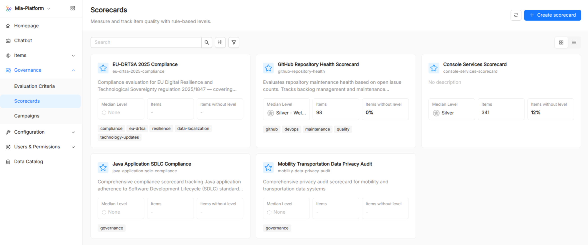

The scorecards page can be displayed in two modes, switchable from the toolbar:

- **Grid** (default) — card view showing each scorecard's median level, items evaluated, and items without a level.
- **List** — table view with the same statistics as columns.

In both modes you can:

- **Search** by title or name.
- **Filter** by title and tags.
- **Customize columns** (list mode) to show or hide Name, Median Level, Items evaluated, Items without level, and Tags.

#### Create a scorecard

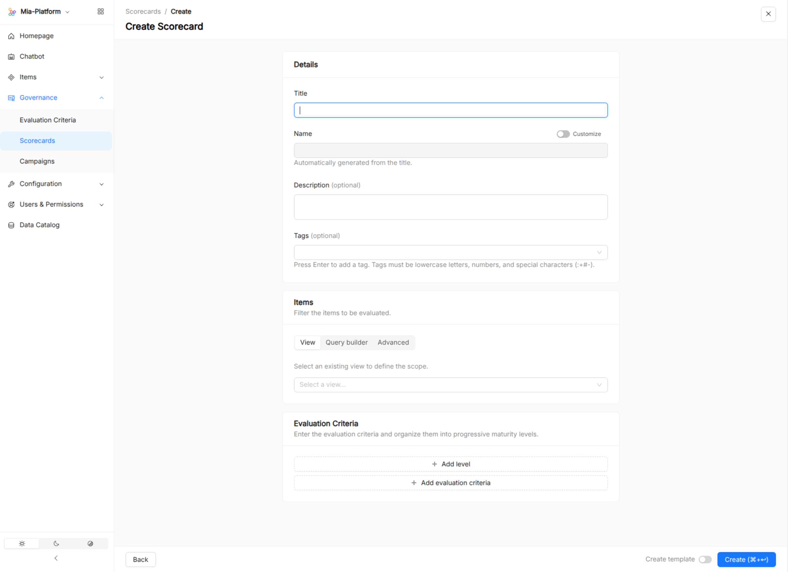

Click **Create scorecard** to open the creation wizard. On the first step, choose whether to start **from scratch** or from a template. On the second step, fill in:

- **Title** and **name** (auto-slugified from the title, editable).
- **Description** and **tags** (optional).
- **Levels** — define named levels in ascending order (e.g., Bronze → Silver → Gold), each with a display name and color.
- **Evaluation Criteria** — add one or more rules, each optionally assigned to a level. Rules can be:
  - **References** to existing Evaluation Criteria.
  - **Inline** rules defined directly in the scorecard (same condition-builder interface as standalone rules).
- **Scope** (optional) — restrict which items the scorecard runs against, using a view reference or a raw query.

#### View a scorecard

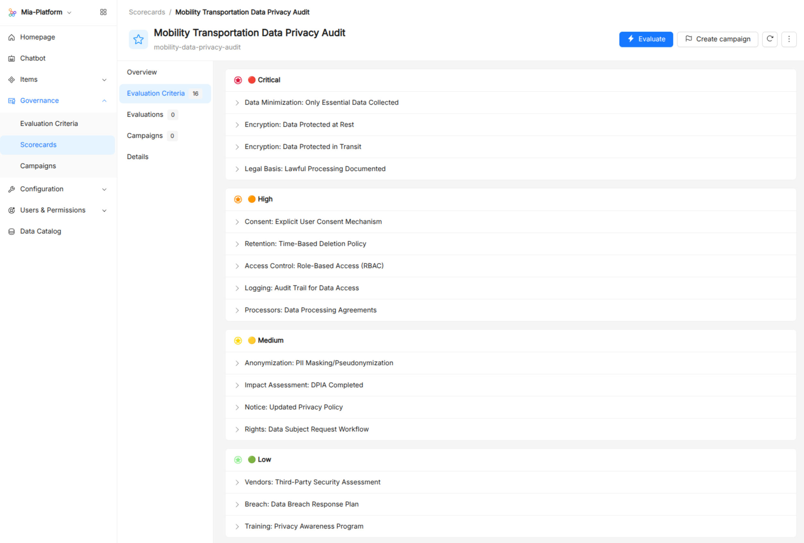

Clicking a scorecard opens its detail page, organized into five sections:

| Section | Content |
| :------ | :------ |
| **Overview** | Table of evaluated items showing the achieved level and per-criterion pass/fail result. Searchable and filterable by name or level. Click any row to open a side panel with the full per-criterion breakdown for that item. |
| **Evaluation Criteria** | All rules in the scorecard, grouped by level. Expand any rule to inspect its condition expression and target item types. |
| **Evaluations** | History of all evaluation runs with status, date, and item count. Click a past run to drill into its full per-item results, with the same filtering and drill-down available as in the Overview. |
| **Campaigns** | Campaigns that reference this scorecard, with their progress and timeline. |
| **Details** | Full metadata: name, title, description, tags, creation timestamp, and scope. |

#### Evaluate a scorecard

Click **Evaluate** to trigger an ad-hoc evaluation. The UI polls for completion and updates the **Overview** and **Evaluations** tabs when the run finishes.

#### Create a campaign from a scorecard

Click **Create campaign** to navigate to campaign creation with this scorecard pre-selected.

#### Edit a scorecard

From the actions menu, click **Edit scorecard** to update any field, rule, level configuration, or scope.

#### Duplicate a scorecard

From the actions menu, click **Duplicate scorecard** to create a copy with a new name, pre-populated with all the original's settings.

#### Delete a scorecard

From the actions menu, click **Delete scorecard** to permanently remove it.

### Campaigns

A **campaign** is a time-boxed compliance drive: it bundles a set of goals (evaluation criteria) and a deadline, then tracks how well each item in scope is meeting those goals.

#### Browse campaigns

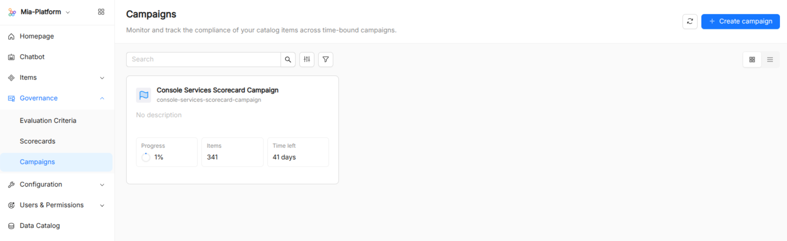

The campaigns page supports two display modes, switchable from the toolbar:

- **Grid** (default) — card view showing each campaign's overall progress percentage, items evaluated, and time left.
- **List** — table view with the same statistics as columns (Name, Progress, Items evaluated, Time left, Tags).

In both modes you can:

- **Search** by title or name.
- **Filter** by title and tags.
- **Customize columns** (list mode) to show or hide Name, Progress, Items evaluated, Time left, and Tags.

#### Create a campaign

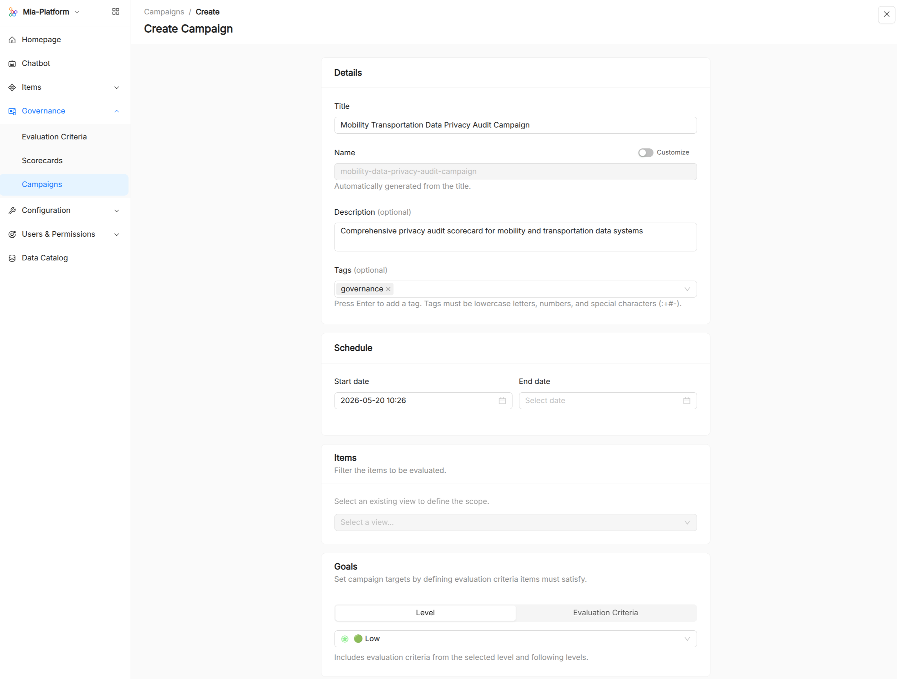

Click **Create campaign** to open the creation wizard. On the first step, choose how to source the campaign's goals:

- **From a scorecard** — pick an existing scorecard and select either a target level (all criteria from that level upward are imported) or individual evaluation criteria from the scorecard.
- **From scratch** — define goals manually using the same condition-builder interface as standalone Evaluation Criteria.

On the second step, fill in:

- **Title** and **name** (auto-slugified from the title, editable).
- **Description** and **tags** (optional).
- **Start date** and **end date** — the campaign's time window.
- **Items** (optional) — restrict which items the campaign evaluates, using a view reference or a raw query.
- **Goals** — the evaluation criteria imported from the scorecard or built from scratch.

#### View a campaign

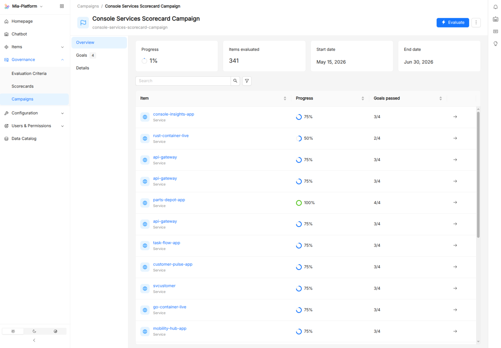

Clicking a campaign opens its detail page, organized into three sections:

| Section | Content |
| :------ | :------ |
| **Overview** | Summary statistics (overall progress %, items evaluated, start and end date) followed by a table of evaluated items showing per-item pass rate. Click any row to open a side panel with the full per-goal pass/fail breakdown for that item, including the condition expression for each goal. |
| **Goals** | All evaluation criteria in the campaign, expandable to show description and condition expression. |
| **Details** | Full metadata: name, title, description, linked scorecard (if the campaign was created from one), start date, end date, and scope. |

#### Evaluate a campaign

Click **Evaluate** to trigger an ad-hoc evaluation of all goals against all items in scope. The results update the **Overview** tab immediately when the run completes.

#### Edit a campaign

From the actions menu, click **Edit campaign** to update any field, goal, date, or scope.

#### Duplicate a campaign

From the actions menu, click **Duplicate campaign** to create a copy with a new name, pre-populated with all the original's settings.

#### Delete a campaign

From the actions menu, click **Delete campaign** to permanently remove it.

## Configuration

### Item Types

**Item Type Definitions (ITDs)** define the schema and API group for each kind of item the catalog can hold. Mia-Platform ships a set of built-in ITDs; you can also register custom ones.

#### Browse item types

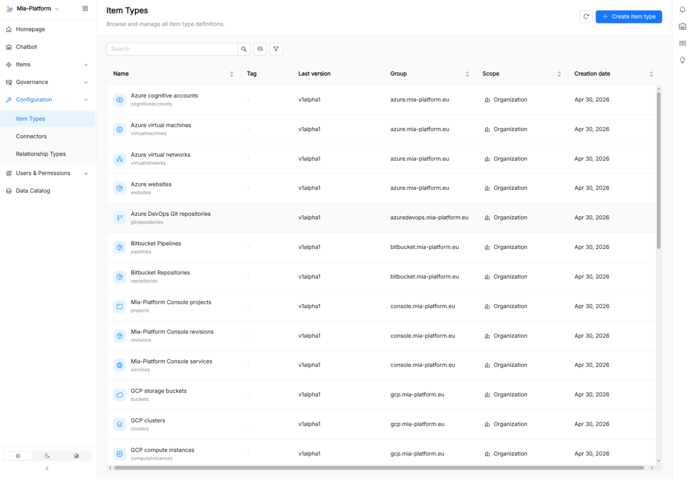

The item types list shows all registered ITDs. From the list you can:

- **Search** by name or title.
- **Filter** by creation date, group, name, scope, and tags.
- **Customize columns** to show or hide the available columns.
- **Refresh** the list.

#### Create an item type

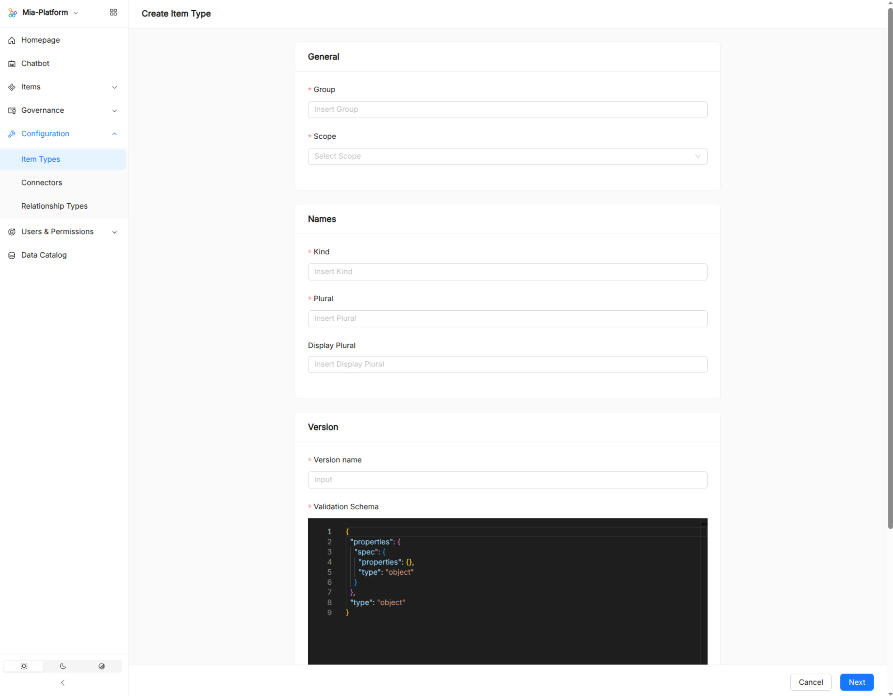

Click **Create item type** to open a two-step wizard:

1. **Specifications** — define the API group, kind name, plural name, and the OpenAPI v3.1 JSON schema for the first version, plus optional selectable fields.
2. **Metadata** — add a description, labels, annotations, and links.

#### View an item type

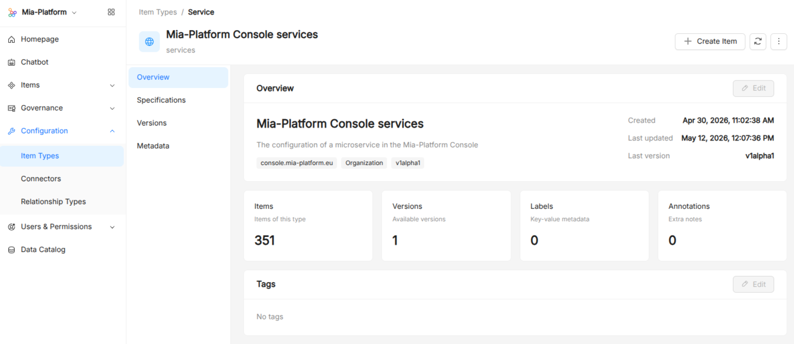

Clicking an ITD opens its detail page, organized into four tabs:

| Tab | Content |
| :-- | :------ |
| **Overview** | Summary of the ITD: kind, group, scope, description, tags, and a shortcut to create a new item of this type. |
| **Specifications** | Kind, plural, display plural names — editable for non-system ITDs. |
| **Versions** | All defined versions with their served status, deprecation state, schema, and selectable fields. You can add new versions (from scratch or copying an existing one) and edit existing versions. |
| **Metadata** | Annotations, labels, and links — add, edit, and delete each. |

#### Edit an item type

From the detail page you can:

- **Edit metadata** — add or remove annotations, labels, and links.
- **Edit tags** — add or remove tags.
- **Edit names** — update kind, plural, and display plural (non-system ITDs only).
- **Manage versions** — create a new version or edit an existing one's schema, selectable fields, served status, and deprecation settings.
- **View/download manifest** — inspect and download the full ITD manifest as JSON.

#### Delete an item type

From the actions menu on the detail page, click **Delete** (disabled for system ITDs).

---

### Relationship Types

**Relationship Types** define named, directed connection types that can exist between items (e.g., "depends on", "owned by").

#### Browse relationship types

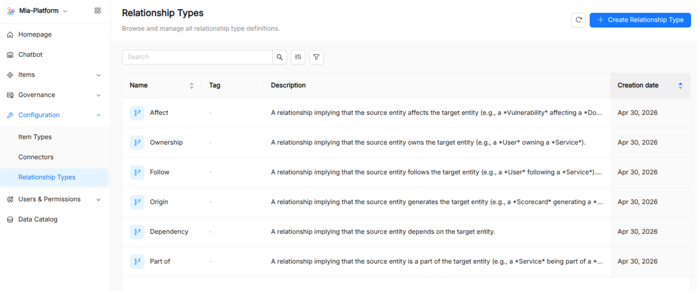

The relationship types list shows all registered types. From the list you can:

- **Search** by name or title.
- **Filter** by name, labels, and tags.
- **Sort** by name, or creation date.
- **Customize columns** to show or hide Name, Tag, Description, and Creation date.
- **Refresh** the list.

#### Create a relationship type

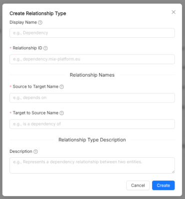

Click **Create relationship type** to open a modal. Provide:

- **Display Name** — the human-readable name
- **Relationship ID** — a unique identifier
- **Source to Target Name** — the label describing the relationship direction from source to target (e.g., "depends on").
- **Target to Source Name** — the label for the reverse direction (e.g., "is depended on by").
- **Description** — a longer description of the semantic of the relationship type.

#### View a relationship type

Clicking a relationship type navigates to its item detail page (the relationship type is stored as a catalog item), where you can inspect its metadata and specification.

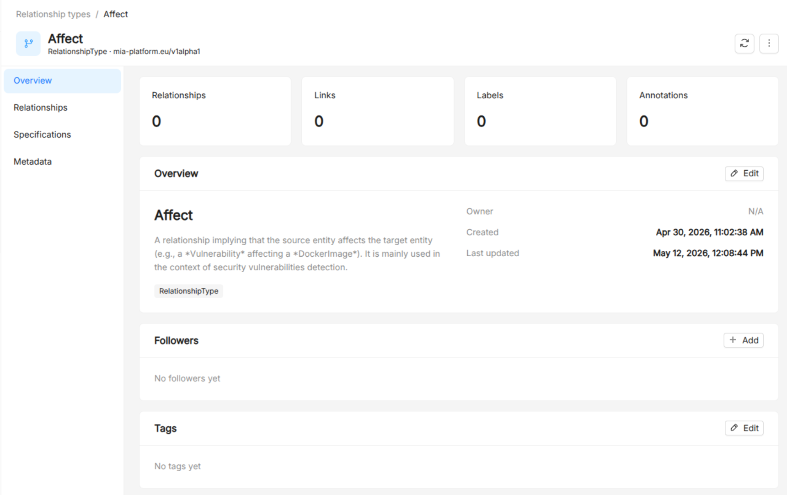

---

### Connectors

**Connectors** are the integration points that ingest external assets into the catalog. Each connector has a client ID that labels all the items it has synchronized.

#### Browse connectors

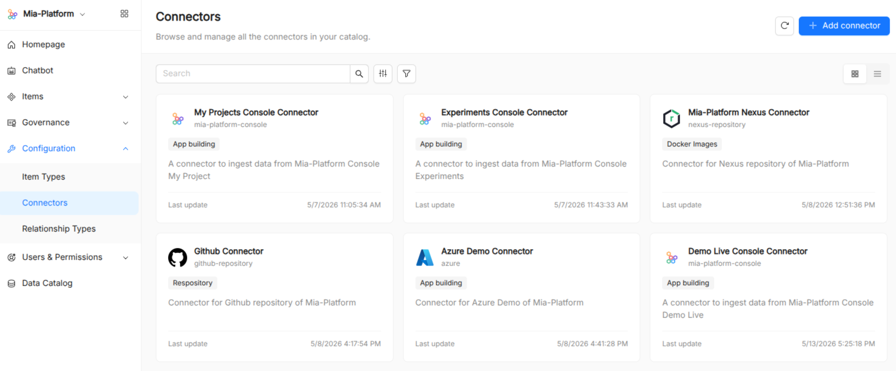

The connectors page supports two display modes, switchable from the toolbar:

- **Grid** (default) — card view showing each connector's icon, provider, categories, description, and last update.
- **List** — table view with columns for Name, Categories, Description, and Last update.

In both modes you can:

- **Search** by title, provider, or category.
- **Filter** by provider and category.
- **Customize columns** (list mode).
- **Refresh** the list.

#### Create a connector

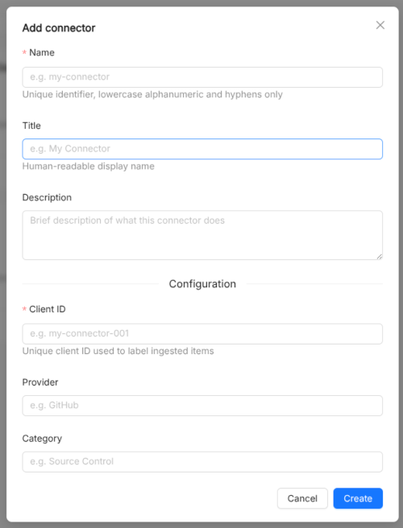

Click **Add connector** to open a modal. Provide:

- **Name** — unique identifier (lowercase alphanumeric and hyphens).
- **Title** — optional human-readable display name.
- **Description** (optional).
- **Client ID** — unique identifier used to tag all items ingested by this connector.
- **Provider** and **Category** (optional) — used for filtering and display.

#### View a connector

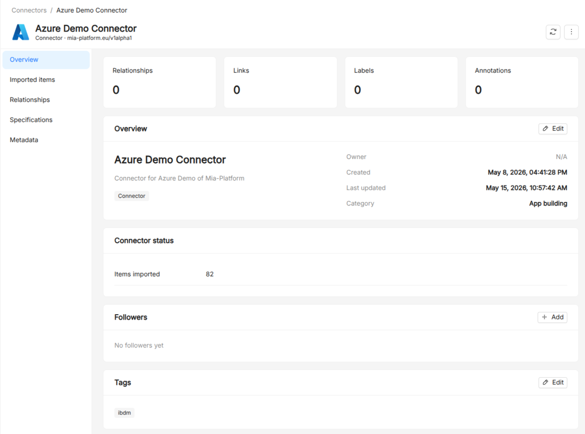

Clicking a connector opens its catalog item detail page, where you can inspect all connector metadata, its ingested items, specification, and relationships.

## Users & Permissions

### Users

**Users** represent people who own or are associated with items in the catalog. Each user is identified by their email address; the name is computed as a SHA-256 hash of the email.

#### Browse users

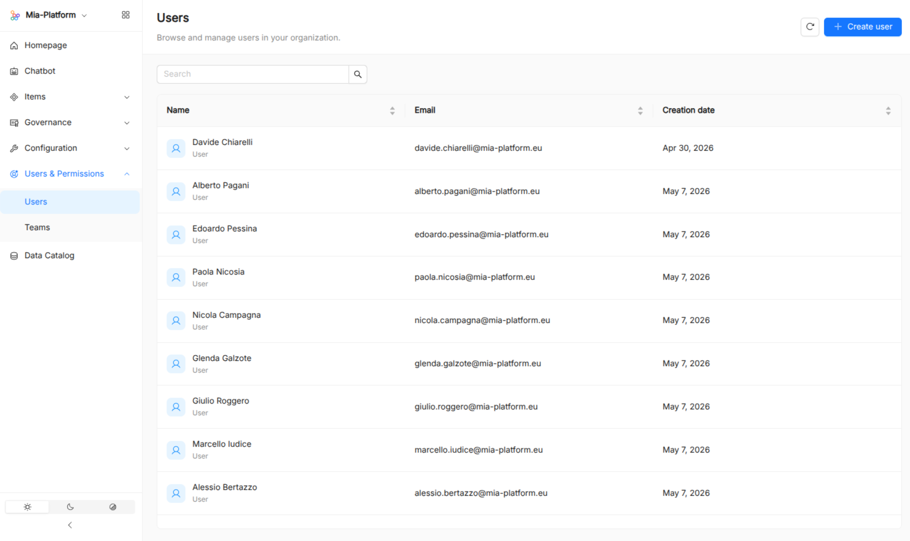

The users list is a paginated table that loads more entries as you scroll. From the list you can:

- **Search** by name or email.
- **Sort** by name, email address or creation date.
- **Refresh** the list.

Columns shown: Name, Email, Creation date.

#### Create a user

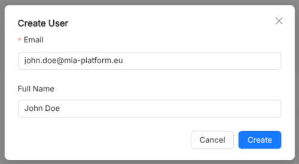

Click **Create user** to open a modal. Provide:

- **Email** (required) — used as the unique identity; the item name is derived from a SHA-256 hash of this value.
- **Full name** (optional) — used as the display title.

#### View a user

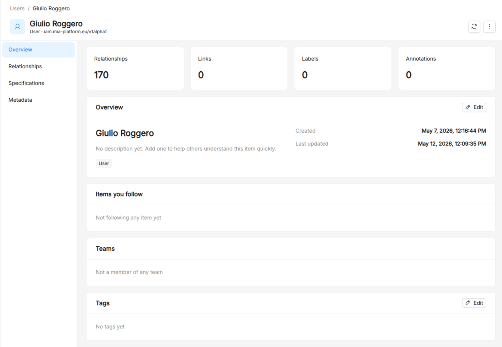

Clicking a user navigates to its catalog item detail page, where you can see the user's metadata, edit it, manage tags, annotations, labels, and links, and view all relationships (including team memberships and items owned by the user).

---

### Teams

**Teams** group users together and can be set as owners of catalog items.

#### Browse teams

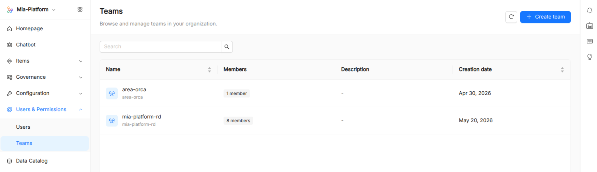

The teams list is a paginated table that loads more entries as you scroll. From the list you can:

- **Search** by name or title.
- **Sort** by name or creation date.
- **Refresh** the list.

Columns shown: Name, Members, Description, Creation date.

#### Create a team

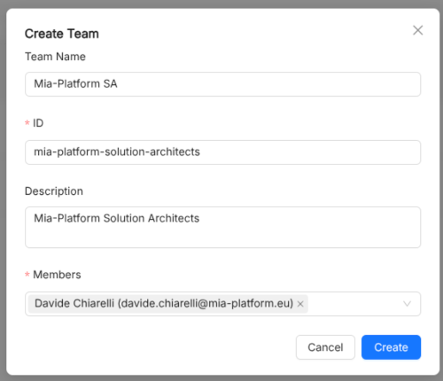

Click **Create team** to open a modal. Provide:

- **Title** (optional) — human-readable display name.
- **Name** (required) — unique identifier, auto-slugified from the title and editable.
- **Description** (optional).
- **Members** — search for existing users by name or email and add them to the team.

#### View a team

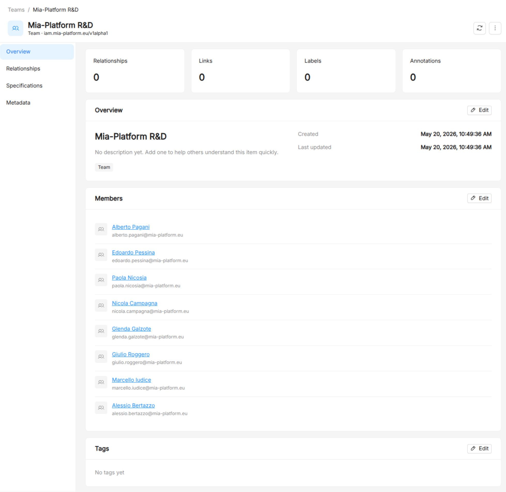

Clicking a team navigates to its catalog item detail page, where you can see the team's metadata, manage its member list (add or remove users), edit metadata, tags, and relationships.

## Where to go next

- See [API Interactions](./api-interactions.md) for the underlying API the Catalog Administration consumes.
- See [Items](./basic-concepts/10_items.md) and [Item Types](./basic-concepts/20_item-types.md) to understand what you are looking at in the UI.
- See [Connectors](./connectors/10_overview.md) to learn how external systems feed data into the catalog.
