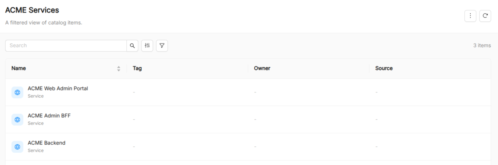
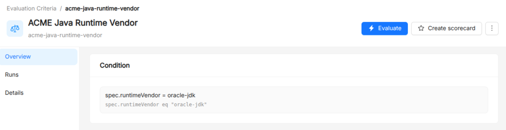
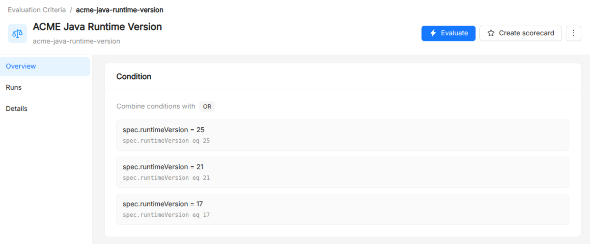
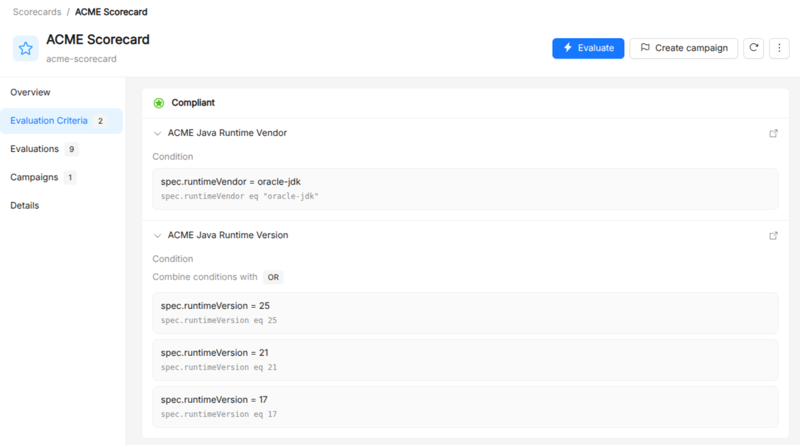
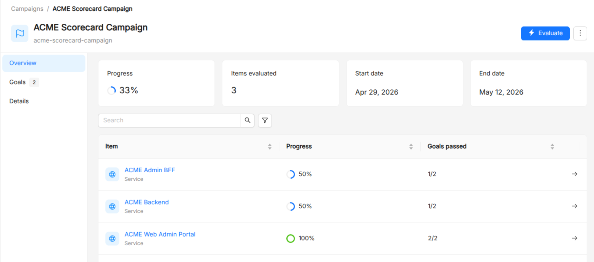

# Tutorial

This tutorial demonstrates how to use the Catalog to monitor compliance of software components, with a focus on mandatory risk management related to Java runtimes.

## Use Case

ACME Inc. requires all Java services running across multiple cloud platforms to use a company-approved and actively maintained Java runtime. This process ensures external dependencies are maintained and mitigates supply-chain attacks.

## Step 1: Define the Item Type Definition (ITD)

Under the `Configuration` > `Create Item Types` section, add a new Item Type Definition (ITD) to incorporate the required Java runtime details into the Catalog.

The validation schema should define two fields for the Java runtime `version` (e.g., 11, 19, 25) and `vendor` (e.g., Oracle JDK, Oracle OpenJDK, Amazon Corretto).

```json
{
  "properties": {
    "spec": {
      "properties": {
        "runtime": {
          "type": "string"
        },
        "runtimeVendor": {
          "type": "string"
        },
        "runtimeVersion": {
          "type": "number"
        }
      },
      "type": "object"
    }
  },
  "type": "object"
}
```

:::tip

You can also use annotations or labels to store relevant metadata instead of a custom ITD and connector 
and customize your CI/CD pipelines to enrich your Catalog items using the [Catalog API](api-interactions.md#update).

:::

## Step 2: Define ACME Services (Items)

Under the `Items` > `All Items` section, add three new items based on the ITD created previously with the following specifications:

- **ACME Admin Web Portal:** Oracle JDK (Approved 🟢), Java 25 (Maintained 🟢).

```json
{
  "runtime": "java",
  "runtimeVendor": "oracle-jdk",
  "runtimeVersion": 25
}
```

- **ACME Admin BFF:** Oracle OpenJDK (Unapproved 🔴), Java 25 (Maintained 🟢).

```json
{
  "runtime": "java",
  "runtimeVendor": "oracle-openjdk",
  "runtimeVersion": 21
}
```

- **ACME Backend:** Oracle JDK (Approved 🟢), Java 11 (Unmaintained 🔴).

```json
{
  "runtime": "java",
  "runtimeVendor": "oracle-jdk",
  "runtimeVersion": 11
}
```

## Step 3: Create View

Under the `Items` > `Create new view`, create a new view called **ACME Services** with the following filters:

- **API Version**: `acme.eu/v1`
- **Type**: `Service`

This view targets the `Service` items based on the previously created ITD.



## Step 4: Create Evaluation Criteria

Under the `Governance` > `Evaluation Criteria`, add the conditions the services must satisfy to be considered compliant with Java runtime version and vendor.

Add two evaluation criteria:

- **ACME Java Runtime Vendor:** Services must use the approved Oracle JDK Java distribution.

```
spec.runtimeVendor = oracle-jdk
```



- **ACME Java Runtime Version:** Services must use an actively maintained Java LTS version (17, 21, or 25 at time of writing).

```
spec.runtimeVersion = 17 OR spec.runtimeVersion = 21 OR spec.runtimeVersion = 25
```



## Step 4: Combine Criteria in a Scorecard

Under the `Governance` > `Scorecards`, create a new scorecard with the following specifications:

- **Title**: ACME Scorecard.
- **Items**: select the `ACME Services` view created previously to evaluate the scorecard only against the items we created.
- **Evaluation Criteria**: add existing evaluation criteria `ACME Java Runtime Vendor` and `ACME Java Runtime Version`.



:::tip

Scorecards can organize criteria in incremental levels (e.g., bronze, silver, gold).

:::

## Step 5: Monitor Compliance with a Campaign

Under the `Governance` > `Campaigns`, create a new campaign based on the scorecard created previously to assess the compliance of the services over time.

The campaign will show both global and per-item progress toward the compliance goal.


